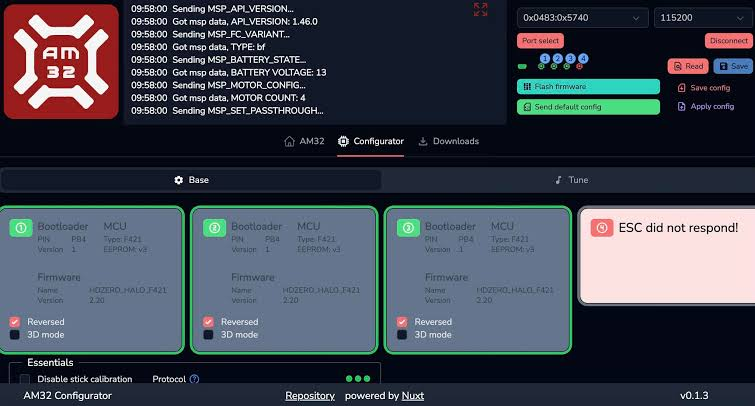
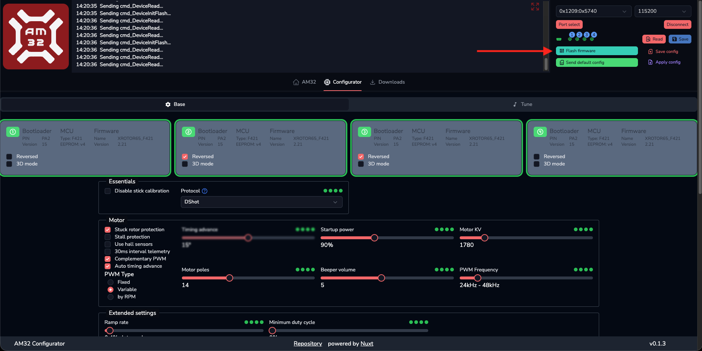
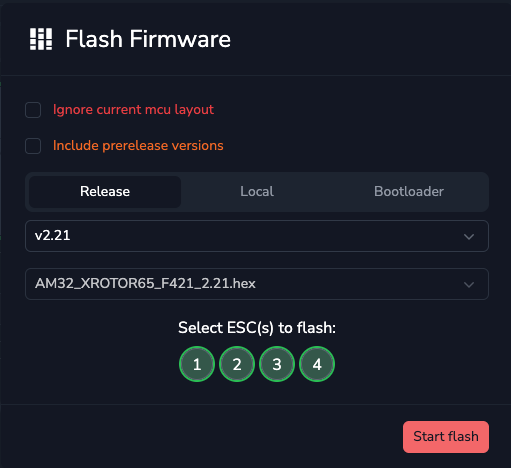
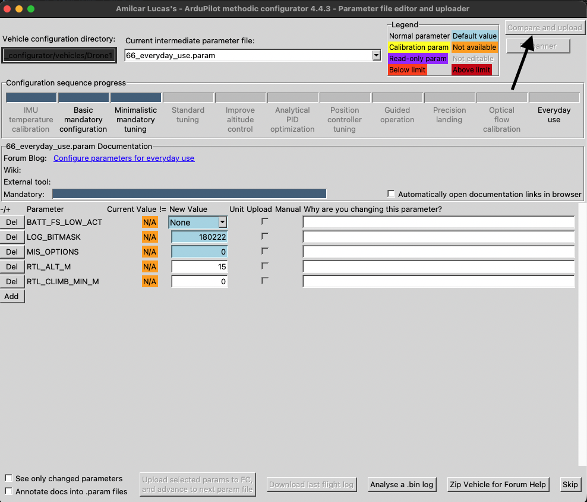

# Guide to Unlock a Stuck AM32 4-in-1 ESC

If you were trying to flash firmware or upgrade the firmware on your AM32 ESC using software such as ESC Configurator or the AM32 Configurator, and the ESC became stuck,
stopped being detected, or stuck in bootloader mode,
there are a few ways to recover it.

The first method is to try to bypass the normal ESC startup process and force the AM32 Configurator to connect to the ESC before it finishes booting up.
This method does not require an STM programmer and should be tried first.

The second method is to manually program the affected ESC using an ST-Link or another compatible STM programmer.
This requires physically connecting the programmer to the ESC. Try this if you are comfortable doing precise soldering and some
complicated steps, or you might ruin your ESC. [If You Have an STM Programmer](#if-you-have-an-stm-programmer).

## Before Starting

Keep the propellers removed from the vehicle throughout this process.

There are two approaches depending on the flight controller firmware being used. The first approach uses ArduPilot. The second approach uses Betaflight.

Start with the ArduPilot method. If the ESC still cannot be accessed through ArduPilot, use the Betaflight method.

### Requirements

Before using the AM32 Configurator through ArduPilot, ensure that the following
requirements are met:

- The ESCs must be connected to DShot-capable FMU/AUX outputs.
- ArduPilot passthrough does not work through IOMCU-controlled MAIN outputs. Use supported FMU/AUX outputs instead.
- ArduPilot firmware 4.5 or later is required when using the web-based ESC
  configurator.
- The flight controller must be configured to use a DShot protocol.
- Disconnect all propellers before starting the passthrough procedure.

Output availability and DShot support vary between flight controllers. Check
the flight controller's documentation before connecting the ESCs.

For further information, see the
[ArduPilot BLHeli/AM32 passthrough documentation](https://ardupilot.org/copter/docs/common-blheli32-passthru.html).

## ArduPilot Method

Different FCs act differently with the ESC, some allow the ESC to communicate with the AM32 software, while others don't

Try these settings so that ArduPilot sends the correct signals for AM32 communication.

Connect the FC to your computer through USB and open Mission Planner.

Open the full parameter list and set the following parameters.

`MOT_PWM_TYPE` should be set to `DShot600`.

`SERVO_BLH_AUTO` should be set to `1`.

Write the parameters to the flight controller and reboot the flight controller before continuing.

After writing the parameters, completely close Mission Planner and AMC, make sure the port is not occupied by any software.
This is important because Mission Planner or other software can keep the flight controller's connection occupied and prevent
the AM32 Configurator from accessing it.

Now connect the main battery to power the ESCs.

Open the [AM32 Web Configurator](https://am32.ca/configurator).

Select the flight controller's port using the Port Select option. Try connecting to the ESCs.

If the ESC is still not detected, continue with the [Betaflight method](#betaflight-method).

Some useful docs:

<https://ardupilot.org/copter/docs/common-am32-escs.html>

<https://ardupilot.org/copter/docs/common-matekh743-wing.html>

## Betaflight Method

If the ArduPilot method does not allow the ESC to be accessed, the Betaflight method can be used as an alternative and mostly works.

This requires temporarily flashing Betaflight firmware to the flight controller.

> [!NOTE]
> Before flashing Betaflight, make sure to have a copy of your current vehicle's parameters. Do this by manually saving a copy of the
> "complete.param" file, from your AMC's vehicle directory on your hard disk. This file will be used to reflash the parameters to the vehicle.

Flash the Betaflight firmware target corresponding to your exact flight controller. Do not use an unrelated Betaflight target.
(Disconnect the main battery from the flight controller before flashing Betaflight. Keep the flight controller connected to USB and powered through USB during the firmware
flashing process.)

Open the Betaflight Configurator and select the ESC protocol that is appropriate for your setup. Save the configuration.

After configuring Betaflight, close Betaflight and disconnect everything from the drone.

Open the [AM32 Web Configurator](https://am32.ca/configurator).

Connect the flight controller to the computer (don't power the drone using battery now) through USB and allow it to boot.

In the AM32 Configurator, use the "Port Select" button and select the flight controller's USB port.

The next step needs to be performed very quickly.

Connect the main battery to the drone and immediately click Connect in the AM32 Configurator.
The purpose of doing this quickly is to make the configurator attempt to communicate with the ESC before the ESC has completely finished its normal startup process.

If the ESC is still not detected, disconnect everything from the drone and try again.

On the next attempt, connect the battery and click "Connect" almost simultaneously. This needs to be done very quickly.
Repeat this process if necessary until the AM32 Configurator detects the ESC.

Click "Read" to read the ESCs. If the connection was successful, the detected ESCs will appear in the configurator.

Click the "Flash Firmware" button.

Select the ESC or ESCs that need to be recovered. For a 4-in-1 ESC with identical ESC targets, selecting all ESCs ensures that the same firmware is flashed to each ESC.

Select the required AM32 firmware version and start the firmware flash. Don't refresh the browser or touch the usb and make sure the
firmware completely flashes.

After the firmware has been successfully flashed, verify that the ESC is detected normally and can be configured.

> Restore the saved ArduPilot parameter file after flashing the appropriate ArduPilot firmware with the `*_with_bl.hex` file using DFU mode.
> See the [ArduPilot firmware flashing guide](https://ardupilot.org/copter/docs/common-loading-firmware.html).
> After ArduPilot has been restored, use the "Compare and Upload" button in AMC to upload the saved `complete.param` file
> in AMC to upload the saved complete.param file from earlier.

Restore the original configuration and motor protocol if they were changed during the recovery process.

## If You Have an STM Programmer

If the ESC cannot be recovered using the methods above and you have an ST-Link or another compatible STM programmer, the ESC can be flashed directly.

This requires connecting the programmer to the appropriate programming points on the ESC and manually flashing the AM32 bootloader or firmware.

Use the following [guide](https://oscarliang.com/flash-am32-blheli32-esc/)
for the physical connection and flashing procedure.

Follow the section titled "How to Flash AM32 Bootloader".

## If Nothing Works

If the ESC cannot be detected using either the ArduPilot method or the Betaflight method, and it also cannot be programmed using an STM programmer,
there is a high possibility that the ESC has a hardware problem.
