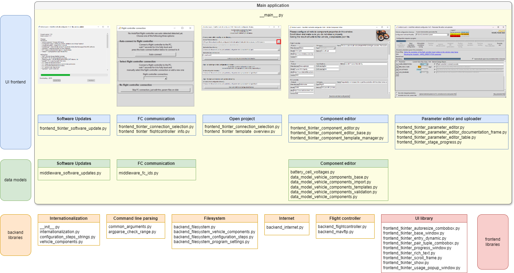
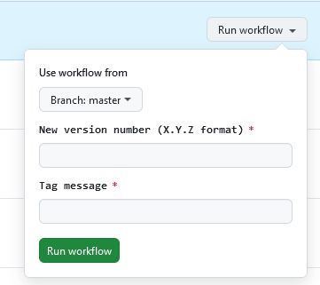
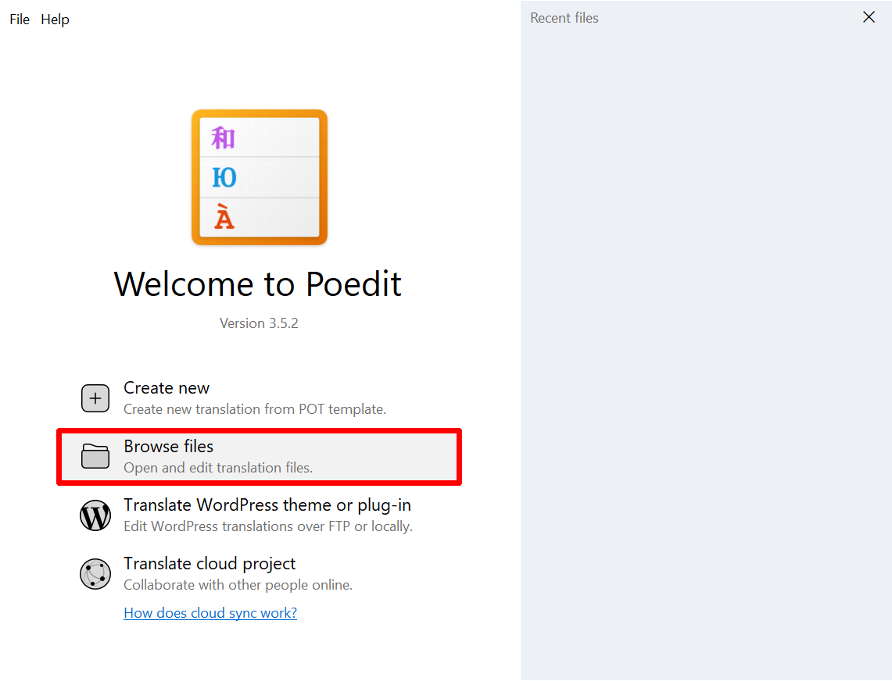
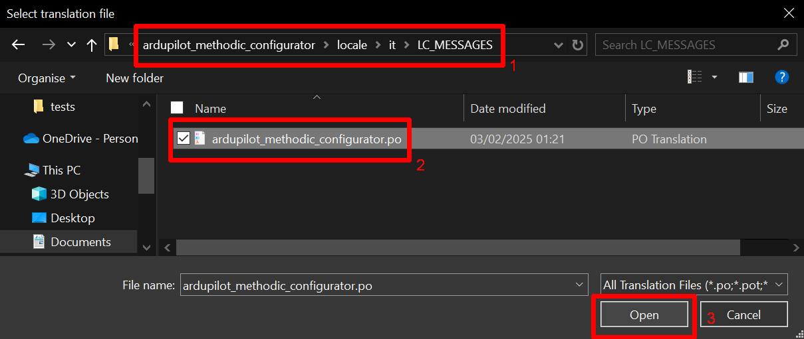
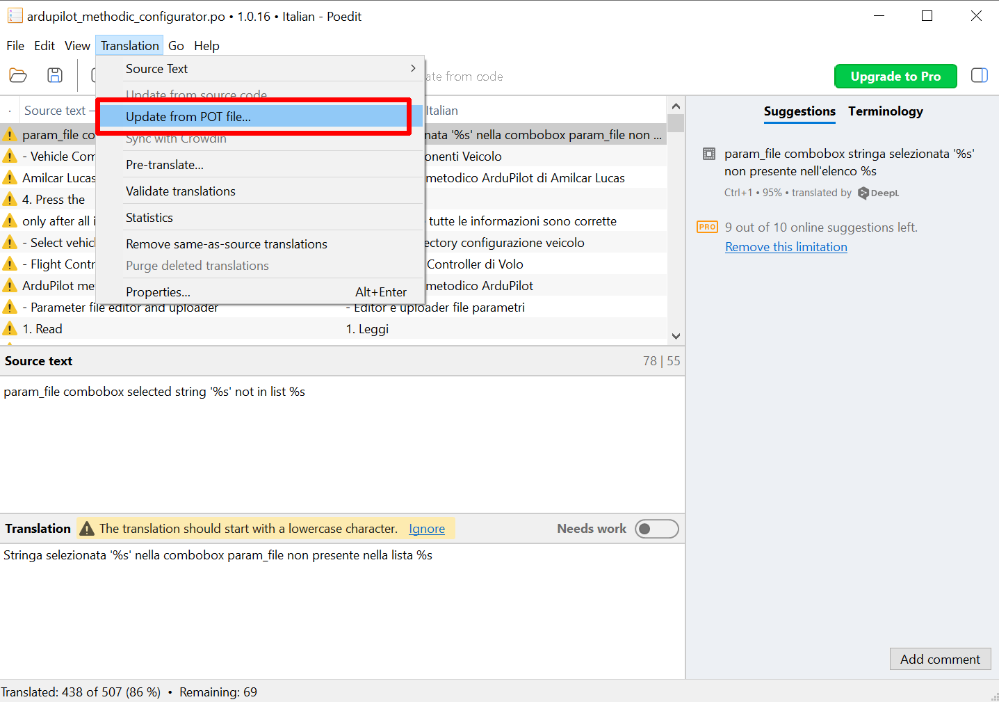
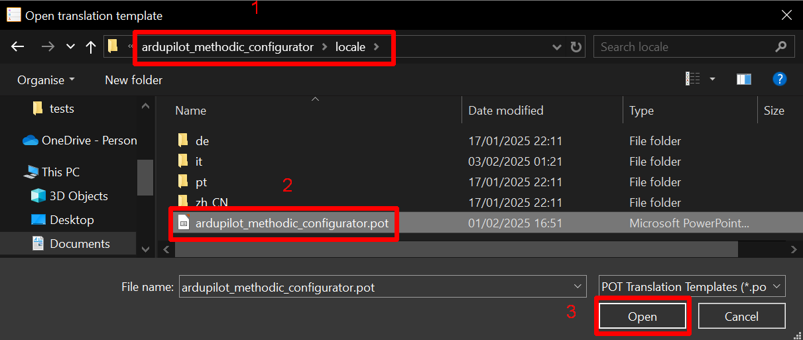
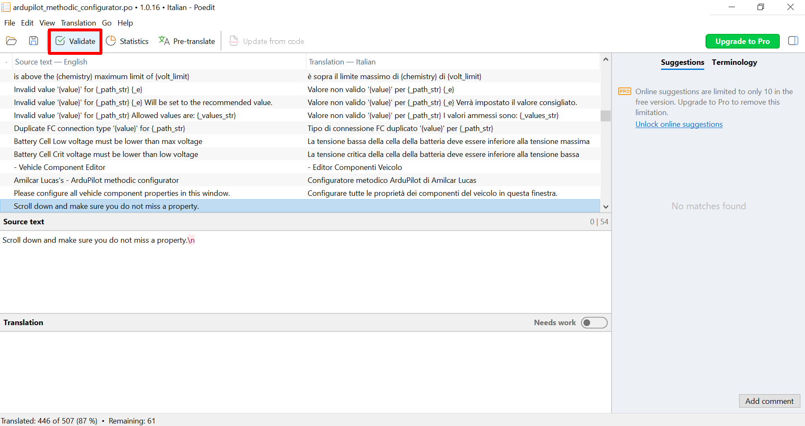

# Development guide

The goal *ArduPilot methodic Configurator* software is to automate some of the tasks involved in configuring and tuning  ArduPilot-based vehicles.
To develop the software the [standard V-Model software development method](https://en.wikipedia.org/wiki/V-model_(software_development)) was first used.
It was augmented with [DevOps](https://en.wikipedia.org/wiki/DevOps) and [CI/CD automation](https://en.wikipedia.org/wiki/CI/CD) practices at a later stage.

## V-model

### Requirements analysis

We collected and analyzed the needs of the ArduPilot users by
[reading 108K+ forum posts](https://discuss.ardupilot.org/u?order=likes_received&period=all),
by reading [Ardupilot FW issues on github](https://github.com/ArduPilot/ardupilot/issues),
by reading the [ArduPilot documentation](https://ardupilot.org/ardupilot/),
by attending the weekly ArduPilot developers meeting and by participating in forum discussions:

- guidelines on how to correctly build the vehicle, many users are not aware of the hardware basics.
- a non-trial and error approach to set the [1300 ArduPilot parameters](https://ardupilot.org/copter/docs/parameters.html)
- a clear sequence of steps to take to configure the vehicle
- a way to save and load the configuration for later use
- a way to document how decisions where made during the configuration process
  - to be able to not repeat errors
  - to be able to reproduce the configuration on another similar bit different vehicle
  - to understand why decisions where made and their implications

Then we developed, documented and tested the *clear sequence of steps to take to configure the vehicle* in the
[How to methodically tune any ArduCopter](https://ardupilot.github.io/MethodicConfigurator/TUNING_GUIDE_ArduCopter) guide in Dec 2023.
Once that was mostly done we proceeded with *system design* the next step of the V-model.

### System design

To automate the steps and processes in the [How to methodically tune any ArduCopter](https://ardupilot.github.io/MethodicConfigurator/TUNING_GUIDE_ArduCopter) guide
the following system design requirements were derived:

#### 1. Parameter Configuration Management

- The software must allow users to view parameter values
- The software must allow users to change parameter values
- For each step in the configuration sequence there must be a "partial/intermediate" parameter file
- The "partial/intermediate" parameter files must have meaningful names
- The sequence of the "partial/intermediate" parameter files must be clear
- Users should be able to upload all parameters from a "partial/intermediate" parameter file to the flight controller and advance to the next intermediate parameter file.
- Users should be able to upload a subset of parameters from a "partial/intermediate" parameter file to the flight controller
  and advance to the next "partial/intermediate" parameter file in the configuration sequence.
- Users should be able to select a "partial/intermediate" parameter file from a list of available files and select the one to be used.
- The software must display a table of parameters with columns for:
  - the parameter name,
  - current value,
  - new value,
  - unit,
  - upload to flight controller,
  - and change reason.
- The software must validate the new parameter values and handle out-of-bounds values gracefully, reverting to the old value if the user chooses not to use the new value.
- The software must save parameter changes to both the flight controller and the intermediate parameter files

#### 2. Communication Protocols

- The software must support communication with the drone's flight controller using [MAVlink](https://mavlink.io/en/):
  - [parameter protocol](https://mavlink.io/en/services/parameter.html) or
  - [FTP-over-MAVLink](https://mavlink.io/en/services/ftp.html) protocols.
- The software must automatically reset the ArduPilot if required by the changes made to the parameters.
  - parameters ending in "_TYPE", "_EN", "_ENABLE", "SID_AXIS" require a reset after being changed
- The software must automatically validate if the parameter was correctly uploaded to the flight controller
  - It must re-upload any parameters that failed to be uploaded correctly
- The software must manage the connection to the flight controller, including establishing, maintaining, and closing the connection.
- Users should be able to reconnect to the flight controller if the connection is lost.

#### 3. User Interface

- The software must provide a user-friendly interface with clear navigation and controls.
- The interface must be responsive and adapt to different screen sizes and resolutions.
- Users should be able to toggle between showing only changed parameters and showing all parameters.
- Users should be able to skip to the next parameter file without uploading changes.
- The software must ensure that all changes made to entry widgets are processed before proceeding with other actions, such as uploading parameters to the flight controller.
- Read-only parameters are displayed in red, Sensor Calibrations are displayed in yellow and non-existing parameters in blue
- Users should be able to edit the new value for each parameter directly in the table.
- Users should be able to edit the reason changed for each parameter directly in the table.
- The software must perform efficiently, with minimal lag or delay in response to user actions.
- The software must provide a `gui_complexity` setting that controls the user interface complexity:
  - When set to "simple" (default), the interface simplifies for beginners by:
    - In the component editor:
      - only displaying non-optional properties
      - only displaying components that have at least one non-optional parameter, hiding components with only optional parameters
      - not displaying component template load/save controls
    - In the parameter editor:
      - hiding the "Upload" column, "Current intermediate parameter file" combobox, "See only changed parameters" checkbox, and "Annotate docs into .param files" checkbox;
      - automatically selecting all parameters for upload
    - In the documentation frame:
      - automatically opening all available documentation links (wiki, external tools, blog posts) in the browser
        when the current intermediate parameter file changes, providing immediate access to relevant documentation for beginners
  - When set to "normal", all interface elements are displayed for advanced users
  - Users should be able to switch between complexity levels using a dropdown combobox in the component editor

#### 4. Documentation and Help

- The software must include comprehensive documentation and help resources.
- The software must provide tooltips for each GUI widget.
- The software must provide tooltips for each parameter to explain their purpose and usage.
- Users should be able to access the blog post and other resources for more information on the software and its usage.
- The software website should use an AI assistant, trained with ArduPilot documentation, to help users configure their
  vehicles [PR #175](https://github.com/ArduPilot/MethodicConfigurator/pull/175)
  - The AI assistant should be able to answer questions about the parameters and the configuration process
  - The AI assistant should be able to provide guidance on how to resolve common issues that may arise during the configuration process

#### 5. Error Handling and Logging

- The software must provide feedback to the user, such as success or error messages, after each action.
- The software must handle errors gracefully and provide clear error messages to the user.
- The software must log events and errors for debugging and auditing purposes to the console.
- if files are empty flag them as non-existing [PR #135](https://github.com/ArduPilot/MethodicConfigurator/pull/135)
- if a downloaded file is empty flag it as download failed [PR #135](https://github.com/ArduPilot/MethodicConfigurator/pull/135)

#### 6. Parameter File Management

- The software must support the loading and parsing of parameter files.
- Comments are first-class citizens and are preserved when reading/writing files
- The software must write at the end of the configuration the following summary files:
  - Complete flight controller *reason changed* annotated parameters in `complete.param` file
  - Non-default, read-only *reason changed* annotated parameters in, `non-default_read-only.param` file
  - Non-default, writable calibrations *reason changed* annotated parameters in `non-default_writable_calibrations.param` file
  - Non-default, writable non-calibrations *reason changed* annotated parameters in `non-default_writable_non-calibrations.param` file
- automatically create a parameter backup before the first usage of the software to change parameters [PR #173](https://github.com/ArduPilot/MethodicConfigurator/pull/173)
  - Only backs up the parameters if a backup file does not exist and only if AMC has not yet been used to write parameters to the FC

#### 7. Customization and Extensibility

- The software must be extensible to support new drone models and parameter configurations.
- Users should be able to customize the software's behavior through configuration files:
  - `configuration_steps_ArduCopter.json`, `configuration_steps_ArduPlane.json`, etc
  - `vehicle_components.json`
  - intermediate parameter files (`*.param`)

#### 8. Automation of development processes

- As many of the development processes should be automated as possible
- Development should use industry best practices:
  - Use git as version control and host the project on [ArduPilot GitHub repository](https://github.com/ArduPilot/MethodicConfigurator)
  - Start with a V-Model development until feature completeness, then switch to DevOps ASAP.
  - [Test-driven development](https://en.wikipedia.org/wiki/Test-driven_development) (TDD)
  - [DevOps](https://en.wikipedia.org/wiki/DevOps)
  - [CI/CD automation](https://en.wikipedia.org/wiki/CI/CD)
  - git pre-commit hooks for code linting and other code quality checks
  - create command-line autocompletion for bash, zsh and powershell [PR #134](https://github.com/ArduPilot/MethodicConfigurator/pull/134)

### 9. Vehicle components and connections

- Use a JSON schema to define a JSON file that describes all configuration-relevant vehicle components and
 their connections to the flight controller.
  - Required top-level keys are "Format version", "Components", "Program version", "Configuration template"
  - Required components are Flight Controller, Frame, Battery Monitor, Battery, ESC, Motors
  - Optional components are RC Controller, RC Transmitter, RC Receiver, Telemetry, Propellers, GNSS Receiver
  - Each component follows the appropriate structure with required and optional fields
  - Common patterns are defined as reusable definitions
- ensure that both loaded and saved vehicle component data complies with the schema, provide useful error messages when validation fails.
- Allow the user to save a vehicle component to a template and select it directly from a pre-defined set of
  common vehicle components. [PR 272](https://github.com/ArduPilot/MethodicConfigurator/pull/272)
  - For each vehicle component, a dropdown arrow is present as well as a button to allow to save the current filled component.
    - These are presented in alphabetical order
  - A predefined set of commonly used components is included in the software as read-only
    - These get updated and overwritten when a new SW version is installed
  - The user can extend that using his own locally saved component templates
    - These do not get overwritten when a new SW version is installed

### The Software architecture

We decided to use python as programming language, and the following libraries and frameworks:

- [pymavlink](https://github.com/ArduPilot/pymavlink) for the flight controller communication
- [tkinter](https://docs.python.org/3/library/tkinter.html) for the graphical user interface
- GNU gettext `po` files to translate the software to other languages

The (main) application itself does the command line parsing and starts the sub-applications defined below in sequence

- [`__main__.py`](ardupilot_methodic_configurator/__main__.py)

To satisfy the system design requirements described above the following five user interface sub-applications were developed:

- **check for software updates**
  - checks if there is a newer software version available, downloads and updates it
  - [`frontend_tkinter_software_update.py`](ardupilot_methodic_configurator/frontend_tkinter_software_update.py)
- **FC communication**
  - establishes connection to the flight controller, gets hardware information, downloads parameters and their default values
  - [`frontend_tkinter_connection_selection.py`](ardupilot_methodic_configurator/frontend_tkinter_connection_selection.py)
    - [`frontend_tkinter_flightcontroller_info.py`](ardupilot_methodic_configurator/frontend_tkinter_flightcontroller_info.py)
- **choose project to open**
  - either creates a new project or opens an existing one, downloads parameter documentation metadata corresponding to the FC firmware version to the project directory
  - [`frontend_tkinter_directory_selection.py`](ardupilot_methodic_configurator/frontend_tkinter_directory_selection.py)
    - [`frontend_tkinter_template_overview.py`](ardupilot_methodic_configurator/frontend_tkinter_template_overview.py)
- **define vehicle components and their connections**
  - define specifications of all vehicle components and their connections to the flight controller
  - [`frontend_tkinter_component_editor.py`](ardupilot_methodic_configurator/frontend_tkinter_component_editor.py)
    - [`frontend_tkinter_component_editor_base.py`](ardupilot_methodic_configurator/frontend_tkinter_component_editor_base.py)
    - [`frontend_tkinter_component_template_manager.py`](ardupilot_methodic_configurator/frontend_tkinter_component_template_manager.py)
- **view documentation, edit parameters, upload them to FC**
  - sequentially for each configuration step:
    - view documentation relevant for the current configuration step,
    - edit parameters relevant for the current configuration step,
    - upload them to the flight controller,
    - save them to file
  - [`frontend_tkinter_parameter_editor.py`](ardupilot_methodic_configurator/frontend_tkinter_parameter_editor.py)
    - [`frontend_tkinter_parameter_editor_documentation_frame.py`](ardupilot_methodic_configurator/frontend_tkinter_parameter_editor_documentation_frame.py)
    - [`frontend_tkinter_parameter_editor_table.py`](ardupilot_methodic_configurator/frontend_tkinter_parameter_editor_table.py)
    - [`frontend_tkinter_stage_progress.py`](ardupilot_methodic_configurator/frontend_tkinter_stage_progress.py)

Each sub-application can be run in isolation, so it is easier to test and develop them.

The data models. Each application separates the business logic from the user interface logic.
This improves testability and maintainability of the code.

1. Check for software updates:
   1. [`middleware_software_updates.py`](ardupilot_methodic_configurator/middleware_software_updates.py)
1. FC connection:
   1. [`middleware_fc_ids.py`](ardupilot_methodic_configurator/middleware_fc_ids.py) <- autogenerated by `update_flight_controller_ids.py`
1. Component editor:
   1. [`battery_cell_voltages.py`](ardupilot_methodic_configurator/battery_cell_voltages.py)
   1. [`data_model_vehicle_components_base.py`](ardupilot_methodic_configurator/data_model_vehicle_components_base.py)
   1. [`data_model_vehicle_components_import.py`](ardupilot_methodic_configurator/data_model_vehicle_components_import.py)
   1. [`data_model_vehicle_components_templates.py`](ardupilot_methodic_configurator/data_model_vehicle_components_templates.py)
   1. [`data_model_vehicle_components_validation.py`](ardupilot_methodic_configurator/data_model_vehicle_components_validation.py)
   1. [`data_model_vehicle_components.py`](ardupilot_methodic_configurator/data_model_vehicle_components.py)

All applications use one or more of the following libraries:

1. internationalization
   1. [`__init__.py`](ardupilot_methodic_configurator/__init__.py)
   1. [`internationalization.py`](ardupilot_methodic_configurator/internationalization.py)
   1. [`configuration_steps_strings.py`](ardupilot_methodic_configurator/configuration_steps_strings.py) <- autogenerated by `update_configuration_steps_translation.py`
   1. [`vehicle_components.py`](ardupilot_methodic_configurator/vehicle_components.py) <- autogenerated by `update_vehicle_components_translation.py`
1. command line parsing
   1. [`common_arguments.py`](ardupilot_methodic_configurator/common_arguments.py)
   1. [`argparse_check_range.py`](ardupilot_methodic_configurator/argparse_check_range.py)
1. the local filesystem backend does file I/O on the local file system. Operates mostly on parameter files and metadata/documentation files
   1. [`backend_filesystem.py`](ardupilot_methodic_configurator/backend_filesystem.py)
   2. [`backend_filesystem_vehicle_components.py`](ardupilot_methodic_configurator/backend_filesystem_vehicle_components.py)
   3. [`backend_filesystem_configuration_steps.py`](ardupilot_methodic_configurator/backend_filesystem_configuration_steps.py)
   4. [`backend_filesystem_program_settings.py`](ardupilot_methodic_configurator/backend_filesystem_program_settings.py)
1. the internet backend communicates with the internet
   1. [`backend_internet.py`](ardupilot_methodic_configurator/backend_internet.py)
1. the flight controller backend communicates with the flight controller
   1. [`backend_flightcontroller.py`](ardupilot_methodic_configurator/backend_flightcontroller.py)
   2. [`backend_mavftp.py`](ardupilot_methodic_configurator/backend_mavftp.py)
1. the tkinter frontend, which is the GUI the user interacts with
   1. [`frontend_tkinter_autoresize_combobox.py`](ardupilot_methodic_configurator/frontend_tkinter_autoresize_combobox.py)
   1. [`frontend_tkinter_base_window.py`](ardupilot_methodic_configurator/frontend_tkinter_base_window.py)
   1. [`frontend_tkinter_entry_dynamic.py`](ardupilot_methodic_configurator/frontend_tkinter_entry_dynamic.py)
   1. [`frontend_tkinter_pair_tuple_combobox.py`](ardupilot_methodic_configurator/frontend_tkinter_pair_tuple_combobox.py)
   1. [`frontend_tkinter_progress_window.py`](ardupilot_methodic_configurator/frontend_tkinter_progress_window.py)
   1. [`frontend_tkinter_rich_text.py`](ardupilot_methodic_configurator/frontend_tkinter_rich_text.py)
   1. [`frontend_tkinter_scroll_frame.py`](ardupilot_methodic_configurator/frontend_tkinter_scroll_frame.py)
   1. [`frontend_tkinter_show.py`](ardupilot_methodic_configurator/frontend_tkinter_show.py)
   1. [`frontend_tkinter_usage_popup_window.py`](ardupilot_methodic_configurator/frontend_tkinter_usage_popup_window.py)

When all is combined it looks like this:



The parts can be individually tested, and do have unit tests.
They can also be exchanged, for instance, [tkinter-frontend](https://docs.python.org/3/library/tkinter.html) can be replaced with
[wxWidgets](https://www.wxwidgets.org/) or [pyQt](https://riverbankcomputing.com/software/pyqt/intro).

In the future, we might port the entire application into a client-based web application.
That way the users would not need to install the software and will always use the latest version.

### Generated Files

Several files in the project are automatically generated and should not be manually edited:

#### Core Application Generated Files

1. [`middleware_fc_ids.py`](ardupilot_methodic_configurator/middleware_fc_ids.py) <- autogenerated by `update_flight_controller_ids.py`
   - Contains flight controller hardware identification mappings
   - Generated from ArduPilot firmware metadata

2. [`configuration_steps_strings.py`](ardupilot_methodic_configurator/configuration_steps_strings.py) <- autogenerated by `update_configuration_steps_translation.py`
   - Contains translatable strings for configuration step descriptions
   - Generated from configuration JSON files for internationalization

3. [`vehicle_components.py`](ardupilot_methodic_configurator/vehicle_components.py) <- autogenerated by `update_vehicle_components_translation.py`
   - Contains translatable strings for vehicle component descriptions
   - Generated from vehicle component JSON schemas for internationalization

#### Development and Analysis Tools

1. [`generate_codebase_pie_chart.py`](scripts/generate_codebase_pie_chart.py) <- generated by AI assistant for codebase analysis
   - Creates pie chart visualizations of codebase structure
   - Automatically maintains codebase metrics and statistics
   - Part of the development workflow for project health assessment

**Note**: When calculating code metrics or performing codebase analysis, these generated files should be counted separately
from hand-written code to provide accurate development statistics.

### Module design

To assure code quality we decided to use Microsoft VS code with a [lot of extensions](SetupDeveloperPC.bat) to lint the code as you type.
We use git [pre-commit](https://pre-commit.com/) hooks to [check the code](.pre-commit-config.yaml) before it is committed to the repository.

### Module testing

We tested using **automated static tests** in both pre-commit hooks and on github CI:

- ruff
- pylint
- mypy
- markdown-lint
- markdown-link-check
- spelling, grammarly
- shellcheck

We tested using **automated dynamic tests** on github CI including automated test coverage reports.
We use [unittest](https://docs.python.org/3/library/unittest.html) to write unit tests for the code.
The tests are easy to run on the command line or in VS code.
When you write new code you must also write tests in the `tests/` directory, there is CI test that only passes if test coverage increases monotonically.

To run the tests either use the python tests plugin in visualstudio code, or execute:

```bash
pytest
```

### Integration testing

The five different sub-applications are first tested independently.

- software update checker
  - `python .\ardupilot_methodic_configurator\middleware_software_updates.py`
- flight controller connection GUI
  - `python .\ardupilot_methodic_configurator\frontend_tkinter_connection_selection.py`
- vehicle configuration directory selection GUI
  - `python .\ardupilot_methodic_configurator\frontend_tkinter_directory_selection.py`
  - `python .\ardupilot_methodic_configurator\frontend_tkinter_template_overview.py`
- vehicle component editor GUI
  - `python .\ardupilot_methodic_configurator\frontend_tkinter_component_editor.py`
- parameter editor and uploader GUI
  - `python .\ardupilot_methodic_configurator\frontend_tkinter_parameter_editor.py`

Only after each one performs 100% as expected, they are integrated and tested together.
This speeds up the development process.

### System testing

Here the integrated application was tested against the system requirements defined above.
The tests were conducted on windows and Linux machines using multiple different flight controllers and firmware versions.
The software is automatically build and distributed using the github CD pipeline.

### Acceptance testing

The software was tested by multiple users with different skill levels, languages, flight controller and backgrounds.
The feedback was used to improve the user interface and user experience.
The software is ready for production use since November 2024.

## DevOps

The software is feature complete and stable with a user base of hundreds of users, we switched from the V-Model to DevOps development process on November 2024.
This provides faster response to requirements changes and additions.

## Do a release

The release process is automated.
To do a release navigate to the [bump_version_and_tag workflow](https://github.com/ArduPilot/MethodicConfigurator/actions/workflows/bump_version_and_tag.yml)
and select `Run Workflow` enter the version and the description and press the green `Run Workflow` button.



## Adding a translation

To add a new translation language to the Ardupilot Methodic Configurator, follow the steps below.
This process involves creating a new language folder in the locale directory and generating the necessary translation files.
You will use the `create_pot_file.py` script to extract the strings that need translation and create a `.pot` file, which serves as a template for the translation.

### 1. Set Up Your Local Code Repository

If not done already navigate to a directory where you want to checkout the git repository and execute:

```cmd
git clone https://github.com/ArduPilot/MethodicConfigurator.git
cd MethodicConfigurator
```

On windows do:

```cmd
.\SetupDeveloperPC.bat
.\install_msgfmt.bat
.\install_wsl.bat
```

On Linux and macOS do:

```bash
./SetupDeveloperPC.sh
```

### 2. Create a New Language Directory

Navigate to the `locale` directory inside your project:

```bash
cd ardupilot_methodic_configurator/locale
```

Create a new folder for the language you want to add. The name of the folder should follow the standard language code format (e.g., de for German, fr for French).

```bash
mkdir <language_code>
```

For example, to add support for German:

```bash
mkdir de
```

Add the language to the end of the `LANGUAGE_CHOICES` array in the `ardupilot_methodic_configurator/internationalization.py` file.

For example, to add support for German:

```python
LANGUAGE_CHOICES = ["en", "zh_CN", "pt", "de", "it", "ja"]
```

Add it also to the test on `tests\test_internationalization.py` file:

```python
    def test_language_choices(self) -> None:
        expected_languages = ["en", "zh_CN", "pt", "de", "it", "ja"]
        assert expected_languages == LANGUAGE_CHOICES
```

and `.vscode\tasks.json` file:

```json
            "description": "Select language code:",
            "options": ["all", "zh_CN", "pt", "de", "it", "ja"],
```

and add the language as `Natural Language ::` to the `classifiers` array in the `ardupilot_methodic_configurator/pyproject.toml` file.

### 3. Create a New PO File

Inside your newly created language directory, create a new `.po` file using the `.pot` template:

```bash
cd de
mkdir LC_MESSAGES
cp ../ardupilot_methodic_configurator.pot LC_MESSAGES/ardupilot_methodic_configurator.po
```

### 4. Bulk translate the strings (optional)

You can bootstrap your translation using translation services that translate full files.
To do so navigate to the project root and issue:

```bash
cd ..\..\..
python extract_missing_translations.py --lang-code=de
```

It will store the result of the bulk translations into n `missing_translations_de[_n].txt` file(s).

Now translate that file(s), or feed it to on-line translation service.
Put all missing translations into a single `missing_translations_de.txt`
Once done, insert the translations into the `.po` file:

```bash
python insert_missing_translations.py --lang-code=de
```

### 5. Translate the Strings

Open the `ardupilot_methodic_configurator.po` file in a text editor or a specialist translation tool (e.g., [Poedit](https://poedit.net/)).
You will see the extracted strings, which you can begin translating.

Each entry will look like this:

```text
msgid "Original English String"
msgstr ""
```

Fill in the `msgstr` lines with your translations:

```text
msgid "Original English String"
msgstr "Translated String"
```

### 6. Compile the PO File

Once you have completed your translations, you will need to compile the `.po` file into a binary `.mo` file. This can be done using the command:

On windows:

```bash
python create_mo_files.py
```

On Linux or macOS:

```bash
python3 create_mo_files.py
```

Make sure you have `msgfmt` installed, which is part of the *GNU gettext* package.
On windows use the `.\install_msgfmt.bat` command.

### 7. Test the New Language

Add it to the `[Languages]` and `[Icons]` sections of the `windows/ardupilot_methodic_configurator.iss` file.

```text
[Languages]
Name: "en"; MessagesFile: "compiler:Default.isl"
Name: "zh_CN"; MessagesFile: "compiler:Languages\ChineseSimplified.isl"
Name: "pt"; MessagesFile: "compiler:Languages\Portuguese.isl"
Name: "de"; MessagesFile: "compiler:Languages\German.isl"
...

```

With the new `.mo` file created, you should ensure the software correctly loads the new language.
Update the software's configuration to set the desired language and run the application to test your translations.

### 8. Review and Refine

Once the new language is running in the software, review the translations within the application for clarity and correctness.
Make adjustments as needed in the `.po` file and recompile to an `.mo` file.

Following these steps should enable you to successfully add support for any new translation language within the Ardupilot Methodic Configurator.

## Update an existing translation

To update an existing translation do the following steps:

### 1. Install Poedit and open the .po and pot files

Install [Poedit v3.5.2 or greater](https://poedit.net/download) on your PC.

Open the existing `.po` file for your language.
Either [download the file from the locale directory in github.com](https://github.com/ArduPilot/MethodicConfigurator/tree/master/ardupilot_methodic_configurator/locale)
or if you have a local git checkout of `ardupilot_methodic_configurator/locale` use it.



Here is an example for the italian translation:



Update the translation by importing the latest `.pot` file.



Either [download the file from the locale directory in github.com](https://github.com/ArduPilot/MethodicConfigurator/tree/master/ardupilot_methodic_configurator/locale)
or if you have a local git checkout of `ardupilot_methodic_configurator/locale` use it.



Validate the translation



### 2. Update and improve each translation string

Search the table for strings that have not been translated yet and translate them.
Update and improve each translation string.

Save the result and either send the `.po` file to the team,
or create a gitlab Pull request with the changes to the `.po` file.
The github [robot will automatically convert that `.po` file into a `.mo` file](https://github.com/ArduPilot/MethodicConfigurator/actions/workflows/update_mo_files.yml)
and create an [*ArduPilot methodic configurator* installer](https://github.com/ArduPilot/MethodicConfigurator/actions/workflows/windows_build.yml)
that you can use to test the translations.

## Install command line completion

### Global python argcomplete

For command line (tab) completion for all python scripts that support [argcomplete](https://github.com/kislyuk/argcomplete) do:

```bash
activate-global-python-argcomplete
```

### Fine granular python argcomplete

For Bash (Linux, macOS) autocompletion, add this to your `~/.bashrc`:

```bash
eval "$(register-python-argcomplete ardupilot_methodic_configurator)"
eval "$(register-python-argcomplete extract_param_defaults)"
eval "$(register-python-argcomplete annotate_params)"
eval "$(register-python-argcomplete param_pid_adjustment_update)"
eval "$(register-python-argcomplete mavftp)"
```

For Zsh (Linux, macOS) autocompletion, add these lines to your `~/.zshrc`:

```zsh
autoload -U bashcompinit
bashcompinit
eval "$(register-python-argcomplete ardupilot_methodic_configurator)"
eval "$(register-python-argcomplete extract_param_defaults)"
eval "$(register-python-argcomplete annotate_params)"
eval "$(register-python-argcomplete param_pid_adjustment_update)"
eval "$(register-python-argcomplete mavftp)"
```

For PowerShell (MS Windows) autocompletion, run this command in PowerShell:

```powershell
notepad $PROFILE
```

And add this line to the file:

```powershell
Import-Module  "C:\Program Files (x86)\ardupilot_methodic_configurator\ardupilot_methodic_configurator_command_line_completion.psm1"
```

<!-- Gurubase Widget -->
<script async src="https://widget.gurubase.io/widget.latest.min.js"
    data-widget-id="uE4kxEE4LY3ZSyfNsF5bU6gIOnWGTBOL_e16KwDH-0g"
    data-text="Ask AI"
    data-margins='{"bottom": "1rem", "right": "1rem"}'
    data-light-mode="true"
    id="guru-widget-id">
</script>
