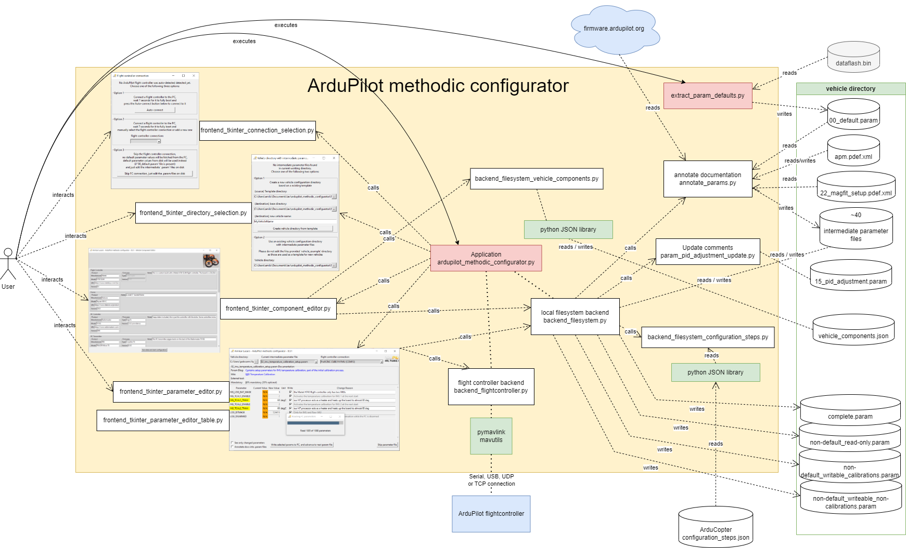

# Development guide
<!--
SPDX-FileCopyrightText: 2024 Amilcar do Carmo Lucas <amilcar.lucas@iav.de>

SPDX-License-Identifier: GPL-3.0-or-later
-->

The goal *ArduPilot methodic Configurator* software is to automate some of the tasks involved in configuring and tuning  ArduPilot-based vehicles.
To develop the software the [standard V-Model software development method](https://en.wikipedia.org/wiki/V-model_(software_development)) was first used.
It was augmented with [DevOps](https://en.wikipedia.org/wiki/DevOps) and [CI/CD automation](https://en.wikipedia.org/wiki/CI/CD) practices at a later stage.

## V-model

### Requirements analysis

We collected and analyzed the needs of the ArduPilot users:

- guidelines on how to correctly build the vehicle, many users are not aware of the hardware basics.
- a non-trial and error approach to set the [1300 ArduPilot parameters](https://ardupilot.org/copter/docs/parameters.html)
- a clear sequence of steps to take to configure the vehicle
- a way to save and load the configuration for later use
- a way to document how decisions where made during the configuration process
  - to be able to not repeat errors
  - to be able to reproduce the configuration on another similar bit different vehicle
  - to understand why decisions where made and their implications

Then we developed, documented and tested the *clear sequence of steps to take to configure the vehicle* in the
[How to methodically tune any ArduCopter](https://ardupilot.github.io/MethodicConfigurator/TUNING_GUIDE_ArduCopter) guide.
Once that was mostly done we proceeded with *system design* the next step of the V-model.

### System design

To automate the steps and processes in the [How to methodically tune any ArduCopter](https://ardupilot.github.io/MethodicConfigurator/TUNING_GUIDE_ArduCopter) guide
the following system design requirements were derived:

#### 1. Parameter Configuration Management

- The software must allow users to view parameter values
- The software must allow users to change parameter values
- For each step in the configuration sequence there must be a "partial/intermediate" parameter file
- The "partial/intermediate" parameter files must have meaningful names
- The sequence of the "partial/intermediate" parameter files must be clear
- Users should be able to upload all parameters from a "partial/intermediate" parameter file to the flight controller and advance to the next intermediate parameter file.
- Users should be able to upload a subset of parameters from a "partial/intermediate" parameter file to the flight controller and advance to the next intermediate parameter file.
- Users should be able to select a "partial/intermediate" parameter file from a list of available files and select the one to be used.
- The software must display a table of parameters with columns for:
  - the parameter name,
  - current value,
  - new value,
  - unit,
  - upload to flight controller,
  - and change reason.
- The software must validate the new parameter values and handle out-of-bounds values gracefully, reverting to the old value if the user chooses not to use the new value.
- The software must save parameter changes to both the flight controller and the intermediate parameter files

#### 2. Communication Protocols

- The software must support communication with the drone's flight controller using [MAVlink](https://mavlink.io/en/).
- Use either [parameter protocol](https://mavlink.io/en/services/parameter.html) or [FTP-over-MAVLink](https://mavlink.io/en/services/ftp.html) protocols.
- The software must automatically reset the ArduPilot if required by the changes made to the parameters.
  - parameters ending in "_TYPE", "_EN", "_ENABLE", "SID_AXIS" require a reset after being changed
- The software must automatically validate if the parameter was correctly uploaded to the flight controller
  - It must re-upload any parameters that failed to be uploaded correctly
- The software must manage the connection to the flight controller, including establishing, maintaining, and closing the connection.
- Users should be able to reconnect to the flight controller if the connection is lost.

#### 3. User Interface

- The software must provide a user-friendly interface with clear navigation and controls.
- The interface must be responsive and adapt to different screen sizes and resolutions.
- Users should be able to toggle between showing only changed parameters and showing all parameters.
- Users should be able to skip to the next parameter file without uploading changes.
- The software must ensure that all changes made to entry widgets are processed before proceeding with other actions, such as uploading parameters to the flight controller.
- Read-only parameters are displayed in red, Sensor Calibrations are displayed in yellow and non-existing parameters in blue
- Users should be able to edit the new value for each parameter directly in the table.
- Users should be able to edit the reason changed for each parameter directly in the table.
- The software must perform efficiently, with minimal lag or delay in response to user actions.

#### 4. Documentation and Help

- The software must include comprehensive documentation and help resources.
- The software must provide tooltips for each GUI widget.
- The software must provide tooltips for each parameter to explain their purpose and usage.
- Users should be able to access the blog post and other resources for more information on the software and its usage.

#### 5. Error Handling and Logging

- The software must provide feedback to the user, such as success or error messages, after each action.
- The software must handle errors gracefully and provide clear error messages to the user.
- The software must log events and errors for debugging and auditing purposes to the console.

#### 6. Parameter File Management

- The software must support the loading and parsing of parameter files.
- Comments are first-class citizens and are preserved when reading/writing files
- The software must write at the end of the configuration the following summary files:
  - Complete flight controller *reason changed* annotated parameters in `complete.param` file
  - Non-default, read-only *reason changed* annotated parameters in, `non-default_read-only.param` file
  - Non-default, writable calibrations *reason changed* annotated parameters in `non-default_writable_calibrations.param` file
  - Non-default, writable non-calibrations *reason changed* annotated parameters in `non-default_writable_non-calibrations.param` file

#### 7. Customization and Extensibility

- The software must be extensible to support new drone models and parameter configurations.
- Users should be able to customize the software's behavior through configuration files:
  - `configuration_steps_ArduCopter.json`, `configuration_steps_ArduPlane.json`, etc
  - `vehicle_components.json`
  - intermediate parameter files (`*.param`)

#### 8. Automation of development processes

- As many of the development processes should be automated as possible
- Development should use industry best practices:
  - Use git as version control and host the project on [ArduPilot GitHub repository](https://github.com/ArduPilot/MethodicConfigurator)
  - Start with a V-Model development until feature completeness, then switch to DevOps ASAP.
  - [Test-driven development](https://en.wikipedia.org/wiki/Test-driven_development) (TDD)
  - [DevOps](https://en.wikipedia.org/wiki/DevOps)
  - [CI/CD automation](https://en.wikipedia.org/wiki/CI/CD)
  - git pre-commit hooks for code linting and other code quality checks

### The Software architecture

We decided to use python as programming language, and the following libraries and frameworks:

- [pymavlink](https://github.com/ArduPilot/pymavlink) for the flight controller communication
- [tkinter](https://docs.python.org/3/library/tkinter.html) for the graphical user interface
- `po` files to translate the software to other languages

To satisfy the system design requirements described above the following software architecture was developed:

It consists of four main components:

1. the application itself does the command line parsing and starts the other processes
   1. [`__main__.py`](ardupilot_methodic_configurator/__main__.py)
   2. [`common_arguments.py`](ardupilot_methodic_configurator/common_arguments.py)
   3. [`__init.py__`](ardupilot_methodic_configurator/__init__.py)
2. the local filesystem backend does file I/O on the local file system. Operates mostly on parameter files and metadata/documentation files
   1. [`backend_filesystem.py`](ardupilot_methodic_configurator/backend_filesystem.py)
   2. [`backend_filesystem_vehicle_components.py`](ardupilot_methodic_configurator/backend_filesystem_vehicle_components.py)
   3. [`backend_filesystem_configuration_steps.py`](ardupilot_methodic_configurator/backend_filesystem_configuration_steps.py)
3. the flight controller backend communicates with the flight controller
   1. [`backend_flight_controller.py`](ardupilot_methodic_configurator/backend_flight_controller.py)
   2. [`backend_mavftp.py`](ardupilot_methodic_configurator/backend_mavftp.py)
   3. [`param_ftp.py`](ardupilot_methodic_configurator/param_ftp.py)
   4. [`battery_cell_voltages.py`](ardupilot_methodic_configurator/battery_cell_voltages.py)
4. the tkinter frontend, which is the GUI the user interacts with
   1. [`frontend_tkinter_base.py`](ardupilot_methodic_configurator/frontend_tkinter_base.py)
   2. [`frontend_tkinter_connection_selection.py`](ardupilot_methodic_configurator/frontend_tkinter_connection_selection.py)
   3. [`frontend_tkinter_directory_selection.py`](ardupilot_methodic_configurator/frontend_tkinter_directory_selection.py)
   4. [`frontend_tkinter_component_editor.py`](ardupilot_methodic_configurator/frontend_tkinter_component_editor.py)
   5. [`frontend_tkinter_component_editor_base.py`](ardupilot_methodic_configurator/frontend_tkinter_component_editor_base.py)
   6. [`frontend_tkinter_parameter_editor.py`](ardupilot_methodic_configurator/frontend_tkinter_parameter_editor.py)
   7. [`frontend_tkinter_parameter_editor_table.py`](ardupilot_methodic_configurator/frontend_tkinter_parameter_editor_table.py)



The parts can be individually tested, and do have unit tests.
They can also be exchanged, for instance, [tkinter-frontend](https://docs.python.org/3/library/tkinter.html) can be replaced with [wxWidgets](https://www.wxwidgets.org/) or [pyQt](https://riverbankcomputing.com/software/pyqt/intro).

In the future, we might port the entire application into a client-based web application.
That way the users would not need to install the software and will always use the latest version.

### Module design

To assure code quality we decided to use Microsoft VS code with a [lot of extensions](SetupDeveloperPc.bat) to lint the code as you type.
We use git [pre-commit](https://pre-commit.com/) hooks to [check the code](.pre-commit-config.yaml) before it is committed to the repository.

### Unit testing

We use [unittest](https://docs.python.org/3/library/unittest.html) to write unit tests for the code.
The tests are easy to run on the command line or in VS code. Tests and coverage report are run automatically in the github CI pipeline.

### Integration testing

The four different sub-applications are first tested independently.

- flight controller connection GUI
- vehicle configuration directory selection GUI
- vehicle component editor GUI
- parameter editor and uploader GUI

Only after each one performs 100% as expected, they are integrated and tested together.
This speeds up the development process.

### System testing

Here the integrated application was tested against the system requirements defined above.
The tests were conducted on windows and linux machines using multiple different flight controllers and firmware versions.
The software is automatically build and distributed using the github CD pipeline.

### Acceptance testing

The software was tested by multiple users with different skill levels, languages, flight controller and backgrounds.
The feedback was used to improve the user interface and user experience.
The software is ready for production use since November 2024.

## DevOps

The software is feature complete and stable with a user base of hundreds of users, we switched from the V-Model to DevOps development process on November 2024.
This provides faster response to requirements changes and additions.

## Adding a translation

To add a new translation language to the Ardupilot Methodic Configurator, follow the steps below.
This process involves creating a new language folder in the locale directory and generating the necessary translation files.
You will use the `create_pot_file.py` script to extract the strings that need translation and create a `.pot` file, which serves as a template for the translation.

### 1. Set Up Your Locale Directory

Navigate to the `locale` directory inside your project:

```bash
cd ardupilot_methodic_configurator/locale
```

### 2. Create a New Language Directory

Create a new folder for the language you want to add. The name of the folder should follow the standard language code format (e.g., de for German, fr for French).

```bash
mkdir <language_code>
```

For example, to add support for German:

```bash
mkdir de
```

### 3. Generate a Template POT File

If you haven't already generated a `.pot` file, you can do so by running the `create_pot_file.py` script in the project root directory.
This script will extract all translatable strings from the project files and create a `.pot` file.

Ensure you are in the root directory of your project, and execute the following command:

```bash
python create_pot_file.py
```

This will create a file named `ardupilot_methodic_configurator.pot` inside the `ardupilot_methodic_configurator/locale` directory.

### 4. Create a New PO File

Inside your newly created language directory, create a new `.po` file using the `.pot` template:

```bash
cd de
mkdir LC_MESSAGES
cp ../ardupilot_methodic_configurator.pot LC_MESSAGES/ardupilot_methodic_configurator.po
```

### 5. Bulk translate the strings (optional)

You can bootstrap your translation using translation services that translate full files.
To do so navigate to the project root and issue:

```bash
python extract_missing_translations.py --lang-code=de
```

Store the result of the bulk translations into a `translations.txt` file.
Insert the translations into the .po file:

```bash
python insert_translations.py --lang-code=de
```

### 6. Translate the Strings

Open the `ardupilot_methodic_configurator.po` file in a text editor or a specialist translation tool (e.g., [Poedit](https://poedit.net/)). You will see the extracted strings, which you can begin translating.

Each entry will look like this:

```text
msgid "Original English String"
msgstr ""
```

Fill in the `msgstr` lines with your translations:

```text
msgid "Original English String"
msgstr "Translated String"
```

### 7. Compile the PO File

Once you have completed your translations, you will need to compile the `.po` file into a binary `.mo` file. This can be done using the command:

```bash
wsl python3 create_mo_files.py
```

Make sure you have `msgfmt` installed, which is part of the *GNU gettext* package.

### 8. Test the New Language

Now add the language to the end of the `LANGUAGE_CHOICES` array in the `ardupilot_methodic_configurator/internationalization.py` file.

```python
LANGUAGE_CHOICES = ['en', 'zh_CN', 'pt', 'de']
```

And add it also to the `[Languages]` and `[Icons]` sections of the `windows/ardupilot_methodic_configurator.iss` file.

```text
[Languages]
Name: "en"; MessagesFile: "compiler:Default.isl"
Name: "zh_CN"; MessagesFile: "compiler:Languages\ChineseSimplified.isl"
Name: "pt"; MessagesFile: "compiler:Languages\Portuguese.isl"
Name: "de"; MessagesFile: "compiler:Languages\German.isl"
...

[Icons]
...
Name: "{commondesktop}\{#MyAppName}"; Filename: "{app}\{#MyAppExeName}"; WorkingDir: "{userappdata}\.ardupilot_methodic_configurator"; Tasks: desktopicon; IconFilename: "{app}\MethodicConfigurator.ico"; Parameters: "--language {language}"; Languages: zh_CN pt de
...
```

With the new `.mo` file created, you should ensure the software correctly loads the new language.
Update the software's configuration to set the desired language and run the application to test your translations.

### 9. Review and Refine

Once the new language is running in the software, review the translations within the application for clarity and correctness. Make adjustments as needed in the `.po` file and recompile to an `.mo` file.

Following these steps should enable you to successfully add support for any new translation language within the Ardupilot Methodic Configurator.
