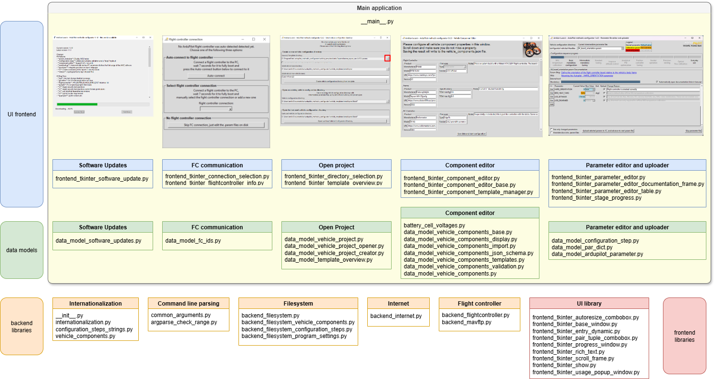
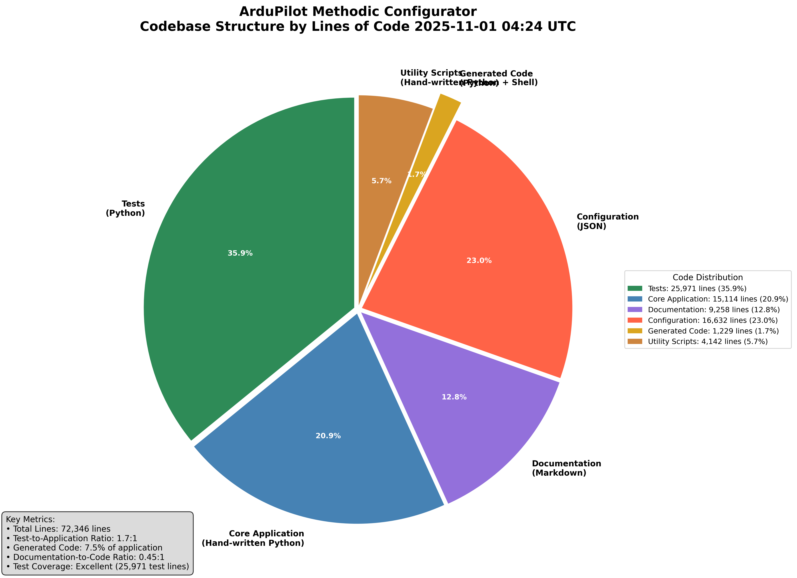

# Development guide

The goal *ArduPilot methodic Configurator* software is to automate some of the tasks involved in configuring and tuning  ArduPilot-based vehicles.
To develop the software the [standard V-Model software development method](https://en.wikipedia.org/wiki/V-model_(software_development)) was first used.
It was augmented with [DevOps](https://en.wikipedia.org/wiki/DevOps) and [CI/CD automation](https://en.wikipedia.org/wiki/CI/CD) practices at a later stage.

## V-model

Development started by using the classic V-model development methodology.


If the diagram above does not display correctly, [see here](https://github.com/ArduPilot/MethodicConfigurator/blob/master/ARCHITECTURE.md#v-model)

### The Software architecture

We decided to use python as programming language, and the following libraries and frameworks:

- [pymavlink](https://github.com/ArduPilot/pymavlink) for the flight controller communication
- [tkinter](https://docs.python.org/3/library/tkinter.html) for the graphical user interface
- GNU gettext `po` files to translate the software to other languages

The (main) application itself does the command line parsing and starts the sub-applications defined below in sequence

- [`__main__.py`](ardupilot_methodic_configurator/__main__.py)

To satisfy the [system design requirements](https://ardupilot.github.io/MethodicConfigurator/SYSTEM_REQUIREMENTS) the following user interface sub-applications were developed:

#### Sub-Application Architecture Documentation

Each sub-application has detailed architecture documentation covering requirements, implementation status, data flow, components, testing, and recommendations:

1. **[Software Update Check](ARCHITECTURE_1_software_update.md)** - Checks for and downloads software updates
   - [`frontend_tkinter_software_update.py`](ardupilot_methodic_configurator/frontend_tkinter_software_update.py)
   - [`data_model_software_updates.py`](ardupilot_methodic_configurator/data_model_software_updates.py)

2. **[Flight Controller Communication](ARCHITECTURE_2_flight_controller_communication.md)** - Establishes FC connection, downloads parameters and metadata
   - [`frontend_tkinter_connection_selection.py`](ardupilot_methodic_configurator/frontend_tkinter_connection_selection.py)
     - [`frontend_tkinter_flightcontroller_info.py`](ardupilot_methodic_configurator/frontend_tkinter_flightcontroller_info.py)
     - [`backend_flightcontroller.py`](ardupilot_methodic_configurator/backend_flightcontroller.py) - Main facade class using delegation pattern
       - [`backend_flightcontroller_connection.py`](ardupilot_methodic_configurator/backend_flightcontroller_connection.py) - Connection management
       - [`backend_flightcontroller_params.py`](ardupilot_methodic_configurator/backend_flightcontroller_params.py) - Parameter operations
       - [`backend_flightcontroller_commands.py`](ardupilot_methodic_configurator/backend_flightcontroller_commands.py) - Command execution
       - [`backend_flightcontroller_files.py`](ardupilot_methodic_configurator/backend_flightcontroller_files.py) - File operations
       - [`data_model_flightcontroller_info.py`](ardupilot_methodic_configurator/data_model_flightcontroller_info.py) - FC information
       - [`backend_flightcontroller_protocols.py`](ardupilot_methodic_configurator/backend_flightcontroller_protocols.py) - Protocol definitions
     - [`backend_mavftp.py`](ardupilot_methodic_configurator/backend_mavftp.py)

3. **[Directory and Project Selection](ARCHITECTURE_3_directory_selection.md)** - Creates new projects or opens existing ones
   - [`frontend_tkinter_directory_selection.py`](ardupilot_methodic_configurator/frontend_tkinter_directory_selection.py)
     - [`frontend_tkinter_template_overview.py`](ardupilot_methodic_configurator/frontend_tkinter_template_overview.py)

4. **[Vehicle Component Editor](ARCHITECTURE_4_component_editor.md)** - Defines vehicle components and their FC connections
   - [`frontend_tkinter_component_editor.py`](ardupilot_methodic_configurator/frontend_tkinter_component_editor.py)
     - [`frontend_tkinter_component_editor_base.py`](ardupilot_methodic_configurator/frontend_tkinter_component_editor_base.py)
     - [`frontend_tkinter_component_template_manager.py`](ardupilot_methodic_configurator/frontend_tkinter_component_template_manager.py)

5. **[Parameter Editor and Uploader](ARCHITECTURE_5_parameter_editor.md)** - Views documentation, edits parameters, uploads to FC
   - sequentially for each configuration step:
     - view documentation relevant for the current configuration step,
     - edit parameters relevant for the current configuration step,
     - upload them to the flight controller,
     - save them to file
   - [`frontend_tkinter_parameter_editor.py`](ardupilot_methodic_configurator/frontend_tkinter_parameter_editor.py)
     - [`frontend_tkinter_parameter_editor_documentation_frame.py`](ardupilot_methodic_configurator/frontend_tkinter_parameter_editor_documentation_frame.py)
     - [`frontend_tkinter_parameter_editor_table.py`](ardupilot_methodic_configurator/frontend_tkinter_parameter_editor_table.py)
     - [`frontend_tkinter_stage_progress.py`](ardupilot_methodic_configurator/frontend_tkinter_stage_progress.py)

6. **[Motor Test](ARCHITECTURE_motor_test.md)** - Provides motor testing functionality with visual diagram display
   - [`frontend_tkinter_motor_test.py`](ardupilot_methodic_configurator/frontend_tkinter_motor_test.py)
   - [`data_model_motor_test.py`](ardupilot_methodic_configurator/data_model_motor_test.py)

Each sub-application can be run in isolation, so it is easier to test and develop them.

#### Data Models and Architecture

Each application separates the business logic (`data_model_*.py`) from the user interface logic (`frontend_tkinter_*.py`).
This improves testability and maintainability of the code.

1. Check for software updates:
   1. [`data_model_software_updates.py`](ardupilot_methodic_configurator/data_model_software_updates.py)
1. FC connection:
   1. [`data_model_fc_ids.py`](ardupilot_methodic_configurator/data_model_fc_ids.py) <- autogenerated by `update_flight_controller_ids.py`
1. Create or open project:
   1. [`data_model_vehicle_project.py`](ardupilot_methodic_configurator/data_model_vehicle_project.py)
   1. [`data_model_vehicle_project_creator.py`](ardupilot_methodic_configurator/data_model_vehicle_project_creator.py)
   1. [`data_model_vehicle_project_opener.py`](ardupilot_methodic_configurator/data_model_vehicle_project_opener.py)
   1. [`data_model_template_overview.py`](ardupilot_methodic_configurator/data_model_template_overview.py)
1. Component editor:
   1. [`battery_cell_voltages.py`](ardupilot_methodic_configurator/battery_cell_voltages.py)
   1. [`data_model_vehicle_components_base.py`](ardupilot_methodic_configurator/data_model_vehicle_components_base.py)
   1. [`data_model_vehicle_components_display.py`](ardupilot_methodic_configurator/data_model_vehicle_components_display.py)
   1. [`data_model_vehicle_components_import.py`](ardupilot_methodic_configurator/data_model_vehicle_components_import.py)
   1. [`data_model_vehicle_components_json_schema.py`](ardupilot_methodic_configurator/data_model_vehicle_components_json_schema.py)
   1. [`data_model_vehicle_components_templates.py`](ardupilot_methodic_configurator/data_model_vehicle_components_templates.py)
   1. [`data_model_vehicle_components_validation.py`](ardupilot_methodic_configurator/data_model_vehicle_components_validation.py)
   1. [`data_model_vehicle_components.py`](ardupilot_methodic_configurator/data_model_vehicle_components.py)
1. Parameter editor:
   1. [`data_model_configuration_step.py`](ardupilot_methodic_configurator/data_model_configuration_step.py)
   1. [`data_model_par_dict.py`](ardupilot_methodic_configurator/data_model_par_dict.py)
   1. [`data_model_ardupilot_parameter.py`](ardupilot_methodic_configurator/data_model_ardupilot_parameter.py)

The detailed data models, components, and dependencies for each sub-application are documented in their respective architecture files linked above.

#### Common Libraries and Shared Components

All applications use one or more of the following shared libraries:

1. internationalization
   1. [`__init__.py`](ardupilot_methodic_configurator/__init__.py)
   1. [`internationalization.py`](ardupilot_methodic_configurator/internationalization.py)
   1. [`configuration_steps_strings.py`](ardupilot_methodic_configurator/configuration_steps_strings.py) <- autogenerated by `update_configuration_steps_translation.py`
   1. [`vehicle_components.py`](ardupilot_methodic_configurator/vehicle_components.py) <- autogenerated by `update_vehicle_components_translation.py`
1. command line parsing
   1. [`common_arguments.py`](ardupilot_methodic_configurator/common_arguments.py)
   1. [`argparse_check_range.py`](ardupilot_methodic_configurator/argparse_check_range.py)
1. the local filesystem backend does file I/O on the local file system. Operates mostly on parameter files and metadata/documentation files
   1. [`backend_filesystem.py`](ardupilot_methodic_configurator/backend_filesystem.py)
   2. [`backend_filesystem_vehicle_components.py`](ardupilot_methodic_configurator/backend_filesystem_vehicle_components.py)
   3. [`backend_filesystem_configuration_steps.py`](ardupilot_methodic_configurator/backend_filesystem_configuration_steps.py)
   4. [`backend_filesystem_program_settings.py`](ardupilot_methodic_configurator/backend_filesystem_program_settings.py)
1. the internet backend communicates with the internet
   1. [`backend_internet.py`](ardupilot_methodic_configurator/backend_internet.py)
1. the flight controller backend communicates with the flight controller using a **delegation pattern** with specialized managers:
   1. [`backend_flightcontroller.py`](ardupilot_methodic_configurator/backend_flightcontroller.py) -
     Main facade class that delegates to specialized managers
   2. [`backend_flightcontroller_connection.py`](ardupilot_methodic_configurator/backend_flightcontroller_connection.py) -
     Handles connection establishment, port discovery, and heartbeat detection
   3. [`backend_flightcontroller_params.py`](ardupilot_methodic_configurator/backend_flightcontroller_params.py) -
     Manages parameter download, upload, and querying
   4. [`backend_flightcontroller_commands.py`](ardupilot_methodic_configurator/backend_flightcontroller_commands.py) -
     Executes MAVLink commands (motor tests, battery status, etc.)
   5. [`backend_flightcontroller_files.py`](ardupilot_methodic_configurator/backend_flightcontroller_files.py) -
     Handles file upload/download via MAVFTP
   6. [`data_model_flightcontroller_info.py`](ardupilot_methodic_configurator/data_model_flightcontroller_info.py) -
     Stores flight controller metadata and capabilities
   7. [`backend_flightcontroller_protocols.py`](ardupilot_methodic_configurator/backend_flightcontroller_protocols.py) -
     Protocol definitions for dependency injection and testing
   8. [`backend_mavftp.py`](ardupilot_methodic_configurator/backend_mavftp.py) - MAVFTP protocol implementation

   **Flight Controller Backend Architecture:**
   - The `FlightController` class acts as a facade, delegating operations to specialized managers
   - Each manager handles a specific concern (connection, parameters, commands, files)
   - Managers can reference each other (e.g., params manager holds reference to connection manager)
   - Protocol definitions enable dependency injection for testing
   - Connection manager is the source of truth for connection state (`master`, `comport`, `info`)
   - Other managers query connection manager for current state rather than caching it

   **Error Handling Standards:**

   To maintain consistency across the flight controller backend, the following error handling patterns are used:

   1. **Connection and I/O Operations** - Return `str` (empty string on success, error message on failure):
      - `connect()`, `disconnect()`, `register_and_try_connect()`
      - Rationale: Allows user-friendly error messages to be displayed directly

   2. **Command Operations** - Return `tuple[bool, str]` (success flag, error message):
      - `test_motor()`, `test_all_motors()`, `reset_all_parameters_to_default()`
      - Rationale: Separates success/failure from error details for better control flow

   3. **Query Operations** - Return `Optional[T]` or raise exceptions:
      - `fetch_param()` - raises `TimeoutError` on timeout
      - `get_battery_status()` - returns `tuple[Optional[tuple[float, float]], str]`
      - Rationale: Distinguishes between "not found" (None) and "error" (exception)

   4. **Bulk Operations** - Return data structures or tuples:
      - `download_params()` - returns `tuple[dict[str, float], ParDict]`
      - Rationale: Success implied by returned data, errors logged but not returned

   **Testing Hacks and Violations:**

   The following methods exist for testing purposes only and violate architectural principles:

   - `FlightController.set_master_for_testing()` - Directly mutates connection manager's internal state,
     violating the principle that connection manager should be the sole mutator of connection state.
     **Never use in production code.**

   - Test parameter loading via `device=DEVICE_FC_PARAM_FROM_FILE` in `backend_flightcontroller_params.py` - Bypasses normal
     parameter download flow to load from local file.

1. the tkinter frontend, which is the GUI the user interacts with
   1. [`frontend_tkinter_autoresize_combobox.py`](ardupilot_methodic_configurator/frontend_tkinter_autoresize_combobox.py)
   1. [`frontend_tkinter_base_window.py`](ardupilot_methodic_configurator/frontend_tkinter_base_window.py)
   1. [`frontend_tkinter_entry_dynamic.py`](ardupilot_methodic_configurator/frontend_tkinter_entry_dynamic.py)
   1. [`frontend_tkinter_pair_tuple_combobox.py`](ardupilot_methodic_configurator/frontend_tkinter_pair_tuple_combobox.py)
   1. [`frontend_tkinter_progress_window.py`](ardupilot_methodic_configurator/frontend_tkinter_progress_window.py)
   1. [`frontend_tkinter_rich_text.py`](ardupilot_methodic_configurator/frontend_tkinter_rich_text.py)
   1. [`frontend_tkinter_scroll_frame.py`](ardupilot_methodic_configurator/frontend_tkinter_scroll_frame.py)
   1. [`frontend_tkinter_show.py`](ardupilot_methodic_configurator/frontend_tkinter_show.py)
   1. [`frontend_tkinter_usage_popup_window.py`](ardupilot_methodic_configurator/frontend_tkinter_usage_popup_window.py)

When all is combined it looks like this:



The parts can be individually tested, and do have unit tests.
They can also be exchanged, for instance, [tkinter-frontend](https://docs.python.org/3/library/tkinter.html) can be replaced with
[wxWidgets](https://www.wxwidgets.org/) or [pyQt](https://riverbankcomputing.com/software/pyqt/intro).

In the future, we might port the entire application into a client-based web application.
That way the users would not need to install the software and will always use the latest version.

#### Generated Files

Several files in the project are automatically generated and should not be manually edited:

##### Core Application Generated Files

1. [`data_model_fc_ids.py`](ardupilot_methodic_configurator/data_model_fc_ids.py) <- autogenerated by `update_flight_controller_ids.py`
   - Contains flight controller hardware identification mappings
   - Generated from ArduPilot firmware metadata

2. [`configuration_steps_strings.py`](ardupilot_methodic_configurator/configuration_steps_strings.py) <- autogenerated by `update_configuration_steps_translation.py`
   - Contains translatable strings for configuration step descriptions
   - Generated from configuration JSON files for internationalization

3. [`vehicle_components.py`](ardupilot_methodic_configurator/vehicle_components.py) <- autogenerated by `update_vehicle_components_translation.py`
   - Contains translatable strings for vehicle component descriptions
   - Generated from vehicle component JSON schemas for internationalization

#### Development and Analysis Tools

1. [`generate_codebase_pie_chart.py`](scripts/generate_codebase_pie_chart.py) <- generated by AI assistant for codebase analysis
   - Creates pie chart visualizations of codebase structure
   - Automatically maintains codebase metrics and statistics
   - Part of the development workflow for project health assessment

2. [`download_motor_diagrams.py`](scripts/download_motor_diagrams.py) <- autogenerated by `.github/instructions/update_motor_diagrams.md`
   - Downloads motor diagram SVG files from ArduPilot documentation
   - Updates motor diagrams used in the motor test sub-application
   - Periodically updated via GitHub Actions workflow

**Note**: When calculating code metrics or performing codebase analysis, these generated files should be counted separately
from hand-written code to provide accurate development statistics.

### Module design

To assure code quality we decided to use Microsoft VS code with a [lot of extensions](SetupDeveloperPC.bat) to lint the code as you type.
We use git [pre-commit](https://pre-commit.com/) hooks to [check the code](.pre-commit-config.yaml) before it is committed to the repository.

### Module testing

We tested using **automated static tests** in both pre-commit hooks and on github CI:

- ruff
- pylint
- mypy
- pyright
- markdown-lint
- markdown-link-check
- codespell, grammarly
- shellcheck

We tested using **automated dynamic tests** on github CI including automated test coverage reports.
We use [unittest](https://docs.python.org/3/library/unittest.html) to write unit tests for the code.
The tests are easy to run on the command line or in VS code.
When you write new code you must also write tests in the `tests/` directory, there is CI test that only passes if test coverage increases monotonically.

To run the tests either use the python tests plugin in visualstudio code, or execute:

```bash
pytest
```

### Integration testing

The different sub-applications are first tested independently.
Each has detailed testing strategies documented in their respective architecture files:

- **[Software Update](ARCHITECTURE_1_software_update.md#testing-analysis)** - `python .\ardupilot_methodic_configurator\data_model_software_updates.py`
- **[Flight Controller Communication](ARCHITECTURE_2_flight_controller_communication.md#testing-analysis)** - `python .\ardupilot_methodic_configurator\frontend_tkinter_connection_selection.py`
- **[Directory Selection](ARCHITECTURE_3_directory_selection.md#testing-strategy)**
  - `python .\ardupilot_methodic_configurator\frontend_tkinter_directory_selection.py`
  - `python .\ardupilot_methodic_configurator\frontend_tkinter_template_overview.py`
- **[Component Editor](ARCHITECTURE_4_component_editor.md#testing-strategy)** - `python .\ardupilot_methodic_configurator\frontend_tkinter_component_editor.py`
- **[Parameter Editor](ARCHITECTURE_5_parameter_editor.md#testing-strategy)** - `python .\ardupilot_methodic_configurator\frontend_tkinter_parameter_editor.py`
- **[Motor Test](ARCHITECTURE_motor_test.md#testing-strategy)** - `python .\ardupilot_methodic_configurator\frontend_tkinter_motor_test.py`

Only after each one performs 100% as expected, they are integrated and tested together.
This speeds up the development process.

### System testing

Here the integrated application was tested against the system requirements defined above.
The tests were conducted on windows and Linux machines using multiple different flight controllers and firmware versions.
The software is automatically build and distributed using the github CD pipeline.

### Acceptance testing

The software was tested by multiple users with different skill levels, languages, flight controller and backgrounds.
The feedback was used to improve the user interface and user experience.
The software is ready for production use since November 2024.

## DevOps

The software is feature complete and stable with a user base of hundreds of users, we switched from the V-Model to DevOps development process on November 2024.
This provides faster response to requirements changes and additions.



## Do a release

The release process is automated.
To do a release navigate to the [bump_version_and_tag workflow](https://github.com/ArduPilot/MethodicConfigurator/actions/workflows/bump_version_and_tag.yml)
and select `Run Workflow` enter the version and the description and press the green `Run Workflow` button.


<!-- Gurubase Widget -->
<script async src="https://widget.gurubase.io/widget.latest.min.js"
    data-widget-id="uE4kxEE4LY3ZSyfNsF5bU6gIOnWGTBOL_e16KwDH-0g"
    data-text="Ask AI"
    data-margins='{"bottom": "1rem", "right": "1rem"}'
    data-light-mode="true"
    id="guru-widget-id">
</script>
