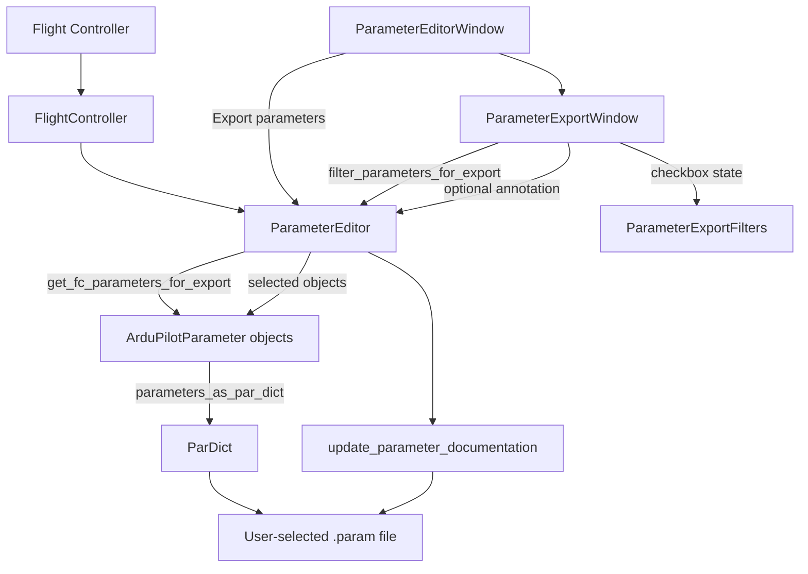

# Flight-Controller Parameter Export Architecture

## Overview

The flight-controller parameter export feature creates a standalone `.param` snapshot of the
current ArduPilot flight-controller (FC) values. It is launched from the Parameter Editor and
uses a modal Tkinter window to let the user select parameter categories before choosing an output
filename.

The export workflow is deliberately separate from the sequential configuration-step workflow:

- It exports values currently held by the FC, not the values staged in the active AMC parameter file.
- It does not change the current configuration step or upload anything to the FC.
- It does not write the exported file into the AMC-managed parameter sequence unless the user
  explicitly chooses that location in the save dialog.
- It can optionally add documentation comments to the selected output file.

## Requirements and Implementation Status

### Functional Requirements

1. **FC-connected entry point**: the Parameter Editor enables the export action
  only when current FC values are available and passes an independent FC snapshot to the modal.
2. **Category filtering**: the modal exposes four filter pairs, applies the
  selected pairs with AND semantics, and updates the matching count as selections change. User
  explanations and selection guidance are documented in
  [USERMANUAL_fc_parameter_export.md](USERMANUAL_fc_parameter_export.md).
3. **Value classification**: the data model classifies calibration, read-only,
  default, and limit state using ArduPilot metadata and current FC values.
4. **Descriptive filename**: the save dialog receives a vehicle- and
  filter-derived `.param` filename suggestion.
5. **Parameter serialization**: selected values are converted to `ParDict` and
  written using the standard Mission Planner serializer. MAVProxy and QGroundControl formats are
  not implemented.
6. **Optional annotation**: the selected output file may be annotated with
  cached ArduPilot documentation.
7. **Standalone FC-backed entry point**: the module connects to a real FC,
  downloads values/defaults, opens the same modal, and disconnects after the GUI closes.

### Non-Functional Requirements

- **Separation of concerns**: the frontend owns selection and dialogs; the
  parameter editor owns classification, conversion, and export orchestration; FC and filesystem
  adapters provide external data and I/O.
- **Internationalization**: visible labels, tooltips, dialog text, and errors
  use gettext translation markers.
- **Modal safety**: the export window is transient to the Parameter Editor and
  uses a Tk grab on platforms where grabs are supported.
- **Portability safeguards** ⚠️ **PARTIALLY IMPLEMENTED**: calibration values can be filtered out,
  but the export workflow does not prevent a user from deliberately exporting or importing a file
  containing calibration values.
- **Progress reporting** ⚠️ **PARTIALLY IMPLEMENTED**: the normal export dialog operates on already
  downloaded FC values. The standalone entry point downloads before opening the dialog but does not
  display a dedicated download progress window.

## Architecture

### Component Relationships

### Components

#### Parameter Editor Entry Point

- **File**: `ardupilot_methodic_configurator/frontend_tkinter_parameter_editor.py` ✅
- **Methods**: `_create_conf_widgets()`, `on_export_parameters_click()`
- **Responsibilities**:
  - Add and enable the export action only when FC values are available.
  - Request an independent snapshot of the current FC parameters.
  - Construct the modal `ParameterExportWindow`.
  - Leave the active configuration-step state unchanged.

#### Export Window

- **File**: `ardupilot_methodic_configurator/frontend_tkinter_parameter_export.py` ✅
- **Class**: `ParameterExportWindow`
- **Responsibilities**:
  - Own the modal window lifecycle.
  - Render the four filter pairs and explanatory tooltips.
  - Maintain checkbox state and update the matching-parameter count.
  - Build the suggested filename from the connected vehicle type and filters.
  - Open the save dialog and delegate export work to `ParameterEditor`.
  - Display export errors and close after a successful export.

The window uses a small parent interface containing `root`, `parameter_editor`, and `ui`. The
standalone harness supplies that interface with a typed cast because it intentionally does not
construct the full Parameter Editor window.

#### Export Filter Model

- **File**: `ardupilot_methodic_configurator/data_model_parameter_editor.py` ✅
- **Class**: `ParameterExportFilters`
- **Responsibilities**:
  - Store the eight boolean selector values.
  - Provide defaults matching the UI defaults.
  - Keep filter selection independent from persistent project state.

#### Parameter Editor Export Operations

- **File**: `ardupilot_methodic_configurator/data_model_parameter_editor.py` ✅
- **Methods**: `get_fc_parameters_for_export()`, `filter_parameters_for_export()`,
  `export_parameters()`, `parameters_as_par_dict()`
- **Responsibilities**:
  - Create independent `ArduPilotParameter` objects from the FC cache.
  - Apply all selected filter pairs with AND semantics.
  - Convert selected parameter objects to `ParDict`.
  - Write the selected values and optionally annotate the chosen file.

#### Parameter and Metadata Models

- **Files**:
  - `ardupilot_methodic_configurator/data_model_ardupilot_parameter.py`
  - `ardupilot_methodic_configurator/data_model_par_dict.py`
- **Responsibilities**:
  - Expose calibration, read-only, default, and limit state.
  - Compare FC values with documented defaults.
  - Check FC values against documented minimum and maximum values.
  - Serialize parameter values to Mission Planner `.param` lines.

#### External Adapters

- **Files**:
  - `ardupilot_methodic_configurator/backend_flightcontroller.py`
  - `ardupilot_methodic_configurator/backend_filesystem.py`
  - `ardupilot_methodic_configurator/annotate_params.py`
- **Responsibilities**:
  - Connect to the FC and download values/defaults for standalone operation.
  - Supply cached parameter metadata, defaults, and documentation.
  - Write the selected parameter file safely.
  - Add optional documentation comments to the output.

## Filter Semantics

`filter_parameters_for_export()` evaluates each selector pair and intersects the four row results.
Both selections in a pair accept every value for that property; neither selection accepts none.
The limit predicate is implemented as `inside limits = not outside limits`, where outside limits
means above the documented maximum or below the documented minimum. User-facing explanations and
examples are maintained in [USERMANUAL_fc_parameter_export.md](USERMANUAL_fc_parameter_export.md).

## Data Flow

### In-Application Export

1. The FC connection and parameter cache are established by the normal application flow.
2. The user presses `Export parameters` in the Parameter Editor.
3. `get_fc_parameters_for_export()` creates independent parameter objects from the FC cache and
   available metadata/defaults.
4. `ParameterExportWindow` initializes its default selector state and calculates the initial count.
5. The user changes selectors; each change re-runs `filter_parameters_for_export()` and updates the
   count.
6. The user presses `Export`.
7. The window builds the suggested filename and opens the `.param` save dialog.
8. The selected objects are filtered again using the current checkbox state.
9. `export_parameters()` converts the objects to `ParDict` and writes the selected file.
10. If annotation is enabled, documentation comments are added to the chosen file.
11. The modal closes without changing the active configuration step.

### Standalone Export

1. The module parses FC connection, vehicle, filesystem, and common logging arguments.
2. `FlightController.connect()` establishes a real FC connection.
3. `ParameterEditor.download_flight_controller_parameters()` downloads FC values and available
   defaults.
4. The standalone host creates the same `ParameterExportWindow` used by the main application.
5. The user performs the same filtering and export workflow.
6. Closing the host exits the Tk event loop.
7. A `finally` block disconnects the FC.

## Integration Points

- **Flight Controller Communication** ✅: uses `FlightController.connect()`, the parameter cache,
  and the normal FC download path.
- **Parameter Editor** ✅: launched from the editor and reuses its data-model facade.
- **ArduPilot Metadata** ✅: uses calibration/read-only/default/minimum/maximum metadata already
  loaded by the configuration-step processor.
- **Local Filesystem** ✅: uses cached documentation/defaults and safe parameter-file writing.
- **Internationalization** ✅: uses the project gettext function for all user-facing strings.
- **Configuration-step persistence** ✅: export does not update the current step, staged values, or
  upload status.
- **Alternative file formats** ❌ **TODO**: MAVProxy, QGroundControl, and user-selectable format
  support are not currently implemented by this workflow.

## Error Handling

- A failed standalone FC connection displays a user-facing connection error and does not open the
  export dialog.
- An empty save-dialog result cancels export without writing a file.
- `OSError` and `ValueError` from conversion, annotation, or file writing are displayed through the
  injected UI error service and leave the dialog open for correction or cancellation.
- The FC is disconnected in the standalone entry point's `finally` block.
- Parameter-range classification is read-only during export; the export operation does not modify
  FC values or validate them for upload.

## Testing Strategy

### Implemented Tests

- **File**: `tests/test_frontend_tkinter_parameter_export.py` ✅
  - Verifies filenames containing one selected option from every filter pair.
  - Verifies filenames for the non-category options.
  - Verifies that pairs with both options selected are omitted from the filename.
- **File**: `tests/test_frontend_tkinter_parameter_editor.py` ✅
  - Covers the Parameter Editor action-button integration and existing editor workflows.
- **File**: `tests/test_data_model_parameter_editor.py` ✅
  - Covers the surrounding parameter-editor data-model workflows.

### Coverage Gaps

- ❌ **TODO**: Dedicated tests for the Tk modal widget construction and tooltip attachment.
- ❌ **TODO**: Dedicated tests for every filter-pair combination and AND-intersection behavior.
- ❌ **TODO**: Dedicated tests for the save-dialog arguments and export error handling.
- ❌ **TODO**: Hardware-in-the-loop coverage for the standalone FC connection and download path.
- ❌ **TODO**: Dedicated tests for documentation annotation output.

## Security and Safety Considerations

- Calibration values can be board-specific and should normally be excluded when moving settings
  between flight controllers.
- Outside-limit values may be invalid or unsafe; the UI exposes them explicitly rather than
  silently dropping them.
- The export workflow performs no FC writes, reset, or reboot operations.
- Output writing uses the existing safe parameter-file writer rather than ad-hoc file handling.
- The user controls the destination path through the standard save dialog.

## Known Limitations and Recommendations

1. **Format support** ⚠️: add explicit format selection only when the supported output formats and
   their semantics are agreed upon.
2. **Filter test coverage** ⚠️: add focused data-model tests for pair truth tables, especially the
   neither-selected case and limit classification with missing metadata.
3. **Export progress** ⚠️: add a progress callback if export or standalone download needs to support
   very large parameter sets or slower links.
4. **Portability guidance** ⚠️: consider a stronger warning or separate action when calibration or
   outside-limit values are selected for export.
5. **Architecture integration** ✅: keep this workflow as a child of the Parameter Editor rather
   than duplicating FC connection, metadata loading, or parameter serialization logic.
