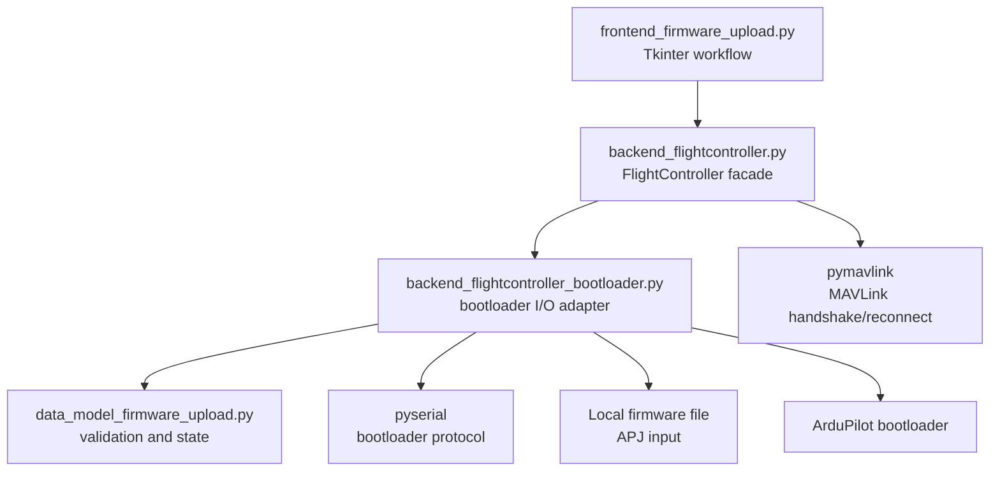

# Firmware Upload Architecture

## Overview

This feature allows a user to select an ArduPilot firmware image, validate it against
the connected flight controller, flash it through the board bootloader, and reconnect
to verify the result.

The feature follows the project separation described in [`ARCHITECTURE.md`](ARCHITECTURE.md):

- `backend_flightcontroller.py` provides the `FlightController` facade. It owns the
  active MAVLink connection, bootloader entry/reboot command, and reconnection.
- `backend_flightcontroller_bootloader.py` is the bootloader I/O adapter. It owns the
  serial port, ArduPilot bootloader protocol, firmware file reading, and progress events.
- `data_model_firmware_upload.py` is the business/domain model. It owns firmware
  metadata, board compatibility, validation, workflow state, and user-facing error
  classifications. It does not open files, access serial ports, use Tkinter, or talk
  directly to the flight controller.
- `frontend_firmware_upload.py` is the GUI. It owns file selection, confirmation,
  progress presentation, cancellation, and translated user messages. It delegates
  validation and upload operations to the model and backend.

The operation is deliberately separate from parameter configuration. Firmware flashing
may destroy the running connection and must not be performed as an implicit part of a
parameter upload or configuration-step transition.

## External protocol references

The implementation should be based on the maintained ArduPilot uploader and pymavlink
interfaces, rather than inventing a second bootloader protocol:

- [ArduPilot `Tools/scripts/uploader.py`](https://github.com/ArduPilot/ardupilot/blob/master/Tools/scripts/uploader.py)
  defines the PX4/ArduPilot serial bootloader protocol, APJ image format, board-ID
  validation, erase/program/verify sequence, and reboot handling.
- [ArduPilot bootloader documentation](https://ardupilot.org/dev/docs/bootloader.html)
  documents the supported serial flashing workflow and baud rates.
- [pymavlink](https://github.com/ArduPilot/pymavlink) supplies MAVLink connection,
  message packing, and serial abstractions for entering the bootloader and detecting
  the flight controller before and after flashing.

Firmware programming itself is not a normal MAVLink file transfer. MAVLink is used for
the reboot/bootloader-entry handshake, including a `COMMAND_ACK` check; a rejected
or armed vehicle is reported before the active MAVLink connection is released. Once the bootloader responds, the
bootloader serial protocol performs synchronization, erase, program, read-back verify,
and reboot.

## Component architecture



The existing `FlightController` facade and protocol definitions should expose the
feature through delegation, following the connection/params/commands/files managers.
The connection manager remains the source of truth for the active MAVLink connection;
the upload adapter may temporarily close and recreate that connection but must not
maintain a competing long-lived connection state. After reboot, the facade resolves
the captured stable serial identity before reconnecting so a changed serial device
path cannot silently target the old port. When USB metadata is unavailable on Linux,
it captures the resolved `/dev/serial/by-path` link before reboot and reopens that exact
link after re-enumeration.

## Requirements

### Functional requirements

1. Allow the user to choose a local ArduPilot firmware image.
2. Parse firmware metadata before opening or resetting the flight controller.
3. Validate the image format, image size, board ID, and supported bootloader protocol
   range before programming. Board revision is retained for display; no authoritative
   cross-board revision-compatibility map exists yet.
4. Require an explicit confirmation at the lowest write-capable API immediately before
   an irreversible erase/write, and a trusted SHA-256 of the exact APJ descriptor bytes
   before bootloader entry. The digest must come from an independently trusted manifest
   or release record, not from APJ metadata.
5. Enter the bootloader using the existing MAVLink connection when supported, with a
   documented unplug/replug fallback for boards that do not respond.
6. Discover and open the bootloader serial port at the configured baud rate.
7. Report synchronization, identification, erase, program, verify, and reboot stages.
8. Support cancellation only at safe protocol boundaries; never interrupt a write in
   the middle of a bootloader packet.
9. Verify the programmed image before rebooting whenever the bootloader supports it.
10. On every pre-erase cancellation, rejection, or failure after opening the
    bootloader, best-effort reboot it, close its port, and reconnect to the original
    flight controller. If a held bootloader cannot be opened, report that a power cycle
    is required; MAVLink reconnection is not attempted because it cannot succeed.
11. Close the bootloader port and reconnect to the flight controller after reboot.
12. Require post-flash `AUTOPILOT_VERSION` identity: the APJ board ID must be present
    and match. APJ `version` is retained for display only because it is not the MAVLink
    firmware-version field.
13. Return actionable, translated errors without exposing raw tracebacks in the GUI.

### Safety requirements

- Never erase or program before image and board compatibility checks pass.
- Refuse every board-ID mismatch. Force flashing is intentionally unsupported until a
  separately designed, explicitly authorized, and auditable operation model exists.
- Require a valid APJ board ID from MAVLink before bootloader entry and bind the
  bootloader board ID to it. Upload without a pre-reboot board identity is refused.
- Bind the serial target to physical hardware across bootloader re-enumeration. The
  active port's USB location or serial number is resolved first on every platform;
  every populated physical-device attribute must match the same port. A captured
  interface value is not used as a cross-mode tie-break: macOS can report the USB
  device parent's location for both CDC interfaces, and the application and
  bootloader interface numbers may differ. Ambiguous matches therefore fail closed.
  Linux `/dev/serial/by-path` is the fallback when no USB identity is available.
  Resolution fails closed rather than opening a stale port, and upload is refused
  when neither a USB identity nor a Linux by-path binding is available. A Linux
  by-path fallback is captured before reboot and the same persistent link is used
  for reconnection; it is never resolved afresh after the board re-enumerates.
- Require a trusted SHA-256 supplied by the caller for the exact APJ descriptor bytes,
  binding the payload and board metadata together. The backend computes and retains a
  separate payload digest for display, but never treats a self-reported APJ field as
  trust evidence. The caller must obtain that digest from an authenticated release
  catalogue which publishes per-APJ checksums; an APJ manifest's `git_sha` is not a
  substitute.
- Do not flash over network MAVLink connections; require a directly addressable serial
  device for the bootloader transport unless a board-specific transport is added.
- Do not treat a lost connection as success.
- Preserve the selected firmware path and metadata in memory only; do not modify the
  source image.
- Ensure every serial port is closed in success, cancellation, and exception paths.
- Use the descriptor's unpadded external-image size for external-flash erase and CRC,
  matching ArduPilot's reference uploader; writes remain 4-byte padded as required by
  `PROG_MULTI`.
- Treat external-flash erase responses below 90% as monotonic percentage bytes, even
  when a progress value equals `INSYNC` (decimal 18); accept `INSYNC/OK` only after
  the progress threshold is reached. Refresh the timeout only when progress advances
  so a stalled erase cannot wait indefinitely.
- Keep v2 read-back verification bounded by `READ_MULTI_MAX` independently of the
  programming chunk size.
- Keep the UI responsive by running the blocking flash operation outside Tkinter's
  event loop and marshal progress updates back to the GUI thread.

## `backend_flightcontroller_bootloader.py`

### Responsibilities

This module owns bootloader serial and local-file I/O. It exposes small protocols so
real hardware and deterministic test doubles can be substituted. The existing
`backend_flightcontroller.py` facade owns MAVLink bootloader entry and reconnection.

Planned interfaces:

```python
class FirmwareUploadBackendProtocol(Protocol):
    def inspect_firmware(self, firmware_path: Path) -> FirmwareImageMetadata: ...
    def enter_bootloader(self, connection: MavlinkConnection, timeout: float) -> None: ...
    def identify_bootloader(self, port: str, baudrate: int) -> BootloaderInfo: ...
    def upload(
        self,
        image: FirmwareImage,
        *,
        confirmation_requested: Callable[[FirmwareImage, BootloaderInfo], bool],
        progress_callback: ProgressCallback | None = None,
        cancellation_requested: Callable[[], bool] | None = None,
    ) -> None: ...
    def reconnect_and_verify(self, device: str, baudrate: int, timeout: float) -> FirmwareIdentity: ...
```

The concrete adapter should contain these private stages:

1. Read and decode APJ JSON, base64, and zlib data using bounded file I/O.
2. Normalize/pad the image exactly as the ArduPilot uploader does.
3. Open the serial port with a controlled timeout and restore the original settings
   on failure where possible. Every bounded read must enforce its deadline after
   partial as well as empty responses. Resolve the port again before every open attempt
   using the captured USB location or serial number, or reopen the captured Linux
   by-path link exactly, and reject zero or multiple USB matches.
4. Synchronize with the bootloader and query protocol revision, board ID, board
  revision, internal flash size, and external flash size. If an old bootloader
  rejects the optional external-size query, clear stale input before fallback
  synchronization and report no external flash.
5. Reject unsupported protocol revisions and images that exceed available flash.
6. Erase only the required flash regions.
7. Program in protocol-sized chunks with ACK/INSYNC checking after each chunk.
8. Verify by read-back or the bootloader's supported CRC mechanism.
9. Reboot and close the port.
10. Reboot and close the port on cancellation or any upload failure before erase so the original
    firmware can run again. Identification retries close and reopen the still-held
    bootloader; only the final failed attempt attempts a recovery reboot. If that
    recovery reboot fails, return a typed recovery error and require a power cycle
    rather than reporting a normal reconnect.

The adapter should reuse the uploader's constants and algorithm through a maintained
internal implementation or a clearly isolated vendored adapter. It should not invoke
MAVProxy as a subprocess: subprocess output, cancellation, platform behavior, and
error handling would be difficult to make reliable inside the application.

### Firmware formats

- APJ is the initial required format because it contains the image, `image_size`, and
  `board_id` metadata required for safe bootloader validation. External-only APJs may
  use an empty internal image when they provide a valid external image.
- Raw BIN support must not guess a board ID or flash offset. It may be added only when
  the source metadata explicitly supplies the target board and layout, or when a
  board-specific mapping is maintained by the application. Otherwise the backend must
  reject BIN with a clear explanation and direct the user to an APJ image.
- Unsupported, malformed, compressed, oversized, or non-finite metadata must produce a
  typed validation error before any serial I/O begins.

### Connection integration

Add a firmware-upload manager/protocol to the existing `FlightController` facade. It
should use the connection manager for:

- current device, stable USB identity, and baud rate;
- the board ID reported by the currently connected firmware; absence or malformed
  identity blocks upload before any reboot command;
- MAVLink reboot/bootloader-entry;
- disconnecting before serial bootloader access; and
- reconnecting and refreshing `FlightControllerInfo` after flashing.

The manager must invalidate stale parameter and command state after a successful flash;
the normal application flow should require a fresh parameter download before allowing
configuration edits to continue.

## `data_model_firmware_upload.py`

### Domain objects

Define plain, immutable-or-controlled-state objects such as:

- `FirmwareImageMetadata`: path, format, image size, board ID, board revision,
  firmware type/version, external flash size, and a SHA-256 over the exact unpadded
  image regions.
- `BootloaderInfo`: protocol revision, board ID/revision, internal and external flash
  capacity, and bootloader identity.
- `FirmwareCompatibility`: compatible/incompatible/unknown plus a reason and severity.
- `FirmwareUploadProgress`: stage, completed units, total units, and display text key.
- `FirmwareUploadResult`: success, cancelled, verified, reconnect status, and typed
  failure information.

### Business rules

The model should:

1. Validate file extension and metadata invariants.
2. Compare the image board ID against detected bootloader information and compare the
   bootloader board ID with the required pre-reboot MAVLink board ID. Board revision
   remains informational until an authoritative compatibility map is added.
3. Check image and external-image sizes against flash capacities.
4. Require confirmation at the write-capable boundary; force flashing is not permitted.
5. Define the state machine:

  `idle → inspecting → entering_bootloader → identifying → awaiting_confirmation →
  erasing → programming → verifying → rebooting → reconnecting → completed`

   with `failed` and `cancelled` exits from every safe boundary.
6. Translate backend exceptions into stable domain error categories for the frontend.
7. Keep policy independent from timing, serial reads, Tkinter, and gettext dialogs.

The model should not determine compatibility from a firmware filename alone. Firmware
metadata and bootloader identification are authoritative; filenames are display-only.

## `frontend_firmware_upload.py`

### Frontend responsibilities

Provide a modal or dedicated firmware-upload window consistent with the existing
Tkinter frontend conventions:

- firmware file picker with an APJ filter and an all-files fallback;
- metadata and detected-board summary;
- explicit mismatch warning;
- confirmation before erase/program;
- stage-specific progress bar and status text;
- cancel button with safe-boundary semantics;
- error dialog with recovery guidance; and
- completion view showing verification and reconnection status.

The frontend must not parse APJ files, compare board IDs, or call serial/MAVLink APIs
directly. It should call the model and backend through injected protocols and use the
existing progress-window/UI-service patterns where applicable.

The window must disable conflicting connection, parameter, and project-navigation
actions while flashing. Closing the window during an active operation should request
cancellation, not destroy the worker state or force-close the serial port.

## Integration workflow

1. The application opens the firmware-upload entry point only when a directly usable
   serial connection is available.
2. The frontend selects a firmware file and asks the backend to inspect it.
3. The model validates metadata, the trusted release digest, and the current FC identity.
4. The backend requests bootloader mode, disconnects the MAVLink parser, and identifies
   the bootloader.
5. The model performs the final board/capacity and pre-reboot-target checks.
6. The frontend asks for the final erase/program confirmation after identification.
7. A declined confirmation, cancellation, incompatibility, or pre-erase error sends a
   best-effort bootloader reboot and reconnects the original MAVLink connection.
8. The backend erases, programs, and verifies while emitting throttled progress events.
9. The backend reboots, closes the bootloader port, and reconnects through the normal
   connection manager.
10. The model requires the new `AUTOPILOT_VERSION` board identity before returning
    success; the APJ's display version is not compared with MAVLink firmware version.
11. The frontend reports success and asks the user to re-download parameters before
    resuming configuration.

## Error handling

Use typed errors internally and map them to translated messages at the frontend:

- invalid or unreadable firmware file;
- unsupported firmware format;
- board-ID mismatch or a bootloader that differs from the pre-reboot target;
- unsupported bootloader protocol;
- bootloader not found or synchronization timeout;
- serial permission or port ownership failure;
- erase/program/verify failure;
- cancellation;
- reboot/reconnect timeout; and
- post-flash firmware identity mismatch.
- missing or ambiguous physical serial-device identity; and
- trusted firmware-digest missing or mismatch.

Errors must include the failed stage and recovery advice. A failed verify is never
reported as a successful upload, even if the bootloader rebooted.

## Testing strategy

### Backend tests

- APJ parsing, decompression, padding, metadata, and trusted-digest handling.
- Malformed JSON/base64/zlib and oversized-image rejection without serial access.
- Bootloader packet encoding/decoding and INSYNC/OK/error handling.
- Board-ID and flash-capacity validation, mandatory pre-reboot target binding, physical
  serial-device re-enumeration/ambiguity handling, and the documented board-revision
  informational policy.
- Erase/program/verify ordering using a fake serial port.
- Chunk boundaries, short reads/writes, timeouts, retries, and cancellation boundaries.
- Port cleanup on every failure path.
- MAVLink bootloader-entry and reconnect behavior with fake connections, including
  callback/disconnect exceptions before erase and mandatory post-reconnect identity.

### Data-model tests

- Compatibility decisions for matching, mismatching, and unknown metadata.
- State-machine transitions and illegal-transition rejection.
- Error classification and progress aggregation.
- Mandatory confirmation requirements and force-flash rejection.

### Frontend tests

- File selection and metadata display.
- Confirmation on compatible and incompatible targets.
- Progress updates without direct backend access from widgets.
- Cancellation and window-close behavior.
- Error and completion dialogs.
- Controls disabled while flashing and restored after completion/failure.

### Integration and acceptance tests

Use a fake bootloader and fake MAVLink connection to exercise the complete workflow
without hardware. Hardware validation should be a separately marked test suite and
must require an explicit serial device selection.

## Implementation sequence

1. Add domain types and validation rules in `data_model_firmware_upload.py`.
2. Add the fake-serial bootloader protocol and APJ reader tests.
3. Implement the real backend adapter using the ArduPilot uploader algorithm.
4. Add facade/protocol delegation and connection lifecycle integration.
5. Build the frontend window and worker/progress orchestration.
6. Add end-to-end fake-device tests and update user/architecture documentation.
7. Run ruff, type checks, focused tests, and the complete non-GUI test suite.
8. Perform a hardware test on a supported board with a known-good recovery path.

## Non-goals for the first implementation

- Bootloader flashing over UDP/TCP or arbitrary MAVLink proxies.
- Bootloader updates, unless separately designed and confirmed by the user.
- Guessing raw BIN board IDs, offsets, or target hardware.
- Automatic firmware downloads from the internet.
- Force flashing or automatic retry after an erase failure.
