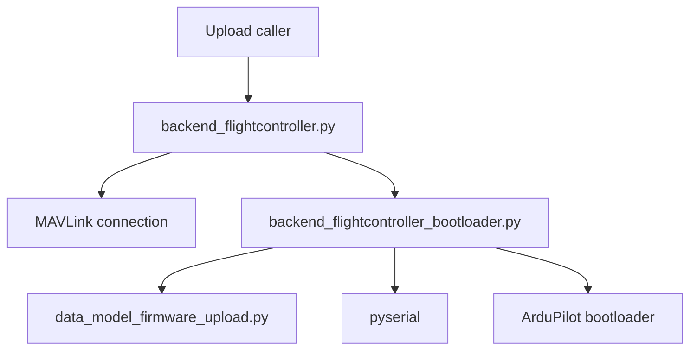

# Firmware Upload Architecture

Firmware upload flashes an ArduPilot APJ image through the board bootloader and
reconnects to the flight controller. It is separate from parameter configuration
because entering the bootloader interrupts the active MAVLink connection.

## Responsibilities

- `backend_flightcontroller.py` owns `upload_apj_firmware()`, the active MAVLink
  connection, bootloader entry, disconnection, reconnection, and post-flash identity.
- `backend_flightcontroller_bootloader.py` owns APJ file I/O, serial discovery,
  bootloader protocol traffic, progress, retries, and cleanup.
- `data_model_firmware_upload.py` contains APJ parsing, image normalization,
  compatibility rules, upload stages, and typed errors. It does not access files,
  serial ports, MAVLink, or Tkinter.

The connection manager remains the source of truth for MAVLink state. The bootloader
adapter may close and recreate that connection, but does not keep a second long-lived
connection state.

## Upload workflow and safety rules

1. Require a directly addressable serial connection, a valid connected board ID,
   stable USB identity, explicit confirmation, and a trusted SHA-256 for the exact
   APJ descriptor.
2. Parse and validate the APJ input before rebooting the controller. APJ is the only
   supported input format; raw BIN images are rejected.
3. Enter bootloader mode through MAVLink, release the MAVLink connection, and
   rediscover the bootloader serial port after re-enumeration.
4. Identify the bootloader and validate protocol revision, board ID, flash capacity,
   and image compatibility.
5. After final confirmation, erase, program, and verify the internal and optional
   external image regions, then reboot.
6. Reconnect through the normal connection manager and require the returned board
   identity before reporting success.

The following invariants apply throughout the workflow:

- Never erase or program before APJ validation, board matching, capacity checks,
  trusted-digest verification, and final confirmation pass.
- Reconnection is bound to the captured USB serial number and/or location. Every
  populated identity field must match the same physical device. Interface suffixes
  such as Linux `1-2.3:1.2` are ignored because the application and bootloader can
  expose different CDC interfaces. Ambiguous matches fail closed.
- Network MAVLink connections and force flashing are unsupported.
- Cancellation is checked at safe boundaries and never interrupts a bootloader
  packet. Before erase, the held bootloader is rebooted when possible; otherwise
  the error requires a power cycle.
- Every serial transport is closed on success and error, and the source APJ is not
  modified. A failed verify or reconnect is never reported as success.
- Full-chip erase is refused because the client cannot yet determine target MCU
  capability safely; normal erase remains supported.

## Implemented modules

### `backend_flightcontroller_bootloader.py`

`FlightControllerBootloaderBackend` loads the APJ, enters and discovers the held
bootloader, and passes the image to `BootloaderClient`. The client handles protocol
synchronization, board and capacity checks, erase/program/verify, reboot, retry, and
transport cleanup. Discovery resolves the captured USB identity before each open and
fails closed on zero or multiple matches.

### `data_model_firmware_upload.py`

The model provides `FirmwareImage`, `BootloaderInfo`, `UploadStage`, APJ parsing,
image padding, CRC helpers, compatibility checks, and typed upload errors. Its
functions are usable without serial or GUI dependencies.

### `backend_flightcontroller.py`

`FlightController.upload_apj_firmware()` validates the active connection, trusted
digest, and pre-reboot board identity; coordinates bootloader entry; reconnects after
reboot; and verifies the returned `AUTOPILOT_VERSION` board ID. A successful flash
also invalidates cached parameters.

## Domain and error model

`data_model_firmware_upload.py` provides the immutable image and bootloader data
objects, APJ validation, compatibility checks, upload-stage state machine, CRC
helpers, and typed errors. Compatibility comes from APJ metadata and bootloader
identification, never from a filename.

Errors identify the failed stage and are translated by the caller into user-facing
messages. They cover invalid APJ, digest or identity mismatch, unsupported protocol,
serial discovery, erase/program/verify, cancellation/recovery, and reconnect failure.

## Testing boundary

Use pure tests for APJ parsing, image normalization, compatibility, CRCs, state
transitions, and error classification. Use fake serial transports and fake MAVLink
connections for protocol framing, retries, erase/program/verify ordering, USB
re-enumeration, cancellation, cleanup, reconnect, and post-flash identity checks.

Hardware tests should be separately marked and require an explicitly selected serial
device.

## References

- [ArduPilot uploader](https://github.com/ArduPilot/ardupilot/blob/master/Tools/scripts/uploader.py)
- [ArduPilot bootloader documentation](https://ardupilot.org/dev/docs/bootloader.html)
- [pymavlink](https://github.com/ArduPilot/pymavlink)
- [`ARCHITECTURE.md`](ARCHITECTURE.md)
