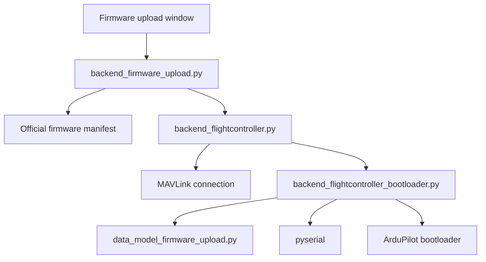

# Firmware Upload Architecture

Firmware upload flashes an ArduPilot APJ image through the board bootloader and
reconnects to the flight controller. It is separate from parameter configuration
because entering the bootloader interrupts the active MAVLink connection.

For startup commands, firmware selection, upload procedures, progress, and recovery
instructions, see the [firmware upload user manual](USERMANUAL_firmware_upload.md).

## Responsibilities

```mermaid
flowchart TD
    WINDOW[Firmware upload window] --> UPLOAD[backend_firmware_upload.py]
    UPLOAD --> CATALOG[Official firmware manifest]
    UPLOAD --> FACADE[backend_flightcontroller.py]
    FACADE --> MAV[MAVLink connection]
    FACADE --> BOOT[backend_flightcontroller_bootloader.py]
    BOOT --> MODEL[data_model_firmware_upload.py]
    BOOT --> SERIAL[pyserial]
    BOOT --> FC[ArduPilot bootloader]
```

- `backend_flightcontroller.py` owns `upload_apj_firmware()`, the active MAVLink
  connection, bootloader entry, disconnection, reconnection, and post-flash identity.
- `backend_flightcontroller_bootloader.py` owns APJ file I/O, serial discovery,
  bootloader protocol traffic, progress, retries, and cleanup.
- `data_model_firmware_upload.py` contains APJ parsing, image normalization,
  compatibility rules, upload stages, and typed errors. It does not access files,
  serial ports, MAVLink, or Tkinter.
- `frontend_tkinter_firmware_upload.py` provides the embedded and standalone
  upload window. It presents the available releases, gathers confirmation and
  displays upload progress without implementing catalog or flashing rules.
  Standalone startup reuses the shared connection bootstrap. Embedded callers pass
  their Tk parent and connected controller.
  Callers may inject the upload service and worker launcher; production defaults
  use `FirmwareUploadService` and daemon threads. Deferred launchers let tests run
  catalog and upload tasks explicitly without threads or network access.
  Queue polling only drains events and reschedules itself. Single-event dispatch,
  final confirmation, and upload-result presentation are separate handlers, so
  presentation tests do not depend on timers. Confirmation always releases its
  waiting worker, including when the dialog fails.
  Board identity and connection controls share a rendering helper that only uses
  loaded board information. Catalog refresh remains an explicit operation;
  finishing an upload preserves its result status and never downloads a catalog.
  A missing or changed board ID clears stale selections before rendering.
  The project opener obtains that shared controller through `VehicleProjectManager`
  and waits for the modal child without destroying or hiding its own window.
  On Windows the owner is also disabled until the child closes. The upload window
  has 30% more height on Windows, before DPI scaling.
  A successful or failed upload, or removal of a previously detected board while idle,
  sets a sticky restart-required flag; reconnecting or a later safe cancellation cannot
  clear it. Worker errors retain their exception type until rendered on the Tk thread.
  Safe cancellation before erase does not set this flag on its own.
  When the child closes with restart required, the project opener disconnects the
  controller, destroys its window, and exits AMC. The user restarts AMC to load the
  current firmware state. No post-upload parameter/default download, project refresh,
  or persistence is performed. Closing without an upload attempt or after safe
  cancellation returns to project selection when no restart requirement was recorded.
  Closing during an upload is refused.
- `backend_firmware_upload.py` loads the official manifest, filters APJ releases
  by board ID, downloads and validates the selected image, then invokes the upload
  facade. Its progress and confirmation callbacks keep the service independent of Tk.
  It checks serial-port presence without reading MAVLink traffic and disconnects a
  retained connection when its USB port disappears. The frontend schedules this check
  once per second, invalidates pending catalog results on disconnect, and enables
  **Connect**. Monitoring is suspended while connecting or uploading so bootloader
  re-enumeration is not mistaken for an unexpected disconnect.
- `data_model_firmware_catalog.py` validates manifest descriptors and accepts only
  HTTPS APJ URLs on the official firmware host for the connected board ID.
  Pure selection helpers supply firmware types, targets, version labels, preferred
  choices, and exact release resolution. The frontend renders these choices and
  resets version selection after a type or target change.

The connection manager remains the source of truth for MAVLink state. The bootloader
adapter may close and recreate that connection, but does not keep a second long-lived
connection state.

## Upload invariants

The user-facing workflows for
[official releases](USERMANUAL_firmware_upload.md#installing-an-official-release) and
[local APJ files](USERMANUAL_firmware_upload.md#uploading-a-local-apj-file) share the
following implementation constraints:

- The upload service binds the SHA-256 of the downloaded or local APJ descriptor
  to the exact file passed to the upload facade.
- APJ parsing and validation precede the MAVLink bootloader-entry command.
- Never erase or program before APJ validation, board matching, capacity checks,
  trusted-digest verification, and final confirmation pass.
- Reconnection is bound to the captured USB serial number and/or physical location.
  Interface metadata is only a disambiguation hint and may differ because the
  application and bootloader can expose different CDC interfaces; interface suffixes
  such as Linux `1-2.3:1.2` are ignored for physical matching. Ambiguous matches fail
  closed.
- Cancellation is checked at safe boundaries and never interrupts a bootloader
  packet. Before erase, the held bootloader is rebooted only after an explicit
  successful reboot acknowledgement, except for protocol revision 2 which does
  not send one; otherwise bootloader recovery fails.
- Bootloader discovery has a 15-second wall-clock budget. Serial response timeouts
  and retry delays are capped by the remaining budget, so a port that opens but
  does not answer cannot extend discovery indefinitely.
- After erase begins, any erase, programming, verification, or reboot failure
  prevents a normal MAVLink reconnect unless a safe bootloader abort has confirmed
  a reboot. User recovery instructions are documented in
  [Troubleshooting](USERMANUAL_firmware_upload.md#troubleshooting).
- Serial transports are closed on successful uploads and handled protocol/error
  paths, and cleanup cannot mask the original upload failure.
- Full-chip erase is refused because the client cannot yet determine target MCU
  capability safely; normal erase remains supported.

## Implemented modules

### `backend_flightcontroller_bootloader.py`

`FlightControllerBootloaderBackend` is an internal transport adapter. It loads the
APJ, enters and discovers the held bootloader, and passes the image to
`BootloaderClient`. The public facade performs trusted-digest and stable-USB-identity
policy checks before invoking it. The client handles protocol synchronization, board
and capacity checks, erase/program/verify, reboot, and transport cleanup; the backend
owns serial-open retries and their wall-clock budget. Discovery resolves the captured
USB identity before each open, fails closed on zero or multiple matches, and shares
injected clock and sleep functions with the client for bounded, testable timing.

### `backend_flightcontroller.py`

`FlightController.upload_apj_firmware()` validates the active connection, trusted
digest, and pre-reboot board identity; delegates bootloader entry and post-reboot
reconnection to dedicated collaborators; and verifies the returned
`AUTOPILOT_VERSION` board ID.
After cancellation before erase, a successful identity-bound reconnect and board-ID
check restore the unchanged parameter cache in place, preserving shared references.
Cancellation before bootloader entry leaves the existing connection and cache alone.
Failed cancellation recovery is reported as an upload failure, requiring an AMC
restart rather than returning to an invalid configuration session.
`_recover_after_firmware_upload_abort()` isolates that recovery boundary, accepting
the identity-bound reconnect callback and the pre-upload board ID and parameter
snapshot. It refuses reconnection without bootloader entry and a confirmed safe
reboot, and never restores parameters for a non-cancellation failure.

## Domain and error model

`data_model_firmware_upload.py` provides the immutable `FirmwareImage` and
`BootloaderInfo` objects, the `UploadStage` state machine, image padding, CRC helpers,
and typed errors. Its functions are usable without serial or GUI dependencies.

Errors identify the failed stage and are translated by the caller into user-facing
messages. They cover invalid APJ, digest or identity mismatch, unsupported protocol,
serial discovery, erase/program/verify, cancellation/recovery, and reconnect failure.

## Testing boundary

Use pure tests for APJ parsing, image normalization, compatibility, CRCs, state
transitions, and error classification. Use fake serial transports and fake MAVLink
connections for protocol framing, retries, erase/program/verify ordering, USB
re-enumeration, cancellation, cleanup, reconnect, and post-flash identity checks.

Hardware tests should be separately marked and require an explicitly selected serial
device.

## References

- [ArduPilot uploader](https://github.com/ArduPilot/ardupilot/blob/master/Tools/scripts/uploader.py)
- [ArduPilot bootloader documentation](https://ardupilot.org/dev/docs/bootloader.html)
- [pymavlink](https://github.com/ArduPilot/pymavlink)
- [`ARCHITECTURE.md`](ARCHITECTURE.md)
