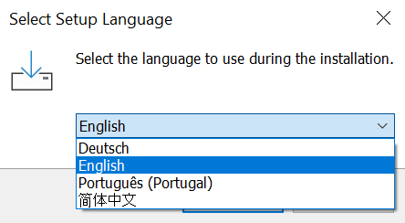

# Install instructions

This software is available for multiple operating systems:

- [Microsoft Windows](#ms-windows-installation)
- [Linux](#linux-installation)
- [macOS](#macos-installation)

After installing it you must also:

- [Install the latest Mission Planner version](#install-mission-planner-software-on-a-pc-or-mac)
- [Install the latest ArduPilot firmware on your flight controller board](#install-ardupilot-firmware-on-the-flight-controller)

## Prerequisites and System Requirements

### Hardware Requirements

- **Flight Controller**: Any ArduPilot-compatible flight controller
- **USB Cable**: For connecting flight controller to PC (data cable, not just power)
- **PC Requirements**:
  - Windows 10/11, Linux, or macOS
  - Minimum 2GB RAM
  - 100MB free disk space
  - USB port

### Software Prerequisites

- **No additional software needed** - ArduPilot Methodic Configurator is self-contained
- **Optional**: Text editor (Notepad++, VS Code) for manual parameter file editing

## MS Windows Installation

The MS Windows Installation file is at the bottom of
[github's AMC project latest release page](https://github.com/ArduPilot/MethodicConfigurator/releases/latest), in the *Assets* section.
You do not need a github account to download this file.

Download the latest
[ardupilot_methodic_configurator_x.x.x_windows_setup.exe](https://github.com/ArduPilot/MethodicConfigurator/releases/latest) installer file.
Ignore the `ardupilot_methodic_configurator_x.x.x_windows_setup.exe.bundle` and `ardupilot_methodic_configurator_x.x.x_windows_setup.exe.sig`
files - they are just cryptographic signatures for cyber security applications.

If you have an anti-virus program running, it may prompt you to allow the download and installation.
Please tell it to allow the download and installation.
Github also runs [ClamAV to scan the AMC software for virus](https://github.com/ArduPilot/MethodicConfigurator/actions/workflows/gitavscan.yml).

Execute the downloaded file and do the steps highlighted in red.


It is available in multiple languages, select the one that better suits you.



Accept the software license.


Create a desktop icon, so that the language setting will take effect.
Most users do not use the command line and do not need to add the application to their path.


Click `Install`.


Click `Finish`.


To run it, double-click on the newly created desktop item.

## Linux Installation

### Older Linux distributions without venv

Install [python pip](https://pypi.org/project/pip/). Then execute the command line:

```bash
sudo apt install python3-tk
pip install -U ardupilot_methodic_configurator
```

To run it, execute the command line:

```bash
ardupilot_methodic_configurator
```

### Newer Linux distributions with venv

You need to create and activate a new virtual environment before you can run the software.

```bash
sudo apt install python3-tk
python -m venv .ardupilot_methodic_configurator_venv
source .ardupilot_methodic_configurator_venv/bin/activate
python -m pip install uv
uv pip install ardupilot_methodic_configurator
```

To run it, execute the command line:

```bash
source .ardupilot_methodic_configurator_venv/bin/activate
ardupilot_methodic_configurator
```

## macOS Installation

The macOS Installation file is at the bottom of
[github's AMC project latest release page](https://github.com/ArduPilot/MethodicConfigurator/releases/latest), in the *Assets* section.
You do not need a github account to download this file.

Download the latest
[ardupilot_methodic_configurator_x.x.x_macos_setup.dmg](https://github.com/ArduPilot/MethodicConfigurator/releases/latest) installer file.
Then install it as follows:

1. In Finder, locate the downloaded `ardupilot_methodic_configurator_x.x.x_macos_setup.dmg` file (usually in your **Downloads** folder).
2. Double‑click the `.dmg` file to open it.
3. In the window that appears, drag **ArduPilot Methodic Configurator** into your **Applications** folder.
4. Eject the mounted installer volume.
From then on you can launch **ArduPilot Methodic Configurator** from **Applications** (or via Spotlight).

Alternatively, follow the Linux installation instructions above.

You might need to also do:

```bash
brew install uv python-tk@3.9
```

## Install *Mission Planner* software on a PC or Mac

1. Download and install [Mission Planner](https://firmware.ardupilot.org/Tools/MissionPlanner/).
1. Make sure to install all the recommended device drivers when asked to.

## Install *ArduPilot* firmware on the flight controller

1. Connect the flight controller to the computer using a USB cable.
1. Open *Mission Planner* software.
1. Go to *SETUP* > *Install Firmware* select your vehicle type and install version 4.3.8 **or newer** of the ArduPilot firmware onto the flight controller.

1. Wait until the firmware download is complete.
1. Disconnect the USB cable from the flight controller.

## Install command line completion

### Global python argcomplete

For command line (tab) completion for all python scripts that support [argcomplete](https://github.com/kislyuk/argcomplete) do:

```bash
activate-global-python-argcomplete
```

### Fine granular python argcomplete

For Bash (Linux, macOS) autocompletion, add this to your `~/.bashrc`:

```bash
eval "$(register-python-argcomplete ardupilot_methodic_configurator)"
eval "$(register-python-argcomplete extract_param_defaults)"
eval "$(register-python-argcomplete annotate_params)"
eval "$(register-python-argcomplete param_pid_adjustment_update)"
eval "$(register-python-argcomplete mavftp)"
```

For Zsh (Linux, macOS) autocompletion, add these lines to your `~/.zshrc`:

```zsh
autoload -U bashcompinit
bashcompinit
eval "$(register-python-argcomplete ardupilot_methodic_configurator)"
eval "$(register-python-argcomplete extract_param_defaults)"
eval "$(register-python-argcomplete annotate_params)"
eval "$(register-python-argcomplete param_pid_adjustment_update)"
eval "$(register-python-argcomplete mavftp)"
```

For PowerShell (MS Windows) autocompletion, run this command in PowerShell:

```powershell
notepad $PROFILE
```

And add this line to the file:

```powershell
Import-Module  "C:\Program Files (x86)\ardupilot_methodic_configurator\ardupilot_methodic_configurator_command_line_completion.psm1"
```

## Verify Installer Security and Integrity

**Why verify?** The ArduPilot Methodic Configurator installer is cryptographically signed and includes SLSA Level 3 provenance attestations.
Verification ensures that:

- The installer was built by the official ArduPilot project (not a malicious copy)
- The installer hasn't been tampered with during download
- The build process followed secure supply chain practices

### Download Required Files

When downloading from the [GitHub releases page](https://github.com/ArduPilot/MethodicConfigurator/releases), you'll need both:

1. **The installer**: `ardupilot_methodic_configurator_windows_setup.exe`
2. **The provenance file**: `ardupilot_methodic_configurator_windows_setup.exe.intoto.jsonl` (automatically generated by our build system)

### Verification Methods

Choose the method that best fits your operating system and security requirements:

#### Method 1: SLSA Verification (Recommended - Highest Security)

This method uses the official SLSA verifier to check the cryptographic provenance of the installer.

**For Linux/macOS:**

```bash
# Download the latest SLSA verifier (recommended: check https://github.com/slsa-framework/slsa-verifier/releases for the latest version)
# Replace <latest-version> with the latest release tag, e.g. v2.7.0
curl -sSLO https://github.com/slsa-framework/slsa-verifier/releases/latest/download/slsa-verifier-linux-amd64
chmod +x slsa-verifier-linux-amd64
# Alternatively, to use a specific version, replace 'latest' with the desired version tag (e.g. v2.7.0), but ensure you check for updates regularly.

# Verify the installer
./slsa-verifier-linux-amd64 verify-artifact \
  ardupilot_methodic_configurator_windows_setup.exe \
  --provenance-path ardupilot_methodic_configurator_windows_setup.exe.intoto.jsonl \
  --source-uri github.com/ArduPilot/MethodicConfigurator

# Successful verification will show:
# ✓ Verified SLSA provenance
```

**For Windows (PowerShell):**

```powershell
# Download the SLSA verifier
Invoke-WebRequest -Uri "https://github.com/slsa-framework/slsa-verifier/releases/download/v2.7.0/slsa-verifier-windows-amd64.exe" -OutFile "slsa-verifier.exe"

# Verify the installer
.\slsa-verifier.exe verify-artifact `
  ardupilot_methodic_configurator_windows_setup.exe `
  --provenance-path ardupilot_methodic_configurator_windows_setup.exe.intoto.jsonl `
  --source-uri github.com/ArduPilot/MethodicConfigurator

# Successful verification will show:
# ✓ Verified SLSA provenance
```

#### Method 2: Cosign Verification (Alternative)

If Cosign signatures are available, you can also verify using Cosign:

**For Linux/macOS:**

```bash
# Install Cosign (if not already installed)
curl -O -L "https://github.com/sigstore/cosign/releases/latest/download/cosign-linux-amd64"
chmod +x cosign-linux-amd64
sudo mv cosign-linux-amd64 /usr/local/bin/cosign

# Verify the signature (if .sig and .bundle files are present)
cosign verify-blob \
  --signature ardupilot_methodic_configurator_windows_setup.exe.sig \
  --bundle ardupilot_methodic_configurator_windows_setup.exe.bundle \
  ardupilot_methodic_configurator_windows_setup.exe \
  --certificate-identity-regexp "https://github.com/ArduPilot/MethodicConfigurator/.*" \
  --certificate-oidc-issuer "https://token.actions.githubusercontent.com"
```

#### Method 3: Basic Checksum Verification (Minimum Security)

If the above tools are not available, you can at least verify the file integrity using checksums:

**For Linux/macOS:**

```bash
# Generate SHA256 checksum
sha256sum ardupilot_methodic_configurator_windows_setup.exe

# Compare with the published checksum from the GitHub release page
```

**For Windows (PowerShell):**

```powershell
# Generate SHA256 checksum
Get-FileHash -Algorithm SHA256 ardupilot_methodic_configurator_windows_setup.exe

# Compare with the published checksum from the GitHub release page
```

### Understanding Verification Results

- **✅ Success**: Verification passed - the installer is authentic and untampered
- **❌ Failure**: Verification failed - **DO NOT** install the software, download again from official sources
- **⚠️ Warning**: Some verification methods may show warnings about experimental features - this is normal for SLSA

### Security Best Practices

1. **Always download from official sources**: Only download from [github.com/ArduPilot/MethodicConfigurator/releases](https://github.com/ArduPilot/MethodicConfigurator/releases)
2. **Verify before installing**: Run verification before executing the installer
3. **Keep verifier tools updated**: Use the latest versions of verification tools
4. **Report issues**: If verification fails, report it on our [GitHub issues page](https://github.com/ArduPilot/MethodicConfigurator/issues)

### What This Protects Against

Our verification system protects against:

- **Supply chain attacks**: Malicious code injected during the build process
- **Man-in-the-middle attacks**: Files modified during download
- **Compromised releases**: Unauthorized uploads to the release page
- **Malicious mirrors**: Fake copies hosted on other websites

This security model follows industry best practices and provides the same level of assurance used by major software projects.

<!-- Gurubase Widget -->
<script async src="https://widget.gurubase.io/widget.latest.min.js"
    data-widget-id="uE4kxEE4LY3ZSyfNsF5bU6gIOnWGTBOL_e16KwDH-0g"
    data-text="Ask AI"
    data-margins='{"bottom": "1rem", "right": "1rem"}'
    data-light-mode="true"
    id="guru-widget-id">
</script>
