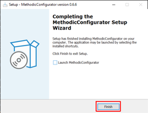

# Install instructions
<!--
SPDX-FileCopyrightText: 2024-2025 Amilcar do Carmo Lucas <amilcar.lucas@iav.de>

SPDX-License-Identifier: GPL-3.0-or-later
-->

This software is available for multiple operating systems:

- [Microsoft Windows](#ms-windows-installation)
- [Linux](#linux-installation)
- [MacOS](#macos-installation)

## MS Windows Installation

Download the [latest MethodicConfiguratorSetup-x.x.x.exe installer file](https://github.com/ArduPilot/MethodicConfigurator/releases/tag/latest).

Do the steps highlighted in red.




To run it double-click on the newly created desktop item.

## Linux Installation

### Older linux distributions without venv

Install [python pip](https://pypi.org/project/pip/). Then execute the command line:

```bash
pip install -U ardupilot_methodic_configurator
```

To run it, execute the command line:

```bash
ardupilot_methodic_configurator
```

### Newer linux distributions with venv

You need to create and activate a new virtual environment before you can run the software.

```bash
python -m venv .ardupilot_methodic_configurator_venv
source .ardupilot_methodic_configurator_venv/bin/activate
python -m pip install --upgrade pip
pip install ardupilot_methodic_configurator
```

To run it, execute the command line:

```bash
source .ardupilot_methodic_configurator_venv/bin/activate
ardupilot_methodic_configurator
```

## MacOS Installation

Install [git](https://git-scm.com/) and [python](https://www.python.org/downloads/). Then execute the command lines:

```bash
git clone https://github.com/ArduPilot/MethodicConfigurator.git
cd MethodicConfigurator
./install_macos.sh
```
