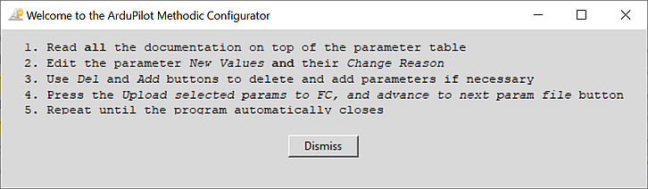

# Quick start guide
<!--
SPDX-FileCopyrightText: 2024 Amilcar do Carmo Lucas <amilcar.lucas@iav.de>

SPDX-License-Identifier: GPL-3.0-or-later
-->

## Do you need this software at all?

## 1. Quick overview of the entire process

To methodically build, configure and tune ArduPilot vehicles follow this sequence of steps:

### 1.1 Select the vehicle components

- while [choosing an Autopilot](https://ardupilot.org/copter/docs/common-autopilots.html) and [other hardware](https://ardupilot.org/copter/docs/common-optional-hardware.html) components [avoid these components](https://discuss.ardupilot.org/t/hardware-to-avoid-when-building-your-first-multirotor/114014/1)
- Use [ecalc for multirotor](https://www.ecalc.ch/index.htm) to select the propulsion system.

### 1.2 Install Software

- [Install ArduPilot Methodic Configurator](#2-install-ardupilot-methodic-configurator-software-on-a-pc-or-mac)
- [Install Mission Planner](#3-install-mission-planner-software-on-a-pc-or-mac)
- [Install ArduPilot](#4-install-ardupilot-firmware-on-the-flight-controller)

### 1.3 Input vehicle components and component connections into ArduPilot Methodic Configurator

The software needs this information to automatically pre-select configuration settings relevant to your specific vehicle

- [Start the ArduPilot Methodic Configurator and input select a vehicle that resembles yours](#5-use-the-ardupilot-methodic-configurator-software-for-the-first-time) and input vehicle components and component connections information into the ArduPilot Methodic Configurator *component editor window*

### 1.4 Perform IMU temperature calibration before assembling the autopilot into the vehicle (optional)

IMU temperature calibration reduces the probability of *Accel inconsistent* and *Gyro inconsistent* errors and reduces the time required to arm the vehicle.
IMU temperature calibration requires lowering the temperature of the autopilot (flight controller) to circa -20°C.
That is harder to do once the autopilot is assembled inside the vehicle, hence it is done now.

- [start the software](#6-configure-the-vehicles-parameters-in-a-traceable-way)
- Perform [IMU temperature calibration](TUNING_GUIDE_ArduCopter.md#21-configure-imu-temperature-calibration-using-the-offline-calibration-tool)

### 1.5 Assemble all components except the propellers

Assemble and connect all components. Make sure you [follow best practices](TUNING_GUIDE_ArduCopter.md#11-multicopter-hardware-best-practices)

### 1.6 Basic mandatory configuration

Again using the [*ArduPilot Methodic configurator* software GUI](#7-use-the-ardupilot-methodic-configurator-software-after-having-created-a-vehicle-from-a-template) perform the following steps:

- [04_board_orientation.param](TUNING_GUIDE_ArduCopter.md#61-configure-flight-controller-orientation) flight controller orientation
- [05_remote_controller.param](TUNING_GUIDE_ArduCopter.md#62-configure-the-rc-receiver) remote controller connections and protocol
- [06_telemetry.param](TUNING_GUIDE_ArduCopter.md#63-configure-telemetry) telemetry transceiver connections and protocol (optional)
- [07_esc.param](TUNING_GUIDE_ArduCopter.md#64-configure-the-esc) Electronic-Speed-Controller connections and protocol
- [08_batt1.param](TUNING_GUIDE_ArduCopter.md#65-configure-the-primary-battery-monitor) Battery health and state of charge monitoring
- [10_gnss.param](TUNING_GUIDE_ArduCopter.md#67-configure-the-gnss-receivers) GNSS receiver connection and protocol
- [11_initial_atc.param](TUNING_GUIDE_ArduCopter.md#68-initial-attitude-pid-gains-vehicle-size-dependent) initial attitude PID gains (vehicle size dependent)

Now use [Mission Planner](https://firmware.ardupilot.org/Tools/MissionPlanner/) to do:

- [12_mp_setup_mandatory_hardware.param](TUNING_GUIDE_ArduCopter.md#69-configure-mandatory-hardware-parameters) calibrate vehicle sensors

And continue with the [*ArduPilot Methodic configurator* software GUI](#7-use-the-ardupilot-methodic-configurator-software-after-having-created-a-vehicle-from-a-template):

- [13_general_configuration.param](TUNING_GUIDE_ArduCopter.md#610-general-configuration) general misc configuration
- [Test if the hardware diagnostics are OK](TUNING_GUIDE_ArduCopter.md#611-ardupilot-hardware-report)
- [14_logging.param](TUNING_GUIDE_ArduCopter.md#612-configure-logging) configure Dataflash/SDCard logging (black box data)
- [15_motor.param](TUNING_GUIDE_ArduCopter.md#613-motorpropeller-order-and-direction-test) motor order and direction tests. ESC linearization.
- [16_pid_adjustment.parm](TUNING_GUIDE_ArduCopter.md#614-optional-pid-adjustment) attitude PID gains (vehicle size dependent)
- [17_remote_id.param](TUNING_GUIDE_ArduCopter.md#615-remote-id-aka-drone-id) required by law in many countries
- [18_notch_filter_setup.param](TUNING_GUIDE_ArduCopter.md#616-notch-filters-setup) to remove motor noise, reduce power consumption and increase flight stability

### 1.7 Assemble propellers and perform the first flight

Now that all mandatory configuration steps are done you can [perform the first flight](TUNING_GUIDE_ArduCopter.md#7-assemble-propellers-and-perform-the-first-flight)

### 1.8 Minimalistic mandatory tuning

These are the very [minimum tuning steps](TUNING_GUIDE_ArduCopter.md#8-minimalistic-mandatory-tuning) required for a stable flight:

- Load the `.bin` log file from the first flight into [Notch filter webtool](https://firmware.ardupilot.org/Tools/WebTools/FilterReview/)
- [19_notch_filter_results.param](TUNING_GUIDE_ArduCopter.md#81-notch-filter-calibration) use the webtool information to configure the notch filter(s)
- [20_throttle_controller.param](TUNING_GUIDE_ArduCopter.md#82-configure-the-throttle-controller) the altitude controller depends on the power-to-thrust ratio found in the first flight
- [21_ekf_config.param](TUNING_GUIDE_ArduCopter.md#83-configure-the-ekf-altitude-source-weights) sometimes the EKF3 needs a tune to maintain altitude
- [22_quick_tune_setup.param](TUNING_GUIDE_ArduCopter.md#84-second-flight-pid-vtol-quiktune-lua-script-or-manual-pid-tune) and [23_quick_tune_results.param](TUNING_GUIDE_ArduCopter.md#84-second-flight-pid-vtol-quiktune-lua-script-or-manual-pid-tune) You need lua scripting support to do this if not available you can tune manually.

That is it, if you are impatient and do not want an optimized vehicle you can skip to [everyday use](#113-everyday-use).

### 1.9 Standard tuning (optional)

These are the [standard tuning steps](TUNING_GUIDE_ArduCopter.md#9-standard-tuning-optional) required for an optimized flight:

- [24_inflight_magnetometer_fit_setup.param](TUNING_GUIDE_ArduCopter.md#91-third-flight-magfit) Use lua scripted flight path or fly manually and  [25_inflight_magnetometer_fit_results.param](TUNING_GUIDE_ArduCopter.md#912-calculate-inflight-magfit-calibration) Use the [magfit webtool](https://firmware.ardupilot.org/Tools/WebTools/MAGFit/) to calculate a file that the ardupilot methodic configurator can use
- [26_quick_tune_setup.param](TUNING_GUIDE_ArduCopter.md#921-setup-quicktune) and [27_quick_tune_results.param](TUNING_GUIDE_ArduCopter.md#922-store-quicktune-results-to-file) Redo quick-tune now that the compass magnetic interference is fully calibrated
- [28_evaluate_the_aircraft_tune_ff_disable.param](TUNING_GUIDE_ArduCopter.md#93-fifth-flight-evaluate-the-aircraft-tune---part-1) and [29_evaluate_the_aircraft_tune_ff_enable.param](TUNING_GUIDE_ArduCopter.md#94-sixth-flight-evaluate-the-aircraft-tune---part-2)
- [30_autotune_roll_setup.param](TUNING_GUIDE_ArduCopter.md#95-autotune-flights) and [31_autotune_roll_results.param](TUNING_GUIDE_ArduCopter.md#951-roll-axis-autotune) tune roll axis rate and angle PIDs
- [32_autotune_pitch_setup.param](TUNING_GUIDE_ArduCopter.md#952-pitch-axis-autotune) and [33_autotune_pitch_results.param](TUNING_GUIDE_ArduCopter.md#952-pitch-axis-autotune) tune pitch axis rate and angle PIDs
- [34_autotune_yaw_setup.param](TUNING_GUIDE_ArduCopter.md#953-yaw-axis-autotune) and [35_autotune_yaw_results.param](TUNING_GUIDE_ArduCopter.md#953-yaw-axis-autotune) tune yaw axis rate and angle PIDs
- [36_autotune_yawd_setup.param](TUNING_GUIDE_ArduCopter.md#954-yaw-d-axis-autotune-optional) and [37_autotune_yawd_results.param](TUNING_GUIDE_ArduCopter.md#954-yaw-d-axis-autotune-optional) tune yawd axis rate and angle PIDs
- [38_autotune_roll_pitch_retune_setup.param](TUNING_GUIDE_ArduCopter.md#955-roll-and-pitch-axis-re-autotune) and [39_autotune_roll_pitch_retune_results.param](TUNING_GUIDE_ArduCopter.md#955-roll-and-pitch-axis-re-autotune) re-tune roll and pitch pitch axis rate and angle PIDs

Now the standard tuning is complete you can skip to [everyday use](#113-everyday-use)

### 1.10 Improve altitude under windy conditions (optional)

- [40_windspeed_estimation.param](TUNING_GUIDE_ArduCopter.md#10-improve-altitude-under-windy-conditions-optional) estimates the wind speed
- [41_barometer_compensation.param](TUNING_GUIDE_ArduCopter.md#102-baro-compensation-flights) Uses the estimated wind speed to improve altitude stability

### 1.11 System identification for analytical PID optimization (optional)

- [42_system_id_roll.param, 43_system_id_pitch.param, 44_system_id_yaw.param](TUNING_GUIDE_ArduCopter.md#11-system-identification-for-analytical-pid-optimization-optional)
- [46_analytical_pid_optimization.param](TUNING_GUIDE_ArduCopter.md#112-analytical-multicopter-flight-controller-pid-optimization)

### 1.12 Position controller tuning (optional)

- [47_position_controller.param, 48_guided_operation.param, 49_precision_land.param](TUNING_GUIDE_ArduCopter.md#12-position-controller-tuning-optional)

### 1.13 Everyday use

Now that tuning and configuration are done, some logging and tests can be disabled and some more safety features enabled:

- [50_everyday_use.param](TUNING_GUIDE_ArduCopter.md#13-productive-configuration)

Enjoy your properly configured vehicle.

The following sections describe each step of the procedure in more detail.

## 2. Install *ArduPilot Methodic Configurator* software on a PC or Mac

1. Download and install [ArduPilot Methodic Configurator](https://github.com/ArduPilot/MethodicConfigurator/releases/tag/latest) software.

## 3. Install *Mission Planner* software on a PC or Mac

1. Download and install [Mission Planner](https://firmware.ardupilot.org/Tools/MissionPlanner/).
1. Make sure to install all the recommended device drivers when asked to.

## 4. Install *ArduPilot* firmware on the flight controller

1. Connect the flight controller to the computer using a USB cable.
1. Open *Mission Planner* software.
1. Go to *SETUP* > *Install Firmware* select your vehicle type and install version 4.3.8 **or newer** of the ArduPilot firmware onto the flight controller.

1. Wait until the firmware download is complete.
1. Disconnect the USB cable from the flight controller.

## 5. Use the *ArduPilot Methodic Configurator* software for the first time

1. Connect the flight controller to the computer using a USB cable.
1. Wait at least 7 seconds.
1. Open the *ArduPilot Methodic Configurator* software.
1. The software should now automatically detect and connect to your flight controller.

1. Select the vehicle template that better resembles your vehicle.

1. Give a name to your vehicle.

1. Press *Create vehicle configuration from template*.

1. Edit all the components of your vehicle to match your own in the *Vehicle Component Editor* window.

1. Press *Save data and start configuration*.
1. The application will validate your input.
If issues are found the problematic fields' background will be marked in red color.
Correct those entries and press the `Save data and start configuration` button again.
1. You should now see the *Parameter file editor and uploader* window.

If something is not clear, read the [ArduPilot Methodic Configurator user manual](USERMANUAL.md)

## 6. Configure the vehicle's parameters in a traceable way

The following simple loop is presented as welcome instructions:

Now do this in a loop until the software automatically closes or you are asked to close the software:

- Read all the documentation links displayed at the top of the GUI (marked with the big red number 4),
- Edit the parameter's *New value* and *Reason changed* fields to match your vehicle (marked with the big red number 5),
  - The *Reason changed* field is extremely important because:
    - if forces you to think, causing rational decisions instead of impulsive ones
    - justifies your decisions on a vehicle certification process required in most countries
    - allows for someone else to see if you know what you are doing
    - allows for someone else (or yourself after a few weeks) to understand your rationale
- Press *Del* and/or *Add* buttons to delete or add parameters respectively (marked with the big red number 5),
- Press *Upload selected params to FC, and advance to next param file* (marked with the big red number 7),
- Repeat from the top until the program automatically closes.

## 7. Use the *ArduPilot Methodic Configurator* software after having created a vehicle from a template

1. Connect the flight controller to the computer using a USB cable.
1. Wait at least 7 seconds.
1. Open the *ArduPilot Methodic Configurator* software.
1. The software should now automatically detect and connect to your flight controller.

1. Open the vehicle configuration directory that you created in the [Use the *ArduPilot Methodic Configurator* software for the first time](#5-use-the-ardupilot-methodic-configurator-software-for-the-first-time).

double-click and step inside the directory that you want to use, not just select it
1. Edit all the components of your vehicle to match your own.

1. Press *Save data and start configuration*.
1. You should now see the *Parameter file editor and uploader* window.

1. Proceed as explained in [Section 6](#6-configure-the-vehicles-parameters-in-a-traceable-way)

Congratulations your flight controller is now fully configured in the safest and fastest way publicly known.

There is also [documentation on other use cases](USECASES.md).
