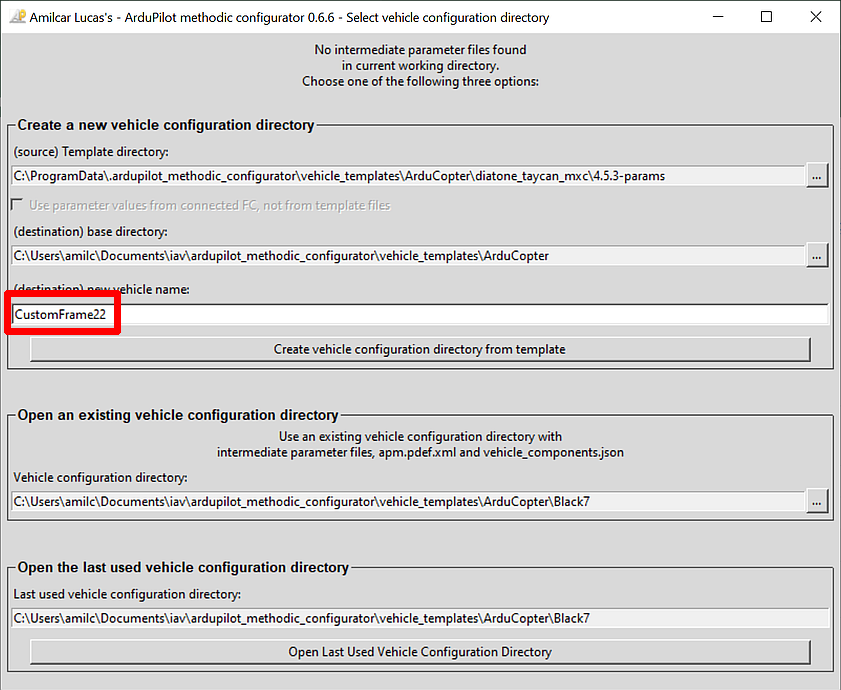

# Quick start guide

## 1. Install *ArduPilot Methodic Configurator* software on a PC or Mac

1. Download and install [ArduPilot Methodic Configurator](https://github.com/ArduPilot/MethodicConfigurator/releases/tag/latest) software.

## 2. Install *Mission Planner* software on a PC or Mac

1. Download and install [Mission Planner](https://firmware.ardupilot.org/Tools/MissionPlanner/).
1. Make sure to install all the recommended device drivers when asked to.

## 3. Install *ArduPilot* firmware on the flight controller

1. Connect the flight controller to the computer using a USB cable.
1. Open *Mission Planner* software.
1. Go to *SETUP* > *Install Firmware* select your vehicle type and install version 4.3.8 **or newer** of the ArduPilot firmware onto the flight controller.

1. Wait until the firmware download is complete.
1. Disconnect the USB cable from the flight controller.

## 4. Use the *ArduPilot Methodic Configurator* software for the first time

1. Connect the flight controller to the computer using a USB cable.
1. Wait at least 7 seconds.
1. Open the *ArduPilot Methodic Configurator* software.
1. The software should now automatically detect and connect to your flight controller.

1. Select the vehicle template that better resembles your own vehicle.

1. Give a name to your vehicle.

1. Press *Create vehicle configuration from template*.

1. Edit all the components of your vehicle to match your own in the *vehicle Component Editor* window.

1. Press *Save data and start configuration*.
1. The application will validate your input.
If issues are found the problematic fields' background will be marked in red color.
Correct those entries and press the `Save data and start configuration` button again.
1. You should now see the *Parameter file editor and uploader* window.

If something is not clear, read the [ArduPilot Methodic Configurator user manual](USERMANUAL.md)

## 5. Configure the vehicle's parameters in a traceable way

The following simple loop is presented as welcome instructions:

Now do this in a loop until the software automatically closes or you are asked to close the software:

- Read all the documentation links displayed at the top of the GUI (marked with the big red number 4),
- Edit the parameter's *New value* and *Reason changed* fields to match your vehicle (marked with the big red number 5),
- Press *Del* and/or *Add* buttons to delete or add parameters respectively (marked with the big red number 5),
- Press *Upload selected params to FC, and advance to next param file* (marked with the big red number 7),
- Repeat until the program automatically closes.

## 6. Use the *ArduPilot Methodic Configurator* software after having created a vehicle from template

1. Connect the flight controller to the computer using a USB cable.
1. Wait at least 7 seconds.
1. Open the *ArduPilot Methodic Configurator* software.
1. The software should now automatically detect and connect to your flight controller.

1. Open the vehicle configuration directory that you created in the [Use the *ArduPilot Methodic Configurator* software for the first time](#4-use-the-ardupilot-methodic-configurator-software-for-the-first-time).

double-click and step inside the directory that you want to use, not just select it
1. Edit all the components of your vehicle to match your own.

1. Press *Save data and start configuration*.
1. You should now see the *Parameter file editor and uploader* window.

1. Proceed as explained on [section 5](#5-configure-the-vehicles-parameters-in-a-traceable-way)
Congratulations your flight controller is now fully configured in the safest and fastest way publicly know.
