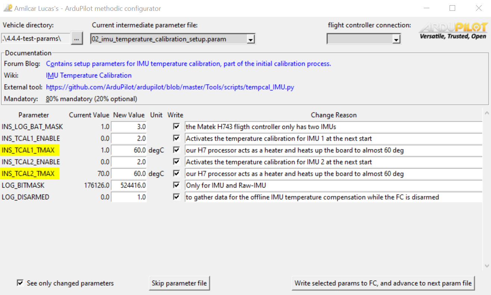

# ArduPilot methodic configurator

 

Amilcar Lucas's ArduPilot methodic configurator is a Python tool that implements a [clear and proven configuration sequence of ArduPilot of drones](https://discuss.ardupilot.org/t/how-to-methodically-tune-almost-any-multicopter-using-arducopter-4-4-x/110842/1).
It provides a graphical user interface (GUI) for managing and visualizing ArduPilot parameters, parameter files and documentation.



## Usage

Usage is detailed in the [USERMANUAL.md](USERMANUAL.md) file

## MS Windows Installation

Install [git](https://git-scm.com/) and [python](https://www.python.org/downloads/). Then do:

```bash
git clone https://github.com/ArduPilot/MethodicConfigurator.git
cd MethodicConfigurator
.\install_windows.bat
```

On MS Windows it tends to auto-connect to the wrong device, you can explicitly set the device with the `--device` command line option to avoid that. Replace COMX with the correct COM port for your device.

```bash
python3 ardupilot_methodic_configurator.py --device COMX
```

## Linux Installation

Install [git](https://git-scm.com/) and [python](https://www.python.org/downloads/). Then do:

```bash
git clone https://github.com/ArduPilot/MethodicConfigurator.git
cd MethodicConfigurator
./install_linux.sh
```

## Support

Support options are described in the [support section](CONTRIBUTING.md#support)

## Contributing

Please feel free to submit [issues](https://github.com/ArduPilot/MethodicConfigurator/issues) or [pull requests](https://github.com/ArduPilot/MethodicConfigurator/pulls). More information is available on the [contributing](CONTRIBUTING.md) page.

## Development requirements

The [Software development requirements](REQUIREMENTS.md) are defined and guide the development.

## Software architecture

To meet the [Software requirements](REQUIREMENTS.md) a [software architecture](REQUIREMENTS.md#software-architecture) was designed and implemented.

## Code of conduct

To use and develop this software you must obey the [ArduPilot Methodic Configurator Code of Conduct](CODE_OF_CONDUCT.md).

## License

This project is licensed under the GNU General Public License v3.0. See the [LICENSE](LICENSE) file for details.

It directly uses:

| Software | License |
|----------|---------|
| [tkinter](https://docs.python.org/3/library/tkinter.html) | [Python Software Foundation License](https://docs.python.org/3/license.html) |
| [argparse](https://docs.python.org/3/library/argparse.html) | [Python Software Foundation License](https://docs.python.org/3/license.html) |
| [logging](https://docs.python.org/3/library/logging.html) | [Python Software Foundation License](https://docs.python.org/3/license.html) |
| [typing](https://docs.python.org/3/library/typing.html) | [Python Software Foundation License](https://docs.python.org/3/license.html) |
| [json](https://docs.python.org/3/library/json.html) | [Python Software Foundation License](https://docs.python.org/3/license.html) |
| [os](https://docs.python.org/3/library/os.html) | [Python Software Foundation License](https://docs.python.org/3/license.html) |
| [re](https://docs.python.org/3/library/re.html) | [Python Software Foundation License](https://docs.python.org/3/license.html) |
| [webbrowser](https://docs.python.org/3/library/webbrowser.html) | [Python Software Foundation License](https://docs.python.org/3/license.html) |
| [pymavlink](https://github.com/ArduPilot/pymavlink) | [GNU Lesser General Public License v3.0](https://github.com/ArduPilot/pymavlink/blob/master/COPYING) |
| [pyserial](https://pyserial.readthedocs.io/en/latest/pyserial.html) | [BSD License](https://github.com/pyserial/pyserial/blob/master/LICENSE.txt) |
| [Scrollable TK frame](https://gist.github.com/mp035/9f2027c3ef9172264532fcd6262f3b01) by Mark Pointing | [Mozilla Public License, v. 2.0](https://mozilla.org/MPL/2.0/) |
| [Python Tkinter ComboBox](https://dev.to/geraldew/python-tkinter-an-exercise-in-wrapping-the-combobox-ndb) by geraldew | [Mozilla Public License, v. 2.0](https://mozilla.org/MPL/2.0/) |

It indirectly uses:

| Software | License |
|----------|---------|
| [future](https://github.com/PythonCharmers/python-future) | [MIT License](https://github.com/PythonCharmers/python-future/blob/master/LICENSE.txt) |
| [lxml](https://github.com/lxml/lxml) | [BSD License](https://github.com/lxml/lxml/blob/master/LICENSE.txt) |
| [certifi](https://github.com/certifi/python-certifi) | [Mozilla Public License 2.0](https://github.com/certifi/python-certifi/blob/master/LICENSE) |
| [charset-normalizer](https://github.com/Ousret/charset_normalizer) | [MIT License](https://github.com/Ousret/charset_normalizer/blob/master/LICENSE) |
| [idna](https://github.com/kjd/idna) | [BSD License](https://github.com/kjd/idna/blob/master/LICENSE.md) |
| [urllib3](https://github.com/urllib3/urllib3) | [MIT License](https://github.com/urllib3/urllib3/blob/main/LICENSE.txt) |
