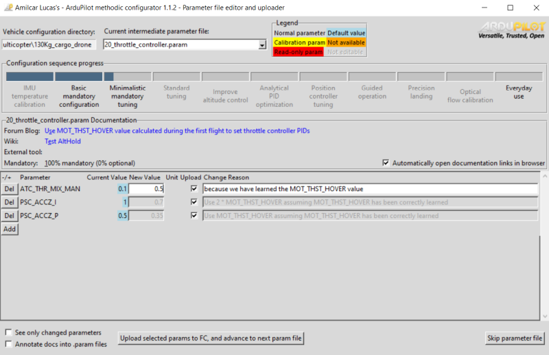

# ArduPilot Methodic Configurator
# Everyone should be able to configure ArduPilot for their vehicles

| Lint | Build | Test | Deploy |
| ---- | ----- | ---- | ------ |
| [](https://github.com/ArduPilot/MethodicConfigurator/actions/workflows/pylint.yml) | | [](https://github.com/ArduPilot/MethodicConfigurator/actions/workflows/unit-tests.yml) | [](https://github.com/ArduPilot/MethodicConfigurator/actions/workflows/pages/pages-build-deployment) |
| [](https://github.com/ArduPilot/MethodicConfigurator/actions/workflows/python-cleanliness.yml) | | [](https://github.com/ArduPilot/MethodicConfigurator/actions/workflows/unittests.yml) | [](https://github.com/ArduPilot/MethodicConfigurator/actions/workflows/python-publish.yml) |
| | | [](https://github.com/ArduPilot/MethodicConfigurator/actions/workflows/coverage.yml) | [](https://github.com/ArduPilot/MethodicConfigurator/actions/workflows/windows_build.yml) |

Amilcar Lucas's ArduPilot Methodic Configurator is a Python tool that implements a [clear and proven configuration sequence of ArduPilot of drones](https://discuss.ardupilot.org/t/how-to-methodically-tune-almost-any-multicopter-using-arducopter-4-4-x/110842/1).


It provides a graphical user interface (GUI) for managing and visualizing ArduPilot parameters, parameter files and documentation.



## Usage

There is a [Quick-start guide](QUICKSTART.md) and a more detailed [Usermanual](USERMANUAL.md)

## MS Windows Installation

Download the [latest MethodicConfiguratorSetup-x.x.x.exe installer file](https://github.com/ArduPilot/MethodicConfigurator/releases/tag/latest).

## Linux Installation

Install [python pip](https://pypi.org/project/pip/). Then do:

```bash
pip install -U MethodicConfigurator
```

## MacOS Installation

Install [git](https://git-scm.com/) and [python](https://www.python.org/downloads/). Then do:

```bash
git clone https://github.com/ArduPilot/MethodicConfigurator.git
cd MethodicConfigurator
./install_macos.sh
```

## Support and Contributing

Please feel free to submit [issues](https://github.com/ArduPilot/MethodicConfigurator/issues) or [pull requests](https://github.com/ArduPilot/MethodicConfigurator/pulls). More information is available on the [contributing and support](CONTRIBUTING.md) page.

## Software architecture

To meet the [Software requirements](ARCHITECTURE.md#software-requirements) a [software architecture](ARCHITECTURE.md#the-software-architecture) was designed and implemented.

## Code of conduct

To use and develop this software you must obey the [ArduPilot Methodic Configurator Code of Conduct](CODE_OF_CONDUCT.md).

## License

This project is licensed under the [GNU General Public License v3.0](LICENSE.md).
It builds upon other [opensource software packages](credits/CREDITS.md)
