# How to methodically tune any ArduCopter Heli

<!-- markdownlint-disable MD013 MD025 MD034 -->

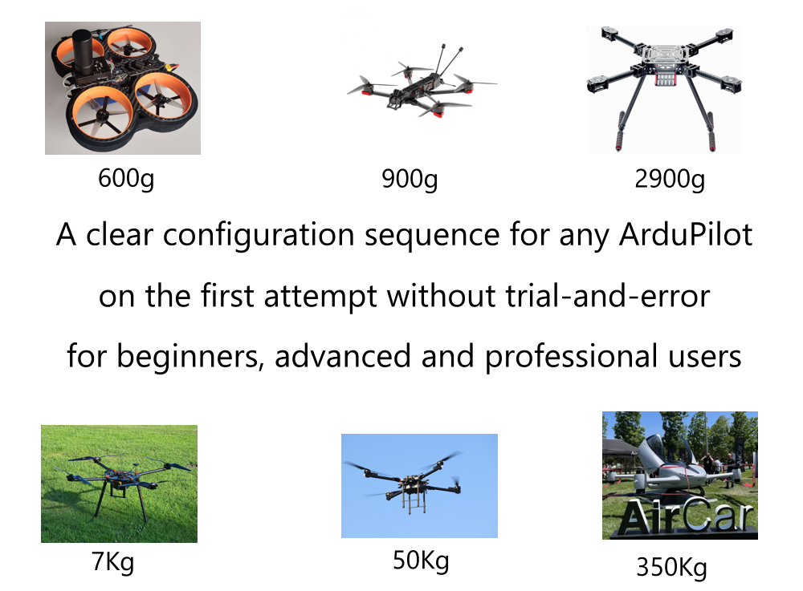

For illustrative purposes, we will use the small 3'' multicopter depicted above, but the tuning sequence will work on any other multicopter.
Parts of Section 1 and Sections 2 to 6 apply to **all ArduPilot vehicles**: ArduPlane, ArduRover, ArduBoat, ArduSub, ArduBlimp ...

This method uses the latest available [ArduPilot WebTools](https://firmware.ardupilot.org/Tools/WebTools/), some of the new features of ArduCopter 4.3 and above and best practices from the [ArduPilot Community](https://discuss.ardupilot.org/).

We will detail the firmware parameters to change, the sequence of how to change them, help you to find the value for each parameter,
 explain which test flights to conduct and the order in which to conduct them and help you document all your steps for traceability.
This applies industry-proven [*software configuration management* (SCM)](https://en.wikipedia.org/wiki/Software_configuration_management) techniques to tuning an ArduCopter vehicle.
You will be able to tune multiple vehicles (think production line) using this method and still have individual traceability of each parameter change on each vehicle.

1. [Select the vehicle components](#1-select-the-vehicle-components)
2. [Install required Software](#2-install-required-software)
3. [Input vehicle components and component connections into ArduPilot Methodic Configurator](#3-input-vehicle-components-and-component-connections-into-ardupilot-methodic-configurator)
4. [Perform IMU temperature calibration before assembling the autopilot into the vehicle](#4-perform-imu-temperature-calibration-before-assembling-the-autopilot-into-the-vehicle-optional) (optional)
5. [Assemble all components except the propellers](#5-assemble-all-components-except-the-propellers)
6. [Basic mandatory configuration](#6-basic-mandatory-configuration)
7. [Install rotor blades and perform the first flight](#7-install-rotor-blades-and-perform-the-first-flight)
8. [Minimalistic mandatory tuning](#8-minimalistic-mandatory-tuning)
9. [Standard tuning](#9-standard-tuning-optional) (optional)
10. [Improve altitude under windy conditions](#10-improve-altitude-under-windy-conditions-optional) (optional)
11. [System identification for analytical PID optimization](#11-system-identification-for-analytical-pid-optimization-optional) (optional)
12. [Position controller tuning](#12-position-controller-tuning-optional) (optional)
13. [Productive configuration](#13-productive-configuration)
14. [Conclusion](#14-conclusion)

# 1. Select the vehicle components

While [choosing an Autopilot](https://ardupilot.org/copter/docs/common-autopilots.html) and [other hardware](https://ardupilot.org/copter/docs/common-optional-hardware.html) components [avoid these components](https://discuss.ardupilot.org/t/hardware-to-avoid-when-building-your-first-multirotor/114014/1)

Use tools like [ecalc for heli](https://www.ecalc.ch/index.htm) to find a suitable set of components to meet your needs.

.PNG)

## 1.1 Helicopter hardware best-practices

1. **Robust frame construction:** A stable and rigid frame is crucial for stable and safe flight behavior. Carbon frames are recommended but not essential, and remember carbon is an electrical conductor.
2. **ESC Governors:** Using ESCs that provide an internal governor can simplify setup. It maintains a stable rotor speed which makes it easy to apply a notch filter to reduce rotor noise in the control signals.
3. **Vibration reduction:** Vibrations reduce the efficiency, stability and lifespan of the drone. The rotor system and motors are the source of most of the vibrations. All components must be securely fastened to minimize vibrations and avoid damage caused by vibrations. Stiff frames reduce vibrations.
    - X and Y vibrations are caused by rotor system and/or motor imbalance - The rotor system must be carefully balanced.
    - Z vibrations are caused by the downwash of each blade hitting the arm and the forward traveling propeller hitting the oncoming air when moving.
4. **Protection of sensors from external disturbances:**
   1. **Vibration-damping mounting of the FC**
   1. **Separation of compass and high-current paths:** To reduce electromagnetic interference, it is recommended to spatially separate the compass (likely integrated with [GNSS](https://en.wikipedia.org/wiki/Satellite_navigation) receivers) from high-current paths and magnetic sources such as motors and power distribution systems/cables. Keep positive and negative wires close together using a gentle twist, braid or regularly spaced zip ties.
   1. **Protection of barometer from airflow:** The barometer must be protected from wind and airflow or turbulence generated by the propellers. A small piece of open-cell foam placed over the sensor acts as a low-pass filter, ensuring accurate altitude measurements.
   1. **GNSS systems are likely to be affected by USB3 devices.** Keep possible negative influences in mind while using USB3 components.
5. **Proper cable management:** Cables and wires must be organized sensibly to prevent entanglement or damage during flight. It must be ensured that no cables hinder movable parts such as propellers or gimbal mechanisms, or are damaged by them. Flexible, silicone-coated cables for data transfer save weight and reduce vibration transmission. Weak connectors are prone to loosening under the influence of vibration.
6. **Weight distribution:** An even weight distribution of the drone with the FC at the center of gravity improves stability and flight control. Components such as batteries, sensors, cameras, and other payloads must be positioned evenly to achieve uniform weight distribution and maximum fit between the geometric and physical center of gravity.
7. **Battery placement:** The battery is often located in the center of the frame to ensure stability during flight. It must be ensured that the battery is rigidly mounted and secured to prevent slipping or unintentional disconnection during operation. Additionally, when properly attached, the battery acts as an inertial mass and helps damp vibrations. Beware of landing directly on the battery since most of the batteries do not have a resistant shell.
8. **Voltage monitoring:** to [dynamically scale the PIDs and maintain stable flight in low battery conditions](https://ardupilot.org/copter/docs/current-limiting-and-voltage-scaling.html#voltage-scaling).
9. **Current monitoring:** to compensate for the dynamic magnetic field caused by the high motor currents.
10. **FC Power supply:** Must provide enough current for the flight controller, [GNSS](https://en.wikipedia.org/wiki/Satellite_navigation) receivers and other payloads operating on 5V.
11. **Helical GNSS antennas:** These kinds of antennas are the [preferred choice for drones and their benefits justify the extra cost](https://discuss.ardupilot.org/t/big-gps-round-up/67755).
12. **STM32 H7 processor family:** Flight controllers that use these processors, have enough processing power and memory to run ArduCopter firmware without restrictions.

## 1.2 Our (example) vehicle

To demonstrate how to methodically tune a ArduCopter vehicle we selected a small helicopter.
It uses the following components:

<!-- markdown-link-check-disable -->

| Type | Part |
| :--- | :--- |
| Frame | [T-Rex 500](https://www.diatone.us/products/diatone-mxc-taycan-duct-3-inch-cinewhoop-fpv-drone) |
| Flight Controller | [Qiotek Adept F405](http://www.mateksys.com/?portfolio=h743-slim) |
| ESC | [Castle Creations 75](https://www.diatone.us/products/mb-f45_128k-bl32-esc) |
| Motor | [Align XXXX](https://www.fpv24.com/de/t-motor/t-motor-f-serie-f1507-cinematic-3800kv-3s-4s) |
| Rotor Blades | 2x [Align 500](https://shop.rc-hangar15.de/HQProp-76mm-CineWhoop-3-8-Blatt-Propeller-grau) |
| BEC with voltage/current monitor | [Holybro PM02 V3](https://holybro.com/products/pm02-v3-12s-power-module) |
| Battery | [6s 4500mAh](https://www.stefansliposhop.de/akkus/sls-x-cube/sls-x-cube-40c/sls-x-cube-1800mah-4s1p-14-8v-40c-80c::1568.html) |
| GNSS Receiver | [Holybro H-RTK F9P Helical](https://holybro.com/products/h-rtk-f9p-gnss-series?variant=41466787168445) |
| SDCard | Any FAT32 or exFAT formatted fast Micro-SDCard > 8 GiB |
| RC Receiver | [Futaba 7603](https://www.team-blacksheep.com/products/prod:crossfire_nano_se) |
| RC Transmitter | [Futaba 9C](https://www.radiomasterrc.com/products/tx16s-mark-ii-radio-controller) |
| Remote ID transmitter | [Remote ID transmitter](https://holybro.com/products/remote-id) |

<!-- markdown-link-check-enable -->

Your vehicle will be different as your application will have different requirements.

# 2. Install required Software

To configure and operate your vehicle you need at least these software:

- [Install ArduPilot Methodic Configurator](INSTALL.md)
- [Install Mission Planner](INSTALL.md#install-mission-planner-software-on-a-pc-or-mac)
- [Install ArduPilot](INSTALL.md#install-ardupilot-firmware-on-the-flight-controller)

Use Mission Planner to flash the latest stable [ArduCopter](https://firmware.ardupilot.org/Copter/stable/), [ArduPlane](https://firmware.ardupilot.org/Plane/stable/), [ArduRover](https://firmware.ardupilot.org/Rover/stable/), [ArduSub](https://firmware.ardupilot.org/Sub/stable/) or [ArduBlimp](https://firmware.ardupilot.org/Blimp/latest/) firmware for your flight controller.

## 2.1 Used software summary

The table below summarizes the software used in this guide. Download and install them as you progress in the guide.

| Software | Version | Description |
| :---- | :---- | :---- |
| [Mission Planner](https://firmware.ardupilot.org/Tools/MissionPlanner/MissionPlanner-latest.msi) | latest beta | Ground control station (PC software) used for configuring and operating the vehicle |
| [ArduPilot Methodic Configurator](https://github.com/ArduPilot/MethodicConfigurator) | latest | A clear ArduPilot configuration sequence |
| [ArduCopter](https://firmware.ardupilot.org/Copter/stable/) | 4.4.4 or 4.5.7 | Flight controller firmware |
| [BLHeliSuite32](https://www.mediafire.com/file/fj1p9qlbzo5bl5g/BLHeliSuite32_32.9.0.6.zip/file) | 32.9.06 | PC software to flash and configure ESCs with BLHeli_32 ARM firmware |
| [BLHeli_32 ARM](https://github.com/bitdump/BLHeli/tree/master/BLHeli_32%20ARM) | 32.8 | ESC firmware with Bidir Dshot support |
| [EdgeTx companion](https://edgetx.org/getedgetx/) | 2.9.2 | PC software for configuring and updating EdgeTX based RC transmitters |
| [EdgeTx](https://edgetx.org/) | 2.9.2 | Radiomaster TX16S firmware with touch screen support |
| [Yaapu scripts](https://github.com/yaapu/FrskyTelemetryScript/wiki/Passthrough-over-CRSF-and-ExpressLRS) | 2023-11-08 | Display vehicle telemetry on the Radiomaster TX16S |
| Simple text editor: [Notepad++](https://notepad-plus-plus.org/), [nano](https://www.nano-editor.org/) or [code](https://code.visualstudio.com/) | any | Allows editing plain text files without undesired text changes. Do not use microsoft word! |
| [MAVExplorer](https://ardupilot.org/dev/docs/using-mavexplorer-for-log-analysis.html) | latest | Analyze dataflash (`.bin`) log files |
| [Scripted MagFit flightpath generation](https://discuss.ardupilot.org/t/scripted-magfit-flightpath-generation/97536) | latest | [Lua script](https://ardupilot.org/copter/docs/common-lua-scripts.html) to generate a MagFit flight path |
| [ecalc for multirotor](https://www.ecalc.ch/index.htm) | online | Finds a suitable set of components that meet your needs |
| [ArduPilot Hardware Report](https://firmware.ardupilot.org/Tools/WebTools/HardwareReport/) | online | Provides an overview of connected hardware from a `.bin` log and visualization of sensor position offsets. |
| [ArduPilot Filter Review Tool](https://firmware.ardupilot.org/Tools/WebTools/FilterReview/) | online | Aid in configuring and validating the Harmonic Notch filters |
| [ArduPilot Filter Analysis](https://firmware.ardupilot.org/Tools/WebTools/FilterTool/) | online | Bode plot tool to give insight into gyro low-pass and notch filter attenuation and phase lag |
| [ArduPilot PID Review Tool](https://firmware.ardupilot.org/Tools/WebTools/PIDReview/) | online | Review PID tune in the frequency domain. Step response estimate is generated. |
| [ArduPilot MAGFit in flight compass calibration](https://firmware.ardupilot.org/Tools/WebTools/MAGFit/) | online | Do [compass calibration using a flight log](https://discuss.ardupilot.org/t/new-magfit-compass-calibration-webtool/110192) |
| [ArduPilot Log Viewer](https://plotbeta.ardupilot.org/) | online | Log viewer, analyzer and plotter. Can also do MagFit |
| [Add grid to image](https://yomotherboard.com/add-grid-to-image/) | online | Add a grid overlay to any image |
| [SketchAndCalc](https://www.sketchandcalc.com/) | online | Calculate areas |

# 3. Input vehicle components and component connections into ArduPilot Methodic Configurator

The ArduPilot Methodic Configurator needs to know which components you used/plan to use and how you connected/plan to connect them to the flight controller (autopilot).
It uses this information to automatically preselect configuration settings relevant to your specific vehicle.

So, [start the ArduPilot Methodic Configurator and select a vehicle that resembles yours](USECASES.md#use-the-ardupilot-methodic-configurator-software-for-the-first-time) and input vehicle components and component connections information into the ArduPilot Methodic Configurator *component editor window*:

1. Close Mission Planner, if it is open on the PC.
1. Connect the flight controller to the PC via a USB cable and wait 7 seconds.
1. Open *ArduPilot Methodic Configurator*, and [connect it to the vehicle](USERMANUAL.md#step-1-flight-controller-connection).<br>
   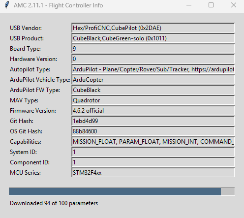
1. Press the *Create a vehicle configuration directory from template* button.<br>
   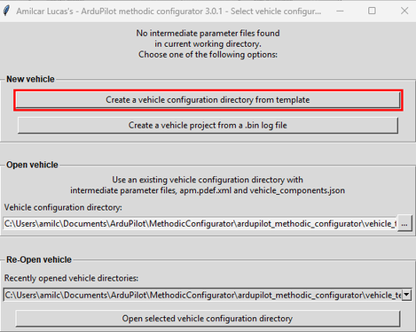
1. Now using [New](USERMANUAL.md#new) subsection<br>
   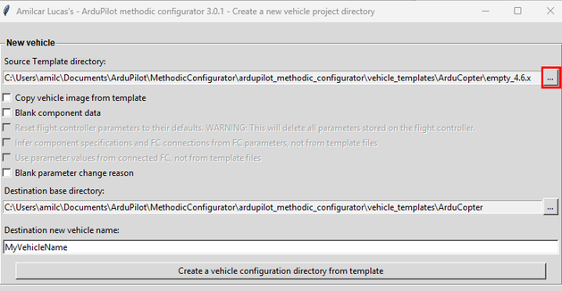
1. From the existing templates, select the one most similar to your vehicle:<br>
   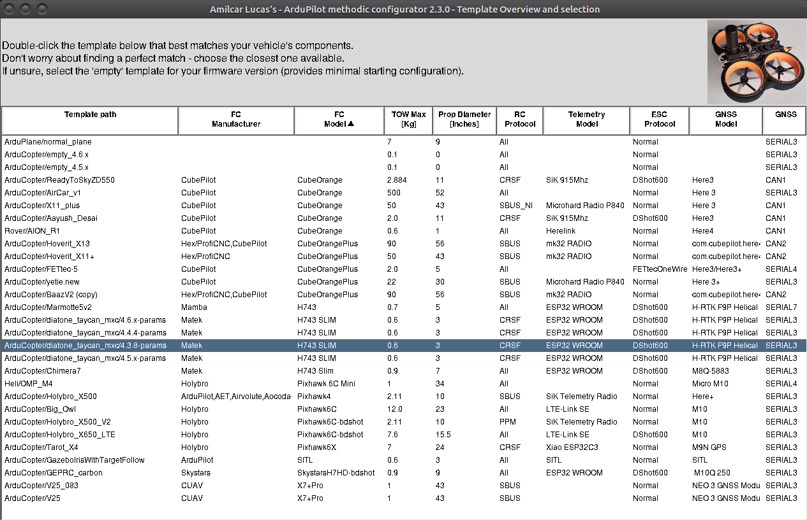
1. Select the options that meet your requirements:
   - *Copy vehicle image from template* - Use the template vehicle image in your created vehicle configuration directory. This image helps identify the vehicle configuration.
   - *Blank component data* - Create a new blank vehicle configuration, with no component data from the template.
   - *Reset flight controller parameters to their defaults* - Reset the flight controller parameters to their default values when creating a new vehicle configuration.
   Helps avoid issues caused by incorrect or incompatible parameter settings. WARNING: This will delete all parameters stored on the flight controller.
   - *Infer component specifications and FC connections from FC parameters, not from template files* - When creating a new vehicle configuration, extract component
   specifications and connection information directly from the connected flight controller instead of using the specifications defined in the template files.
   This helps ensure the configuration accurately matches your actual hardware.
   Note: you will not see the information from the correctly configured vehicle template. This option is only available when a flight controller is connected.
   - *Use parameter values from connected FC, not from template files* - Use the parameter values from the connected flight controller instead of the template files when
   creating a new vehicle configuration directory from a template.
   Only makes sense if your FC has already been correctly configured. This option is only available when a flight controller is connected.
   - *Blank parameter change reason* - Do not use the parameters change reason from the template.
1. Select the destination directory, give it a name, and press the *Create a vehicle configuration directory from template* button.
1. On the component editor window, **add all the details of the components of your system** as we did in [Section 1.2](#12-our-example-vehicle):<br>
   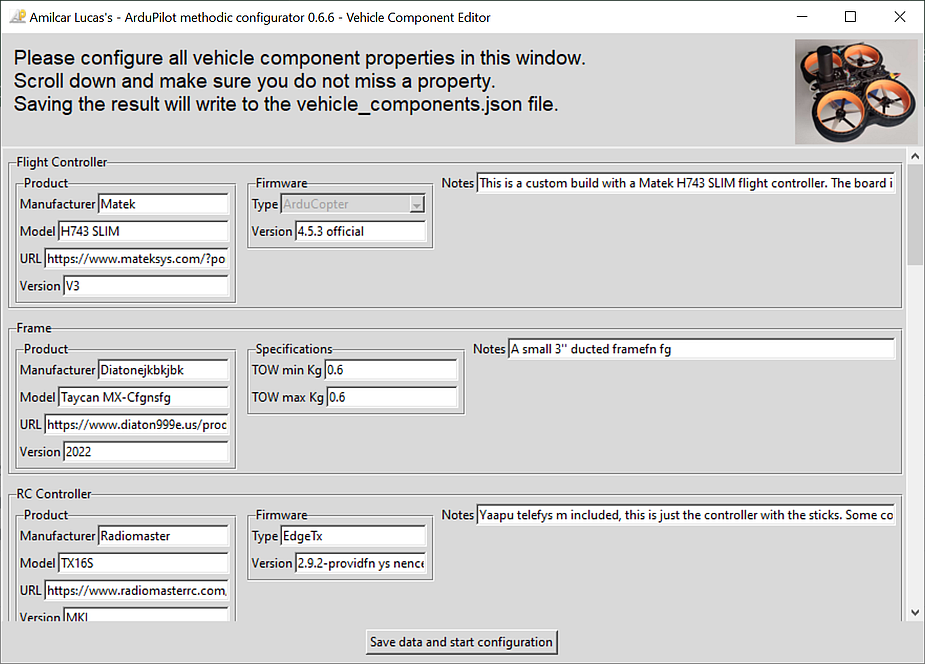

Most optional information fields are only visible in `normal` GUI complexity mode.

All components have **optional** information about the product itself:

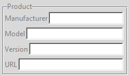

The URL can be used to store a link to a datasheet or a link to a shop product page.

Some components have **optional** information about their firmware:

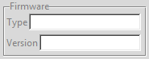

All components have an **optional** notes field.

## Flight Controller

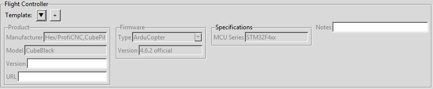

Some information, if available, is automatically filed in by the software as seen in the example above.

## Frame

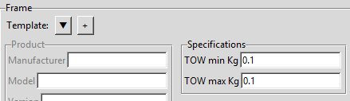

The minimum take off weight and the maximum take off weight in Kilo are entered here.
If you have variable payload configure the vehicle at the minimum take off weight.
Only after completely tuned can you add the additional payload.

## Battery Monitor

All supported connection types and their corresponding protocols are:

| Connection Type | Protocol |
| --------------- | -------- |
| `None` | `Disabled` |
| `Analog` | `Analog Voltage Only` |
| `Analog` | `Analog Voltage and Current` |
| `Analog` | `FuelLevelAnalog` |
| `Analog` | `Synthetic Current and Analog Voltage` |
| `I2C1`–`I2C4` | `Solo` |
| `I2C1`–`I2C4` | `Bebop` |
| `I2C1`–`I2C4` | `SMBus-Generic` |
| `I2C1`–`I2C4` | `FuelFlow` |
| `I2C1`–`I2C4` | `SMBUS-SUI3` |
| `I2C1`–`I2C4` | `SMBUS-SUI6` |
| `I2C1`–`I2C4` | `NeoDesign` |
| `I2C1`–`I2C4` | `SMBus-Maxell` |
| `I2C1`–`I2C4` | `Generator-Elec` |
| `I2C1`–`I2C4` | `Generator-Fuel` |
| `I2C1`–`I2C4` | `Rotoye` |
| `I2C1`–`I2C4` | `MPPT` |
| `I2C1`–`I2C4` | `INA2XX` |
| `I2C1`–`I2C4` | `LTC2946` |
| `I2C1`–`I2C4` | `EFI` |
| `I2C1`–`I2C4` | `AD7091R5` |
| `CAN1`–`CAN2` | `DroneCAN-BatteryInfo` |
| `PWM` | `FuelLevelPWM` |
| `SPI` | `INA239_SPI` |
| `other` | `ESC` |
| `other` | `Sum Of Selected Monitors` |
| `other` | `Torqeedo` |
| `other` | `Scripting` |

It is strongly recommended to use a battery monitor.
But if you do not have one select `none` in the flight controller connection:

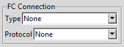

If your battery monitor has an analog connection to the FC, select `analog` and one of the possible protocols:

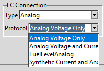

If your battery monitor has an I2C connection to the FC, select the I2C bus and one of the possible protocols:

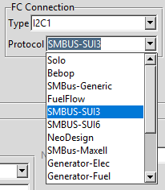

If your battery monitor has a CAN connection to the FC, select the CAN bus:

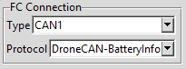

If your battery monitor has a SPI connection to the FC, select the SPI bus:

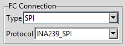

If your battery monitor has a PWM connection to the FC, select the PWM:

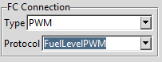

Otherwise select `other` and one of the possible protocols:

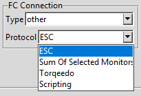

## Battery

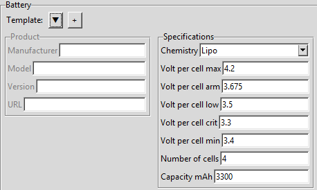

Select the correct battery chemistry, doing so will automatically set typical voltage thresholds for that battery chemistry.

Afterwards you should tweak the voltage thresholds to meet your requirements.

- `Volt per cell max` - PID values will only scale when below this voltage
- `Volt per cell arm` - vehicle will only arm if battery voltage is above this threshold
- `Volt per cell low` - first failsafe level gets triggered when below this value
- `Volt per cell crit` - second failsafe level gets triggered when below this value
- `Volt per cell min` - PID values will only scale when above this voltage

They must obey `Volt per cell crit` < `Volt per cell low` < `Volt per cell arm` < `Volt per cell max`

`Number of cells` is the number of cells connected in series.
For a 6S battery this is 6.

### Battery Discharge Characteristics

The voltage thresholds depend on multiple factors:

- **Battery Chemistry**: LiPo, LiFe, Li-ion, etc. have different discharge curves
- **Temperature**: Battery voltage varies significantly across temperature ranges
- **Load Current (C-rating)**: Higher discharge currents reduce available voltage
- **Specific Battery**: Each manufacturer's battery has unique characteristics

The following graphs show typical LiPo discharge curves.

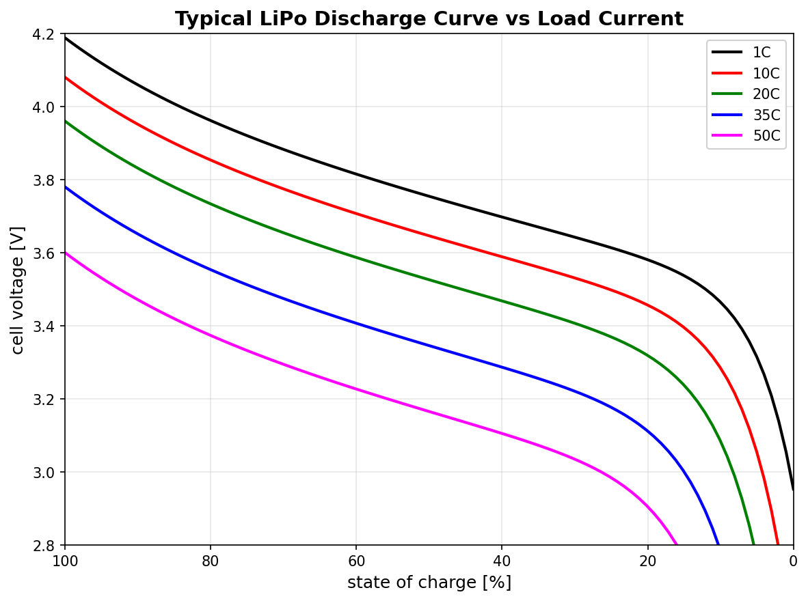

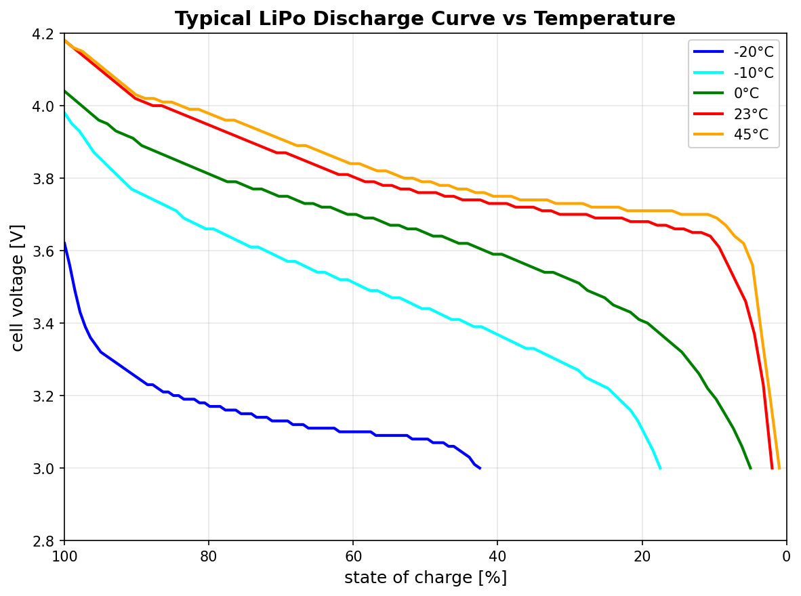

**Always request these discharge curves from your battery manufacturer** to properly configure the voltage thresholds for your specific battery and operating conditions.
This ensures your vehicle operates safely and reliably across all expected temperatures and load conditions.

## ESC

Electronic speed controllers have a `FC->ESC Connection` for control of the motor speed and
an optional `ESC->FC Telemetry` for telemetry feedback from the ESC to the flight controller.

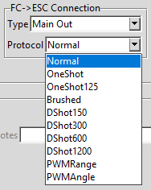

The `FC->ESC Connection` type can be `Main Out`, an `AIO` integrated output, a serial port, or a CAN bus.
The protocol is determined by the `MOT_PWM_TYPE` parameter (e.g. `Normal`, `DShot600`) for PWM outputs,
or the serial/CAN protocol (e.g. `FETtecOneWire`, `DroneCAN`) for digital connections.

The `ESC->FC Telemetry` type and protocol describe the return path:

| Connection Type | Protocol | Notes |
| --------------- | -------- | ----- |
| `None` | `None` | No ESC telemetry |
| same as FC->ESC | `BDShotOnly` | BDShot only on Main Out and/or AIO, without serial port backup channel |
| serial port | `ESC Telemetry` | DShot or BDShot serial telemetry backup channel |
| serial port | `FETtecOneWire` | Bidirectional FETtec protocol on the same wire |
| serial port | `Scripting` | For T-Motor/Hobbywing Datalink v2 serial telemetry |
| serial port | `Torqeedo` | For Torqeedo telemetry |
| serial port | `CoDevESC` | For CoDevESC serial telemetry |
| CAN port | `DroneCAN` | Telemetry over CAN bus |

When using BDShot only on `Main Out` (1-8) and/or `Aux I/O` (9-14) connection, without serial port backup channel:

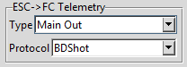

When using DShot or BDShot with a serial port backup channel:

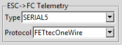

## Motors

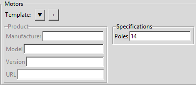

Enter the number of magnetic **poles** of the motor rotor.
This is the **P** number in the common `nNmP` motor winding notation (e.g. `12N14P` → 14 poles).
The value must be an even integer.
It is used by ArduPilot to calculate the actual motor RPM from the ESC telemetry electrical frequency.

## Propellers

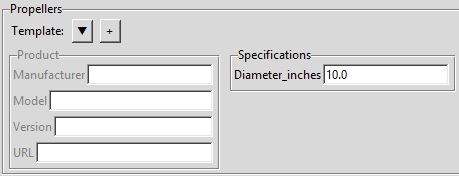

Enter the propeller **diameter in inches**.
This value affects many initial PID values.

## GNSS Receiver

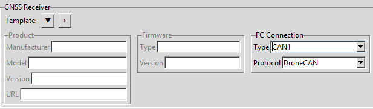

Select the FC connection **type** (serial port or CAN bus) and the matching **protocol**:

| Connection Type | Protocol |
| --------------- | -------- |
| None | `None` |
| CAN bus | `DroneCAN` |
| serial port — auto-detect | `AUTO` |
| serial port — vendor-specific | other |

If you do not have a GNSS receiver, select `None` as the connection type.

## RC Controller

The hand-held controller used by the pilot.
Enter the manufacturer and model for documentation purposes.
This component has no FC connection — it communicates wirelessly via the RC Transmitter and RC Receiver pair.

## RC Transmitter

The RF transmitter module (may be integrated in the RC Controller or a separate module).
Enter the manufacturer and model for documentation purposes.
This component has no FC connection.

## RC Receiver

Select the FC connection **type** and **protocol** that match how the receiver is wired to the flight controller:

| Connection Type | Protocol |
| --------------- | -------- |
| RCin/SBUS — auto-detect all protocols | `All` |
| RCin/SBUS | `PPM` |
| RCin/SBUS or serial | `SBUS` / `SBUS_NI` |
| serial port | `DSM` |
| serial port | `CRSF` |
| serial port | `FPORT` |
| serial port | `MAVRadio` |
| serial port — vendor-specific | other |

If your receiver is connected to a dedicated RC input pin, choose `RCin/SBUS` as the type.
If it is connected to a UART (e.g. CRSF, FPORT, DSM), choose the corresponding serial port.

## Telemetry

Select the FC connection **type** (serial port or CAN bus) and the matching **protocol**:

| Connection Type | Protocol | Notes |
| --------------- | -------- | ----- |
| None | `None` | when not present |
| serial | `MAVLink2` | recommended for most ground stations |
| serial | `MAVLink1` | legacy ground stations |
| serial | `MAVLink High Latency` | satellite / low-bandwidth links |
| serial | `DDS XRCE` | ROS 2 micro-XRCE-DDS bridge |
| serial | other | vendor-specific |

If you do not have a telemetry radio, select `None` as the connection type.

Make sure to **scroll all the way down and enter all the information requested**, even if it does not seem important to you.
Click the `Save data and start configuration` button on the bottom

You now have a vehicle configuration directory with the name that you selected.
But the files are just templates, you need to edit them in the next steps.

# 4. Perform IMU temperature calibration before assembling the autopilot into the vehicle (optional)

IMU temperature calibration reduces the probability of *Accel inconsistent* and *Gyro inconsistent* errors and reduces the time required to arm the vehicle.
IMU temperature calibration requires lowering the temperature of the autopilot (flight controller) to circa -20°C.
That is harder to do once the autopilot is assembled inside the vehicle, hence it is done now.

## 4.1 Setup IMU temperature calibration

1. [Start the software](USECASES.md#use-the-ardupilot-methodic-configurator-software-for-the-first-time) if not already running.
1. On *ArduPilot Methodic Configurator* select `02_imu_temperature_calibration_setup.param` on the *Current intermediate parameter file:* Combobox if not already selected.
1. Read the *Forum Blog:* and *Wiki:* documentation by pressing on the blue URL links.
1. Edit the `02_imu_temperature_calibration_setup.param` parameters' `New Value` and `Change Reason` using the *ArduPilot Methodic Configurator* parameter editor and press `Upload selected params to FC, and advance to next file`.
1. When *ArduPilot Methodic Configurator* asks you *Do you want to provide a .bin log file and run the IMU temperature calibration using it?* select `No` and close the program.
1. Power off the flight controller and remove the battery.
1. Place the flight controller **without battery** in a freezer capable of reaching your vehicle's minimum expected operation temperature (-18°C in our case).
1. Once the flight controller is completely cooled down to its minimum expected operation temperature, take it out and power it.
   **Do not move the flight controller** for one or two hours.
   If the flight controller does not have a heater, place it in a warm place to make sure the target temperature gets reached fast enough.
   The data collection process will automatically stop once the temperature increase is less than 0.5 °C in 10 minutes.
1. Monitor the data collection process:
   - If you have a buzzer connected, you will hear a short periodic beep while the calibration is in progress.
     When the calibration is complete, a completion tune will play.
   - If you have [notification LEDs](https://ardupilot.org/copter/docs/common-leds-pixhawk.html) on your flight controller they will cyclically flash red, blue and green while calibrating.
   - If you do not have a buzzer connected nor notification LEDs, monitor the parameters using Mission Planner.
     Use Mission Planner's Live Tuning Screen found on the Data Screen:
        1. Connect the flight controller to Mission Planner
        1. Check the *Tuning* checkbox on the bottom of the Data Screen.
        1. Double-click in the screen and select `IMUx` from the Sensor fields, where `x` represents the IMUs you have configured to collect data.
        1. Monitor the progress in the *Tuning* screen as well as the *Messages* screen under the HUD.
        1. The images below show an example of the Start of the process and the Completion.
        1. You can also periodically refresh (re-read) the parameters from the flight controller.
           On completion, the `INS_TCALn_ENABLE` parameters will change to 1 (*enable*) for each calibrated IMU.
1. Power it off, and remove the micro SDCard
1. Copy the latest `.bin` log file in the micro SDcard from `/APM/LOGS` to your PC
1. Insert the micro SDcard back into the flight controller

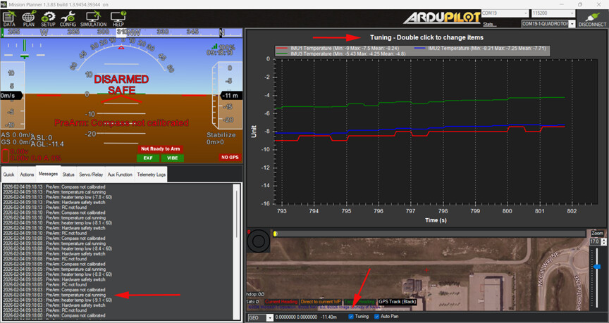

The Figure above depicts the Mission Planner tuning screen showing IMU temperature calibration start (low temperatures) and messages window

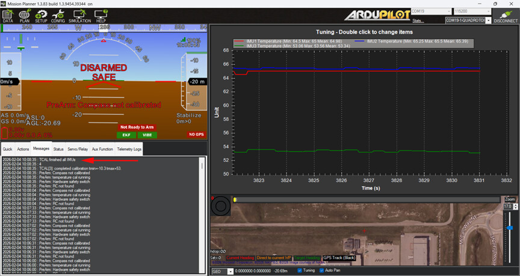

The Figure above depicts the Mission Planner tuning screen showing IMU temperature calibration completed (high temperatures) and messages window

## 4.2 Calculate IMU temperature calibration

1. Connect a USB cable to the FC and open *ArduPilot Methodic Configurator*. It will ask you again *Do you want to provide a .bin log file and run the IMU temperature calibration using it?* Select `Yes` and point it to the `.bin` file that you just downloaded.
1. Wait until finished It can take 10 Minutes or more look at the produced graphs they are also automatically saved to disk on the vehicle directory
1. Press `Upload selected params to FC, and advance to next file`.
   This stores the calibration polynomial coefficients in the `03_imu_temperature_calibration_results.param` file.

The graphic below depicts the accelerometer drift versus time and the board temperature versus time.
The temperature curve, depicted in black, is logarithmic as expected.
The other curves are smooth, proving that the flight controller was not moved in the process and the calibration is valid.
As can be seen, before the calibration temperature changes caused a big change in accelerometer/gyro drift.
After the calibration, temperature changes will cause no significant accelerometer/gyro drift changes.

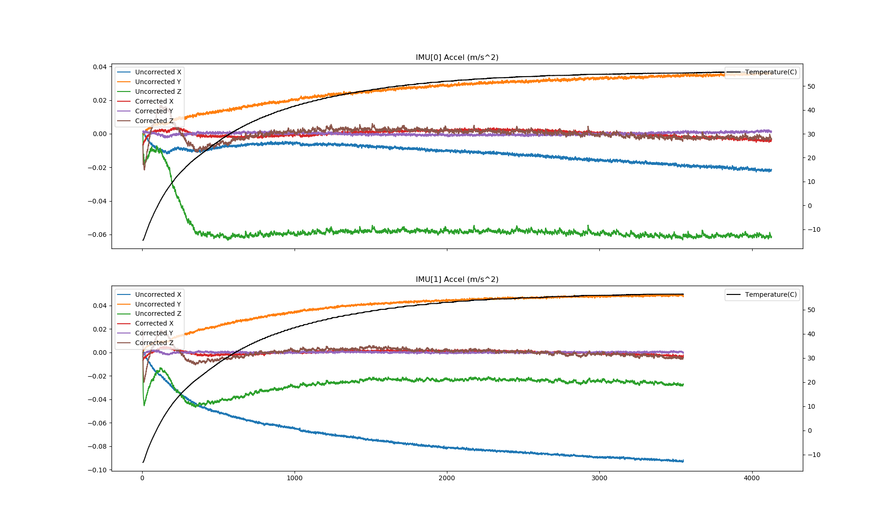

## 4.3 Finish IMU temperature calibration

Repeat the steps from [Section 6.1.1](#611-use-ardupilot-methodic-configurator-to-edit-the-parameter-file-and-upload-it-to-the-flight-controller) to edit and upload the `04_imu_temperature_calibration_finish.param` file.
This disables disarmed logging (no longer needed after calibration) and sets the board target temperature, so that future steps run at a stable, drift-compensated temperature and only log when armed.

# 5. Assemble all components except the propellers

Now that the optional IMU temperature calibration is done we must assemble and connect all components except the rotors.

Read the [Helicopter hardware best-practices](#11-helicopter-hardware-best-practices) section again before assembling the vehicle.

If you changed the way the components are connected to the flight controller (FC), re-enter the updated information into ArduPilot Methodic Configurator [component editor window](USERMANUAL.md#step-3-vehicle-component-editor-interface).

Always connect the vehicle battery before connecting the USB cable (if you are using one) between the PC and the flight controller.
Always disconnect the USB cable (if you are using one) between the PC and the flight controller before disconnecting the vehicle battery.

## 5.1 Assembly of the example vehicle

We connected the components as depicted below.
The figure excludes the LiPo battery and the PM02 BEC with a voltage/current monitor.

| Component | [Flight controller connections](https://www.mateksys.com/?portfolio=h743-slim-v4#tab-id-4) |
| :--- | :---- |
| T-Motor F45 4in1 ESC V2 | `G`, `G`, `Vbat`, not Connected, `S4`, `S3`, `S2`, `S1`, `Cur`, `Rx8` (SERIAL5) |
| Holybro PM02 V3 | not connected, `G`, `Vbat2`, `Curr2`, not Connected, not Connected |
| Holybro H-RTK F9P Helical | `5V`, `Tx2`, `Rx2`, `CL1`, `DA1`, not connected, not connected, `3V3`, `Buzz`, `G` |
| TBS Crossfire Nano RX se | `G`, `5V`, `Rx6`, `Tx6` |

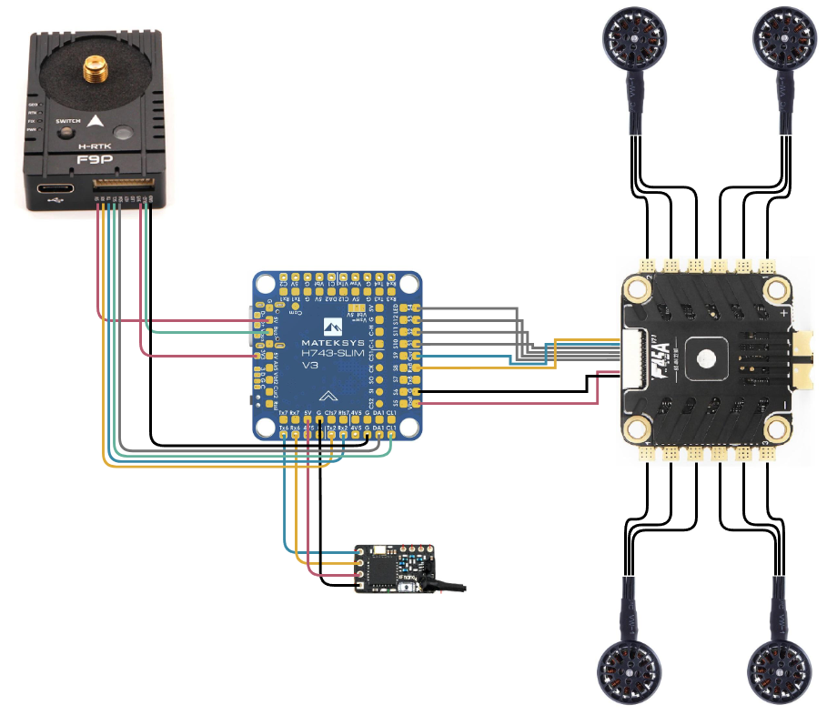

# 6. Basic mandatory configuration

## 6.1 Configure flight controller orientation

Follow [mounting the autopilot](https://ardupilot.org/copter/docs/common-mounting-the-flight-controller.html) documentation to determine the correct value of the [AHRS_ORIENTATION](https://ardupilot.org/copter/docs/parameters.html#ahrs-orientation) parameter.

### 6.1.1 Use ArduPilot Methodic Configurator to edit the parameter file and upload it to the flight controller

1. The parameter file for this particular step is `05_board_orientation.param` other steps will use other parameter files
  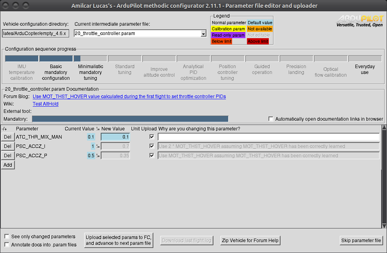
1. On *ArduPilot Methodic Configurator* select `05_board_orientation.param` on the *Current intermediate parameter file:* Combobox.
1. Read the documentation links inside the `05_board_orientation.param documentation`
1. **Add** or **Del**ete parameters if necessary, using the respective GUI buttons
1. Edit the parameters' `New Value` and `Change Reason` to suit your requirements.
The `Change Reason` field is extremely important because:
    - it forces you to think, causing rational decisions instead of impulsive ones
    - justifies your decisions on a vehicle certification process required in most countries
    - allows for someone else to see if you know what you are doing
    - allows for someone else (or yourself after a few weeks) to understand your rationale
1. Press `Upload selected params to FC, and advance to next file` button.

## 6.2 Configure the Remote Controller

### 6.2.1 Configure the RC receiver

In our setup, we used an advanced RC receiver that cannot be fully configured using Mission Planner's `SETUP >> Mandatory Hardware >> Radio Calibration` menu.

Repeat the steps from [Section 6.1.1](#611-use-ardupilot-methodic-configurator-to-edit-the-parameter-file-and-upload-it-to-the-flight-controller) to edit and upload the `06_remote_controller_receiver.param` file

### 6.2.2 Configure the RC controller

In our setup, we use EdgeTX firmware on the RC transmitter.

Download and install *EdgeTX Companion* to your PC. Start it and configure it as depicted below.

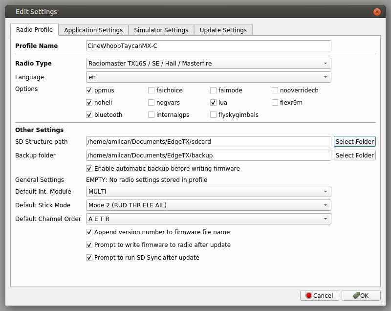

After that, use a micro SDcard to update the firmware on the Radiomaster TX16S and copy the **yaapu** scripts to the `/WIDGETS/yaapu` directory on the micro SDcard.

Once the RC transmitter is running EdgeTx you can load the [Taycan MX-C EdgeTX configuration file](images/blog/TaycanMX-C.etx) into EdgeTX companion and upload it to the radio.
Or simply copy only the settings that you require, EdgeTX companion is very flexible.

Repeat the steps from [Section 6.1.1](#611-use-ardupilot-methodic-configurator-to-edit-the-parameter-file-and-upload-it-to-the-flight-controller) to edit and upload the `07_remote_controller_controller.param` file to configure RC controller-specific options, including the arming method and RC channel option assignments (e.g. arming via RC5 for ExpressLRS systems).

After that test the [RC failsafe](https://ardupilot.org/copter/docs/radio-failsafe.html)

## 6.3 Configure telemetry

The RC transmitter we used has a big color display where telemetry data is displayed, nevertheless, we use telemetry data for real-time flight monitoring with Mission Planner or QGroundControl.

Repeat the steps from [Section 6.1.1](#611-use-ardupilot-methodic-configurator-to-edit-the-parameter-file-and-upload-it-to-the-flight-controller) to edit and upload the `08_telemetry.param` file

Once this is operating we no longer need the USB connection to the vehicle. We can now use the telemetry connection instead.

## 6.4 Configure the ESC

In our setup, we used a [Bi-directional Dshot ESC](https://ardupilot.org/copter/docs/common-dshot-escs.html) that cannot be fully configured using Mission Planner's `SETUP >> Mandatory Hardware >> Servo Output` menu.

Repeat the steps from [Section 6.1.1](#611-use-ardupilot-methodic-configurator-to-edit-the-parameter-file-and-upload-it-to-the-flight-controller) to edit and upload the `09_esc_telemetry.param` file

The step above configured ESC communication passthrough.
In our vehicle, we use *BLHeli_32 ARM* ESC firmware.
So we use BLHeliSuite32 Version 32.9.0.6 to configure the ESCs.
Flash the Firmware version described in the table above.
Configure the parameters to match the figures below.

https://youtu.be/7WeHTb7aBrE?si=gW9YbcQkZYK3DoNE

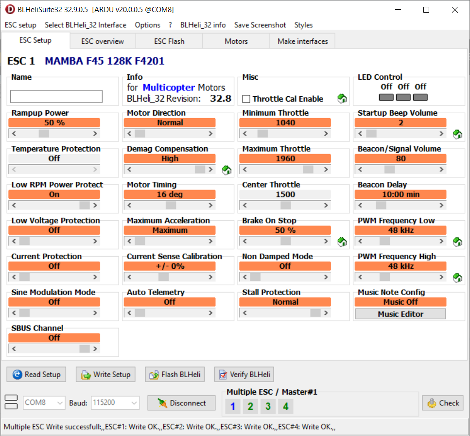

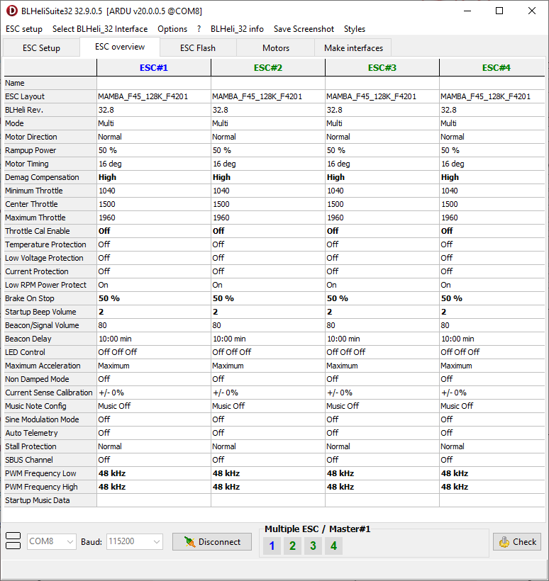

## 6.5 Configure the primary battery monitor

In our setup, the battery voltage is measured directly at the flight controller `Vbat` pin and the current is measured at the 4-in1 ESC `Curr` pin.

### 6.5.1 When using an analog voltage and current monitor

To calibrate the `BATT_VOLT_MULT` voltage multiplier parameter, note the reported voltage from the flight controller and
measure the actual battery voltage with a multimeter.
`New BATT_VOLT_MULT` = (`old BATT_VOLT_MULT` x `Multimeter reading`) / `Reported voltage`

To set the `BATT_AMP_PERVLT` parameter value, fly a fully charged battery and from the flight log note the consumed mAh (BAT[0].CurrTot).
Then re-charge the battery and note the charged mAh (you need to have a battery charger that displays this information).
Then calculate a new `BATT_AMP_PERVLT` value by:
`New BATT_AMP_PERVLT` = (`old BATT_AMP_PERVLT` x `charged mAh`) / `Flight logged mAh`

Repeat the steps from [Section 6.1.1](#611-use-ardupilot-methodic-configurator-to-edit-the-parameter-file-and-upload-it-to-the-flight-controller) to edit and upload the `10_battery_monitor.param` file to configure the battery monitor hardware connection type, protocol and calibration values so the autopilot correctly reads battery voltage and current.

Your vehicle is not ready to fly yet, so you will need to come back to this step later to perform the `BATT_AMP_PERVLT` calibration.

### 6.5.2 Configure the battery(es)

Repeat the steps from [Section 6.1.1](#611-use-ardupilot-methodic-configurator-to-edit-the-parameter-file-and-upload-it-to-the-flight-controller) to edit and upload the `11_battery.param` file

## 6.6 Configure the GNSS receiver(s)

GNSS receivers very often contain a magnetometer (compass) sensor. So they need to be configured before proceeding to the next step.

Repeat the steps from [Section 6.1.1](#611-use-ardupilot-methodic-configurator-to-edit-the-parameter-file-and-upload-it-to-the-flight-controller) to edit and upload the `12_gnss.param` file

## 6.7 Initial attitude PID gains (vehicle size dependent)

Propeller size has a big influence on the vehicle dynamics, this adapts controller response to it.

Repeat the steps from [Section 6.1.1](#611-use-ardupilot-methodic-configurator-to-edit-the-parameter-file-and-upload-it-to-the-flight-controller) to edit and upload the `13_initial_atc.param` file

When asked *Update file with values from FC?* select `Close` to close the application and go perform the experiment.

## 6.8 Configure "Mandatory Hardware" Parameters

Open Mission Planner, connect to the flight controller and select `SETUP >> Mandatory Hardware` and work yourself through all the submenus as described below. **DO NOT SKIP ANY STEP**.

### Frame Type

This relates to the `FRAME_CLASS` and `FRAME_TYPE` parameters.

### [Accel Calibration](https://ardupilot.org/copter/docs/common-accelerometer-calibration.html)

Follow the [ArduPilot wiki instructions](https://ardupilot.org/copter/docs/common-accelerometer-calibration.html) and calibrate the accelerometers.
For small vehicles use:

- *Calibrate Accel*
- *Calibrate level*

For very large vehicles:

- *Simple Accel Cal*

### [Compass](https://ardupilot.org/copter/docs/common-compass-calibration-in-mission-planner.html)

Follow the [ArduPilot wiki instructions](https://ardupilot.org/copter/docs/common-compass-calibration-in-mission-planner.html) and calibrate the compass(es).
Disable internal compasses if the battery or power wires are close to the flight controller.
Do not select *Automatically learn offsets* it makes little sense on a multicopter.
And we will do in-flight MagFit later

If you have a large vehicle you might want to use [large vehicle MagCal](https://ardupilot.org/copter/docs/common-compass-calibration-in-mission-planner.html#large-vehicle-magcal) instead.

### [Radio Calibration](https://ardupilot.org/copter/docs/common-radio-control-calibration.html)

Follow the [ArduPilot wiki instructions](https://ardupilot.org/copter/docs/common-radio-control-calibration.html) and calibrate the Remote Control.
Turn on your RC Transmitter and move the sticks around.
Make sure all transmitter channels move across their entire range.

### [Servo Output](https://ardupilot.org/copter/docs/common-dshot-escs.html#configure-the-servo-functions)

Change the parameters according to your requirements.

There should be a more detailed setup in this area for helicopters.

### [ESC Calibration](https://ardupilot.org/copter/docs/esc-calibration.html)

ESC calibration is only needed if the ESC doesn't have an internal governor.
In that case, the throttle curve would be used with the built-in rotor speed governor.

### [Flight Modes](https://ardupilot.org/copter/docs/flight-modes.html)

Define the flight modes you plan to use.
Do not use [`POSHOLD`](https://ardupilot.org/copter/docs/poshold-mode.html), use [`LOITER`](https://ardupilot.org/copter/docs/loiter-mode.html) instead.
Both only work outdoors because they require a good GNSS signal quality with low variance.
If that is not possible, [GPS glitches](https://ardupilot.org/copter/docs/common-diagnosing-problems-using-logs.html#gps-glitches) will occur and [`ALTHOLD` flight mode](https://ardupilot.org/copter/docs/altholdmode.html) is recommended instead.

### [Failsafe](https://ardupilot.org/copter/docs/failsafe-landing-page.html)

These are very important and can save your vehicle in case of failure.
Configure at least [`Radio Failsafe`](https://ardupilot.org/copter/docs/radio-failsafe.html), [`Battery Failsafe`](https://ardupilot.org/copter/docs/failsafe-battery.html) and [`Geofence`](https://ardupilot.org/copter/docs/common-ac2_simple_geofence.html)

### HW ID

This is just informational. No need to change anything.

### [ADSB](https://ardupilot.org/copter/docs/common-ads-b-receiver.html)

Change the parameters according to your requirements.

### Last step

The changes you did in the steps above have been stored in your vehicle.
Most of the changed parameters are vehicle-instance specific and can not be reused between two vehicles, no matter how similar they are.
Close Mission Planner.

## 6.9 General configuration

Now do some general configuration

1. Connect the flight controller to the PC
1. Start *ArduPilot Methodic Configurator* and select the vehicle directory where you previously stored your *intermediate parameter files*.
1. When asked *Update file with values from FC?* select `Yes` to copy current FC values to the `14_mp_setup_mandatory_hardware.param` file because you've completed the experiment.
1. Press `Upload selected params to FC, and advance to next file` button.
1. Read the documentation links inside the `15_general_configuration.param documentation`
1. Edit the parameters' `New Value` and `Change Reason` to suit your requirements
1. Press `Upload selected params to FC, and advance to next file` button.

### 6.9.1 Safety setup

Repeat the steps from [Section 6.1.1](#611-use-ardupilot-methodic-configurator-to-edit-the-parameter-file-and-upload-it-to-the-flight-controller) to edit and upload the `16_safety_setup.param` file to configure safety parameters including arming checks, geofence, failsafe actions and ESC slew rate limits.
These protect the vehicle and its surroundings and must be configured before the first flight.

### 6.9.2 Remote ID (aka Drone ID), optional

Read and follow [ArduPilot's Remote ID setup instructions](https://ardupilot.org/copter/docs/common-remoteid.html). You might have to [build OpenDroneID firmware for production](https://ardupilot.org/dev/docs/opendroneid.html).

Repeat the steps from [Section 6.1.1](#611-use-ardupilot-methodic-configurator-to-edit-the-parameter-file-and-upload-it-to-the-flight-controller) to edit and upload the `17_remote_id.param` file

### 6.9.3 On Screen display (optional)

Repeat the steps from [Section 6.1.1](#611-use-ardupilot-methodic-configurator-to-edit-the-parameter-file-and-upload-it-to-the-flight-controller) to edit and upload the `18_osd.param` file to configure the On Screen Display (OSD) to show relevant flight data on the FPV video feed (optional, only applicable if your vehicle has an OSD).

## 6.10 ArduPilot Hardware Report

For this test, you need to:

1. Press "Download last .bin file" button on the bottom of the parameter editor window.
1. Visit the [ArduPilot Hardware report](https://firmware.ardupilot.org/Tools/WebTools/HardwareReport/) on your PC and upload the `.bin` file you got in the previous step.
1. Take a look at the results

It should look like the following picture.
If it doesn't, go back and perform the missing calibration(s).

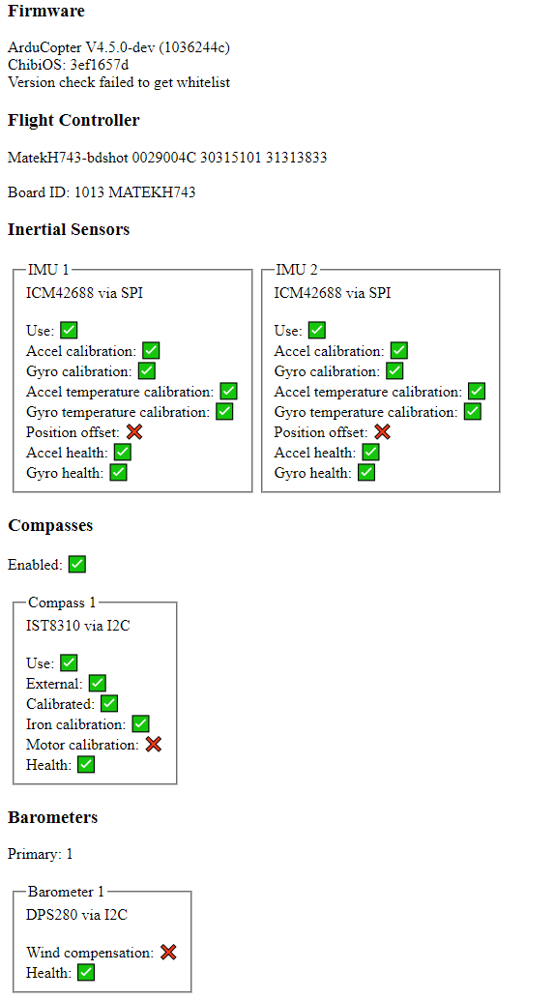

## 6.14 Configure Logging

Repeat the steps from [Section 6.1.1](#611-use-ardupilot-methodic-configurator-to-edit-the-parameter-file-and-upload-it-to-the-flight-controller) to edit and upload the `22_motor_notch_logging.param` file

For vehicles with weak F4 processors, small propellers, low-speed microSDcards, **or** simply not capable of gyro raw logging,
batch logging is recommended:

```param
INS_LOG_BAT_MASK, 1
INS_LOG_BAT_OPT, 4
INS_RAW_LOG_OPT, 0
```

For vehicles with F7 or H7 processors, big propellers, high-speed microSDcards, **and** capable of gyro raw logging,
gyro raw logging is recommended:

```param
INS_LOG_BAT_MASK, 0
INS_LOG_BAT_OPT, 0
INS_RAW_LOG_OPT, 9
```

Raw gyro logging provides better resolution at lower frequencies, at the expense of more data and higher processor load.
Big vehicles can benefit from better low frequency resolution.
For small vehicles there is no real benefit.

The software will automatically select the suitable values based on your vehicle components, but you can overwrite them
by manually adding the parameters to the next intermediate parameter file as they will not get overwritten there.

The table below explains which bit is responsible for which `.bin` dataflash log message(s):

<table border="1px">
<caption>Log message vs. LOG_BITMASK value</caption>
<tr><th rowspan="2"><a href="https://ardupilot.org/copter/docs/logmessages.html">Message</a></th><th rowspan="2">description</th><th rowspan="2">Log rate</th><th colspan="3" style="text-align: center"><a href="https://ardupilot.org/copter/docs/parameters.html#log-bitmask-log-bitmask">LOG_BITMASK</a></th></tr>
<tr><th>field name</th><th>bit</th><th>value</th></tr>

<tr><td rowspan="4">SIDD</td><td rowspan="4">System ID data</td><td><a href="https://ardupilot.org/copter/docs/parameters.html#sched-loop-rate-scheduling-main-loop-rate">SCHED_LOOP_RATE</a> / 1</td><td>ATTITUDE_FAST and ATTITUDE_MED</td><td>1 and 0</td><td>3</td></tr>
<tr><td><a href="https://ardupilot.org/copter/docs/parameters.html#sched-loop-rate-scheduling-main-loop-rate">SCHED_LOOP_RATE</a> / 2</td><td>ATTITUDE_FAST</td><td>0</td><td>2</td></tr>
<tr><td><a href="https://ardupilot.org/copter/docs/parameters.html#sched-loop-rate-scheduling-main-loop-rate">SCHED_LOOP_RATE</a> / 4</td><td>ATTITUDE_MED</td><td>0</td><td>1</td></tr>
<tr><td><a href="https://ardupilot.org/copter/docs/parameters.html#sched-loop-rate-scheduling-main-loop-rate">SCHED_LOOP_RATE</a> / 8</td><td>-</td><td>-</td><td>0</td></tr>

<tr><td rowspan="4">SIDS</td><td rowspan="4">System ID settings</td><td><a href="https://ardupilot.org/copter/docs/parameters.html#sched-loop-rate-scheduling-main-loop-rate">SCHED_LOOP_RATE</a> / 1</td><td>ATTITUDE_FAST and ATTITUDE_MED</td><td>1 and 0</td><td>3</td></tr>
<tr><td><a href="https://ardupilot.org/copter/docs/parameters.html#sched-loop-rate-scheduling-main-loop-rate">SCHED_LOOP_RATE</a> / 2</td><td>ATTITUDE_FAST</td><td>0</td><td>2</td></tr>
<tr><td><a href="https://ardupilot.org/copter/docs/parameters.html#sched-loop-rate-scheduling-main-loop-rate">SCHED_LOOP_RATE</a> / 4</td><td>ATTITUDE_MED</td><td>0</td><td>1</td></tr>
<tr><td><a href="https://ardupilot.org/copter/docs/parameters.html#sched-loop-rate-scheduling-main-loop-rate">SCHED_LOOP_RATE</a> / 8</td><td>-</td><td>-</td><td>0</td></tr>

<tr><td rowspan="4">RATE</td><td rowspan="4">Desired and achieved vehicle attitude rates</td><td><a href="https://ardupilot.org/copter/docs/parameters.html#sched-loop-rate-scheduling-main-loop-rate">SCHED_LOOP_RATE</a> / 1</td><td>ATTITUDE_FAST and ATTITUDE_MED</td><td>1 and 0</td><td>3</td></tr>
<tr><td><a href="https://ardupilot.org/copter/docs/parameters.html#sched-loop-rate-scheduling-main-loop-rate">SCHED_LOOP_RATE</a> / 2</td><td>ATTITUDE_FAST</td><td>0</td><td>2</td></tr>
<tr><td><a href="https://ardupilot.org/copter/docs/parameters.html#sched-loop-rate-scheduling-main-loop-rate">SCHED_LOOP_RATE</a> / 4</td><td>ATTITUDE_MED</td><td>0</td><td>1</td></tr>
<tr><td><a href="https://ardupilot.org/copter/docs/parameters.html#sched-loop-rate-scheduling-main-loop-rate">SCHED_LOOP_RATE</a> / 8</td><td>-</td><td>-</td><td>0</td></tr>

<tr><td rowspan="4">ATSC</td><td rowspan="4">Scale factors for attitude controller</td><td><a href="https://ardupilot.org/copter/docs/parameters.html#sched-loop-rate-scheduling-main-loop-rate">SCHED_LOOP_RATE</a> / 1</td><td>ATTITUDE_FAST and ATTITUDE_MED</td><td>1 and 0</td><td>3</td></tr>
<tr><td><a href="https://ardupilot.org/copter/docs/parameters.html#sched-loop-rate-scheduling-main-loop-rate">SCHED_LOOP_RATE</a> / 2</td><td>ATTITUDE_FAST</td><td>0</td><td>2</td></tr>
<tr><td><a href="https://ardupilot.org/copter/docs/parameters.html#sched-loop-rate-scheduling-main-loop-rate">SCHED_LOOP_RATE</a> / 4</td><td>ATTITUDE_MED</td><td>0</td><td>1</td></tr>
<tr><td><a href="https://ardupilot.org/copter/docs/parameters.html#sched-loop-rate-scheduling-main-loop-rate">SCHED_LOOP_RATE</a> / 8</td><td>-</td><td>-</td><td>0</td></tr>

<tr><td rowspan="2">ATT</td><td rowspan="2">Canonical vehicle attitude</td><td><a href="https://ardupilot.org/copter/docs/parameters.html#sched-loop-rate-scheduling-main-loop-rate">SCHED_LOOP_RATE</a></td><td>ATTITUDE_FAST</td><td>0</td><td>1</td></tr>
<tr><td>10 Hz</td><td>ATTITUDE_MED</td><td>1</td><td>2</td></tr>

<tr><td rowspan="2">IMU</td><td rowspan="2">Inertial Measurement Unit data</td><td><a href="https://ardupilot.org/copter/docs/parameters.html#sched-loop-rate-scheduling-main-loop-rate">SCHED_LOOP_RATE</a></td><td>IMU_FAST and ATTITUDE_FAST</td><td>18 and 0</td><td>262145</td></tr>
<tr><td>25 Hz</td><td>IMU</td><td>7</td><td>128</td></tr>

<tr><td>GPS</td><td>Information received from GNSS systems attached to the autopilot</td><td rowspan="8">~ 5 Hz</td><td rowspan="8">GPS</td><td rowspan="8">2</td><td rowspan="8">4</td></tr>
<tr><td>GPA</td><td>GPS accuracy information</td></tr>
<tr><td>UBX1</td><td>uBlox-specific GPS information (part 1)</td></tr>
<tr><td>UBX2</td><td>uBlox-specific GPS information (part 2)</td></tr>
<tr><td>GRAW</td><td>Raw uBlox data</td></tr>
<tr><td>GRXH</td><td>Raw uBlox data - header</td></tr>
<tr><td>GRXS</td><td>Raw uBlox data - space-vehicle data</td></tr>
<tr><td>TERR</td><td>Terrain database information</td></tr>

<tr><td>PM</td><td>autopilot system performance and general data dumping ground</td><td>1 Hz</td><td>PM</td><td>3</td><td>8</td></tr>

<tr><td>XKF0</td><td>EKF3 beacon sensor diagnostics</td><td rowspan="13">25Hz if ATTITUDE_FAST is set, else 10Hz</td><td rowspan="13">-</td><td rowspan="13">-</td><td rowspan="13">-</td></tr>
<tr><td>XKF1</td><td>EKF3 estimator outputs</td></tr>
<tr><td>XKF2</td><td>EKF3 estimator secondary outputs</td></tr>
<tr><td>XKF3</td><td>EKF3 innovations</td></tr>
<tr><td>XKF4</td><td>EKF3 variances</td></tr>
<tr><td>XKF5</td><td>EKF3 Sensor innovations (primary core) and general dumping ground</td></tr>
<tr><td>XKFS</td><td>EKF3 sensor selection</td></tr>
<tr><td>XKQ</td><td>EKF3 quaternion defining the rotation from NED to XYZ (autopilot) axes</td></tr>
<tr><td>XKV1</td><td>EKF3 State variances (primary core)</td></tr>
<tr><td>XKV2</td><td>more EKF3 State Variances (primary core)</td></tr>
<tr><td>XKT</td><td>EKF3 timing information</td></tr>
<tr><td>AHR2</td><td>Backup AHRS data</td></tr>
<tr><td>POS</td><td>Canonical vehicle position</td></tr>

<tr><td>CTRL</td><td>Attitude Control oscillation monitor diagnostics</td><td rowspan="5">10Hz</td><td rowspan="6">CTUN</td><td rowspan="6">4</td><td rowspan="6">16</td></tr>
<tr><td>RFND</td><td>Rangefinder sensor information</td></tr>
<tr><td>PRX</td><td>Proximity Filtered sensor data</td></tr>
<tr><td>PRXR</td><td>Proximity Raw sensor data</td></tr>
<tr><td>BCN</td><td>Beacon information</td></tr>
<tr><td>CTUN</td><td>Control Tuning information</td><td>100Hz</td></tr>

<tr><td>PSCN</td><td>Position Control North</td><td rowspan="3">10Hz</td><td rowspan="3">NTUN</td><td rowspan="3">5</td><td rowspan="3">32</td></tr>
<tr><td>PSCD</td><td>Position Control Down</td></tr>
<tr><td>PSCE</td><td>Position Control East</td></tr>

<tr><td>RCIN</td><td>RC input channels to vehicle</td><td rowspan="3">10Hz</td><td rowspan="3">RCIN</td><td rowspan="3">6</td><td rowspan="3">64</td></tr>
<tr><td>RCI2</td><td>(More) RC input channels to vehicle</td></tr>
<tr><td>RSSI</td><td>Received Signal Strength Indicator for RC receiver</td></tr>

<tr><td>VIBE</td><td>Processed (acceleration) vibration information</td><td>10Hz</td><td>IMU or IMU_FAST or IMU_RAW</td><td>19 or 18 or 7</td><td>-</td></tr>

<tr><td>CMD</td><td>Executed mission command information</td><td rowspan="2">on event</td><td rowspan="2">CMD</td><td rowspan="2">8</td><td rowspan="2">256</td></tr>
<tr><td>MAVC</td><td>MAVLink command we have just executed</td></tr>

<tr><td>BAT</td><td>Gathered battery data</td><td rowspan="2">??</td><td rowspan="4">CURRENT</td><td rowspan="4">9</td><td rowspan="4">512</td></tr>
<tr><td>BCL</td><td>Battery cell voltage information</td></tr>
<tr><td>MCU</td><td>MCU voltage and temperature monitoring</td></tr>
<tr><td>POWR</td><td>System power information</td></tr>

<tr><td>RCOU</td><td>Servo channel output values 1 to 14</td><td rowspan="3">10Hz</td><td rowspan="3">RCOUT</td><td rowspan="3">10</td><td rowspan="3">1024</td></tr>
<tr><td>RCO2</td><td>Servo channel output values 15 to 18</td></tr>
<tr><td>RCO3</td><td>Servo channel output values 19 to 32</td></tr>

<tr><td>OF</td><td>Optical flow sensor data</td><td>??</td><td>OPTFLOW</td><td>11</td><td>2048</td></tr>

<tr><td>PIDN</td><td>Proportional/Integral/Derivative gain values for North</td><td rowspan="2"><a href="https://ardupilot.org/copter/docs/parameters.html#sched-loop-rate-scheduling-main-loop-rate">SCHED_LOOP_RATE</a> if ATTITUDE_FAST is set else 10Hz</td><td rowspan="2">NTUN and PID</td><td rowspan="2">12 and 5</td><td rowspan="2">4128</td></tr>
<tr><td>PIDE</td><td>Proportional/Integral/Derivative gain values for East</td></tr>

<tr><td>PIDR</td><td>Proportional/Integral/Derivative gain values for Roll</td><td rowspan="4"><a href="https://ardupilot.org/copter/docs/parameters.html#sched-loop-rate-scheduling-main-loop-rate">SCHED_LOOP_RATE</a> if ATTITUDE_FAST is set else 10Hz</td><td rowspan="4">PID</td><td rowspan="4">12</td><td rowspan="4">4096</td></tr>
<tr><td>PIDP</td><td>Proportional/Integral/Derivative gain values for Pitch</td></tr>
<tr><td>PIDY</td><td>Proportional/Integral/Derivative gain values for Yaw</td></tr>
<tr><td>PIDA</td><td>Proportional/Integral/Derivative gain values for Altitude</td></tr>

<tr><td>MAG</td><td>Information received from compasses</td><td>??</td><td>COMPASS</td><td>13</td><td>8192</td></tr>

<tr><td>CAM</td><td>Camera shutter information</td><td rowspan="2">on event</td><td rowspan="2">CAMERA</td><td rowspan="2">15</td><td rowspan="2">32768</td></tr>
<tr><td>TRIG</td><td>Camera shutter information</td></tr>

<tr><td>MOTB</td><td>Motor mixer information</td><td>10Hz</td><td>MOTBAT</td><td>17</td><td>131072</td></tr>

<tr><td>ACC</td><td>IMU accelerometer data</td><td rowspan="2"><a href="https://ardupilot.org/copter/docs/parameters.html#sched-loop-rate-scheduling-main-loop-rate">SCHED_LOOP_RATE</a></td><td rowspan="2">IMU_RAW</td><td rowspan="2">19</td><td rowspan="2">524288</td></tr>
<tr><td>GYR</td><td>IMU gyroscope data</td></tr>

<tr><td>VSTB</td><td>Motor mixer information</td><td><a href="https://ardupilot.org/copter/docs/parameters.html#sched-loop-rate-scheduling-main-loop-rate">SCHED_LOOP_RATE</a></td><td>VIDEO_STABILISATION</td><td>20</td><td>1048576</td></tr>

<tr><td>FTN</td><td>Filter Tuning Message - per motor</td><td rowspan="2"><a href="https://ardupilot.org/copter/docs/parameters.html#sched-loop-rate-scheduling-main-loop-rate">SCHED_LOOP_RATE</a></td><td rowspan="3">FTN_FAST</td><td rowspan="3">21</td><td rowspan="3">2097152</td></tr>
<tr><td>FTNS</td><td>Filter Tuning Message</td></tr>
<tr><td>FTN1</td><td>FFT Filter Tuning</td><td>25 Hz</td></tr>

<tr><td>WINC</td><td>Winch</td><td>10Hz</td><td>Any</td><td>any</td><td>any</td></tr>
</table>

## 6.15 Optional PID adjustment (not sure how this applies to helicopters)

If you have a very small, or a very large vehicle that requires non-default PID values for a safe flight.
Usually, smaller vehicles require lower than default PID rate values. Larger vehicles usually require higher than default PID rate values.

Repeat the steps from [Section 6.1.1](#611-use-ardupilot-methodic-configurator-to-edit-the-parameter-file-and-upload-it-to-the-flight-controller) to edit and upload the `23_optional_pid_adjustment.param` file

# 7. Install rotor blades and perform the first flight

Install the rotor blades in the vehicle ensuring that they are [balanced in order to reduce vibrations (add heli specific)](https://www.youtube.com/watch?v=zTDkCZ698uA).
High vibrations will cause your vehicle to behave erratically endangering people and property.

Now that all mandatory configuration steps are done and the rotor blades are installed you can perform the first flight.

## 7.1 First flight: Motor Thrust Hover and Harmonic Notch data collection

For more detailed information visit the [First flight](https://ardupilot.org/copter/docs/flying-arducopter.html)

Test the initial setup on the ground in [stabilize flight mode](https://ardupilot.org/copter/docs/stabilize-mode.html) by using as little RC transmitter throttle as possible without taking off.
At this sweet spot, inspect all axes (roll, pitch and yaw) by providing small RC transmitter stick inputs.
If the multicopter behaves correspondingly, the setup is good to go.

After some careful test maneuvers switch to `ALTHOLD` and hover for 30 to 40 seconds one to two meters above the ground.
Land and disarm.

Immediately check for hot motors.
If the motors are too hot, check the `.bin` dataflash log, high or oscillating `RATE.*out` values indicate which PID gain you should reduce to remove the output oscillations causing the motors to heat up.

# 8. Minimalistic mandatory tuning

These are the very minimum tuning steps required for a stable flight:

## 8.1 [Notch filter calibration](https://ardupilot.org/copter/docs/common-imu-notch-filtering.html)

Load the `.bin` log from the first flight onto the [online ArduPilot Filter Review tool](https://firmware.ardupilot.org/Tools/WebTools/FilterReview/)
Follow the [instructions from Peter Hall on his Blog Post](https://discuss.ardupilot.org/t/new-fft-filter-setup-and-review-web-tool/102572) to configure the Harmonic Notch filter(s).
Noise levels below -50dB are considered good enough.
Do not use notch filters to reduce noise below that level as it introduces unwanted signal lag.
The graph below is a bode diagram of the gyro signals before and after the low-pass and Harmonic Notch filters.
As you can see, the filters remove most of the vibration noise from the gyro sensors.

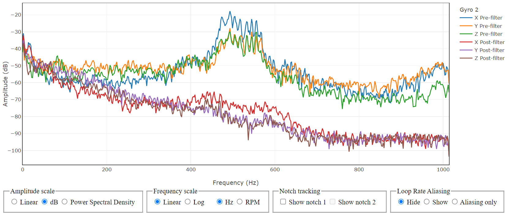

Below is the configuration we used.

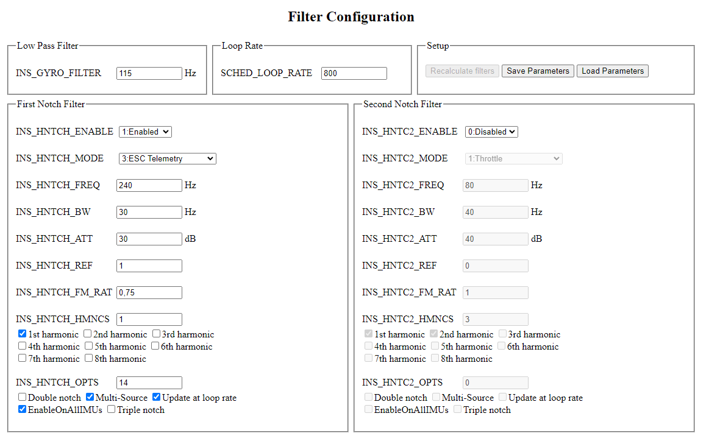

1. On *ArduPilot Methodic Configurator* select `25_motor_notch_filter_results.param` on the *Current intermediate parameter file:* Combobox.
1. When asked *Should the FC values now be copied to the 25_motor_notch_filter_results.param file?* select `No`.
1. Read the documentation links inside the `25_motor_notch_filter_results.param documentation`
1. Edit the parameters' `New Value` and `Change Reason` to suit your requirements
1. Press `Upload selected params to FC, and advance to next file` button.

Load the `.bin` log from the first flight onto the [online ArduPilot Log Viewer](https://plotbeta.ardupilot.org/) or into Mission Planner.
Take a look at the `VIBE.VibeX`, `VIBE.VibeY`, `VIBE.VibeZ` graphs they [all should be below 15](https://ardupilot.org/copter/docs/common-measuring-vibration.html)

According to common ArduPilot forum knowledge, and quoting @xfacta:

- Vibrations over 30 are very bad
- Vibrations over 20 are causing issues even if you don't know it yet
- Vibrations over 15 are in a grey area - it could go either way - check clipping, it must be zero
- Vibrations below 10 are good

Now upload the `.bin` log to the [Hardware-Report Tool](https://firmware.ardupilot.org/Tools/WebTools/HardwareReport/) once again to check CPU load and loop times, which in our case look like this:

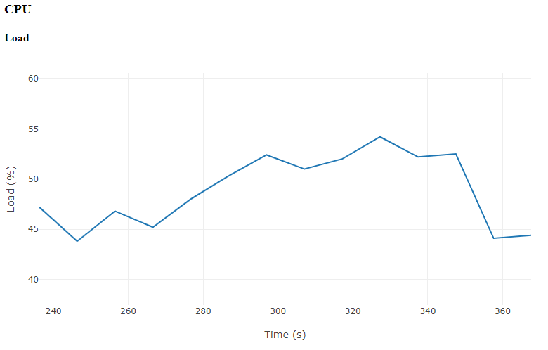

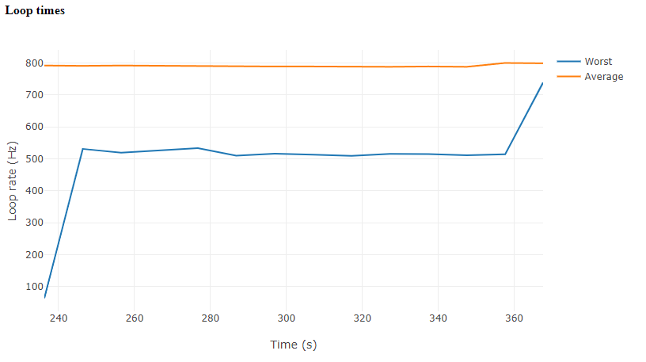

## 8.2 Configure the throttle controller

After the first flight connect the FC to the PC, start AMC and use the `24_throttle_controller.param` to set the values for you.

## 8.3 Configure the EKF altitude source weights

In some situations you will need to configure the expected noise levels of the altitude sources.
And the weight that EKF should use for each source on the `26_ekf_config.param` file.

## 8.5 Second Flight: PID VTOL-Quiktune lua script or manual PID tune

If your flight controller can run lua scripts perform a [PID lua VTOL-Quiktune](https://ardupilot.org/copter/docs/quiktune.html).
If you have an STM32 F4 or F7 processor that can not run lua scripts perform a [manual PID tune](https://ardupilot.org/copter/docs/ac_rollpitchtuning.html) instead.

Setup the lua script using:

1. Connect your flight controller to the PC
1. Close mission planner, open *ArduPilot Methodic Configurator* and select your vehicle's directory
1. Make sure your PC has internet connection
1. On *ArduPilot Methodic Configurator* select `29_quick_tune_setup.param` on the *Current intermediate parameter file:* Combobox.
1. When asked if you want to download the .lua script from internet answer yes.
1. When asked if you want to upload the .lua script to the FC answer yes.
1. Read the documentation links inside the `29_quick_tune_setup.param documentation`
1. Edit the parameters' `New Value` and `Change Reason` to suit your requirements
1. Press `Upload selected params to FC, and advance to next file` button.
1. Close *ArduPilot Methodic Configurator*

Perform the flight and afterward:

1. Connect the flight controller to the PC
1. On *ArduPilot Methodic Configurator* select `30_quick_tune_results.param` on the *Current intermediate parameter file:* Combobox.
1. When asked *Update file with values from FC?* select `Yes` to copy current FC values to the `30_quick_tune_results.param` file because you've completed the experiment.
1. Press `Upload selected params to FC, and advance to next file` button.
1. Close *ArduPilot Methodic Configurator*

If you are impatient and do not want a fully optimized flight controller jump to *[Section 13 Productive configuration](#13-productive-configuration)*

# 9. Standard tuning (optional)

These are the standard tuning steps required for an optimized flight:

## 9.1 Third flight: MagFit

Now that the Harmonic Notch filter, the throttle controller and PIDs are configured, the third flight will be safer.
This flight will be used to [calibrate the compass during a realistic operation scenario in the air](https://ardupilot.org/copter/docs/common-magfit.html#using-mavexplorer-s-integrated-magfit-utility).

### 9.1.1 Setup inflight MagFit calibration

You can either manually perform a flight in `ALT_HOLD` or `STABILIZE` flight mode with yaw movements and coordinated turns
with throttle changes.
Or you follow these steps to create an auto mission that performs the required flight patterns:

1. On ArduPilot versions < 4.6.0 download the `advance-wp.lua` scripts from [ardupilot github repository](https://github.com/ArduPilot/ardupilot/blob/master/libraries/AP_Scripting/applets/advance-wp.lua), follow [Scripted MagFit flightpath generation](https://discuss.ardupilot.org/t/scripted-magfit-flightpath-generation/97536) and put it on the micro SDCard's `APM/scripts` folder.
1. On ArduPilot versions >= 4.6.0 the script is already included.
1. Insert the SD-Card on the flight controller
1. Connect your flight controller to the PC
1. Make sure your PC has internet connection
1. On *ArduPilot Methodic Configurator* select `31_inflight_magnetometer_fit_setup.param` on the *Current intermediate parameter file:* Combobox.
1. When asked if you want to download the .lua script from internet answer yes.
1. When asked if you want to upload the .lua script to the FC answer yes.
1. Read the documentation links inside the `31_inflight_magnetometer_fit_setup.param documentation`
1. Edit the parameters' `New Value` and `Change Reason` to suit your requirements
1. Press `Upload selected params to FC, and advance to next file` button.
1. When prompted *Update file with values from FC?* select `Close` to close the application and go perform the experiment.
1. Connect the FC to mission planner via USB cable
1. Create a flight plan that uses it, like this one.
   The figure-8 will be inserted between the points on either side of the `SCRIPT_TIME` command.
   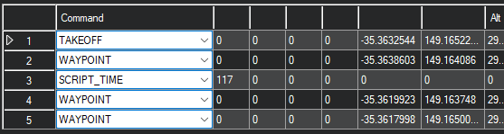
   The `SCRIPT_TIME` command can be given two arguments for min speed and altitude delta, respectively, if you want to
   override `MAGH_MIN_SPEED` and `MAGH_ALT_DELTA`.
   Zero values (as shown) will let the parameter values remain in use.
   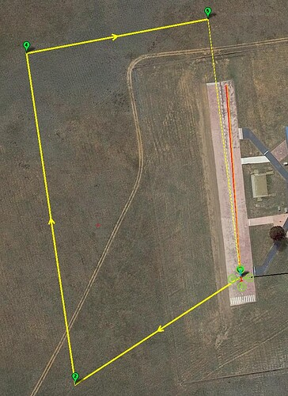
1. Upon execution of the mission, several messages will be displayed via telemetry:
   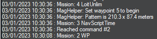
   At this point, the figure-8 has been created, and the script is awaiting the user to set the waypoint beyond the loiter to commence the pattern.
   Download the mission to confirm obstacle clearance before proceeding, and then use the GCS to set the indicated waypoint to continue (or use the additional helper script `advance-wp.lua` above to use an RC switch for advancing the waypoint).
   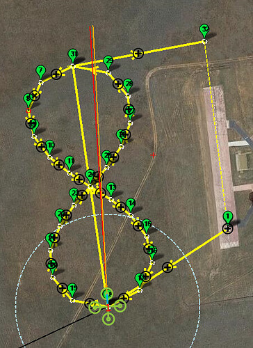
1. The figure-8 will then repeat `MAGH_COUNT` times, occasionally climbing and descending by `MAGH_ALT_DELTA` meters and
   incrementing speed toward `WPNAV_SPEED`.
   The ~200m long pattern consisting of 24 points depicted here should be more than adequate.
   @Yuri_Rage has achieved good success with patterns as small as ~50m and only 16 waypoints.

Perform the MagFit figure-eight flight in AUTO mode and land.

### 9.1.2 Calculate inflight MagFit calibration

1. Download the latest `.bin` dataflash log file from the micro SDcard's `/APM/LOGS` folder
1. Load it into MAVExplorer using the command line: `MAVExplorer.py filename.bin` or into the [ArduPilot MAGFit in flight compass calibration](https://firmware.ardupilot.org/Tools/WebTools/MAGFit/) using an internet browser.
1. Select the area where the multicopter performed the Figure eight (exclude the takeoff and landing flight sections)
1. Perform the MagFit calculations. Save the tool-generated file as `32_inflight_magnetometer_fit_results.param` in your vehicle's intermediate parameter file directory.
1. Connect your flight controller to the PC
1. On *ArduPilot Methodic Configurator* select `32_inflight_magnetometer_fit_results.param` on the *Current intermediate parameter file:* Combobox.
1. When asked *Update file with values from FC?* select `No`.
1. Press `Upload selected params to FC, and advance to next file` button.
1. Close *ArduPilot Methodic Configurator*

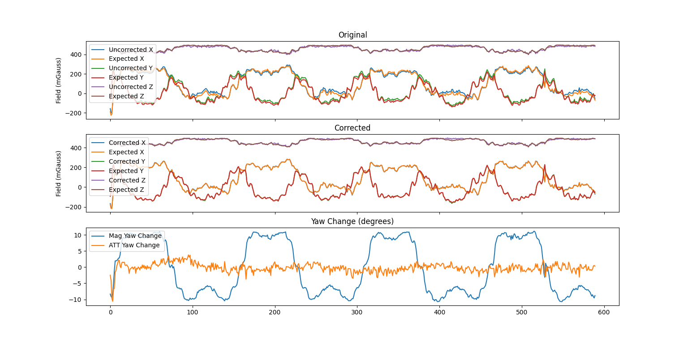

After that repeat the steps described in [Section 6.10 ArduPilot Hardware Report](#610-ardupilot-hardware-report).

The report should now look like this:

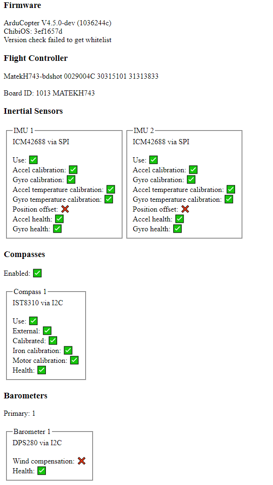

## 9.2 Fourth Flight: PID VTOL-Quiktune lua script or manual PID tune (optional)

If your flight controller can run lua scripts perform a [PID lua VTOL-Quiktune](https://ardupilot.org/copter/docs/quiktune.html).
If you have an STM32 F4 or F7 processor that can not run lua scripts perform a [manual PID tune](https://ardupilot.org/copter/docs/ac_rollpitchtuning.html) instead.

### 9.2.1 Setup Quiktune

Setup the lua script using:

1. Download the [VTOL-quicktune.lua](https://raw.githubusercontent.com/ArduPilot/ardupilot/master/libraries/AP_Scripting/applets/VTOL-quicktune.lua) to your PC
1. connect your flight controller to the PC
1. Copy the script to your autopilot’s SD card’s APM/scripts directory. If using MP it may be easiest to use the Config, MAVFtp screen.
1. Close mission planner, open *ArduPilot Methodic Configurator* and select your vehicle's directory
1. On *ArduPilot Methodic Configurator* select `24_quicktune_setup.param` on the *Current intermediate parameter file:* Combobox.
1. Read the documentation links inside the `24_quicktune_setup.param documentation`
1. Edit the parameters' `New Value` and `Change Reason` to suit your requirements
1. Press `Upload selected params to FC, and advance to next file` button.
1. When asked *Update file with values from FC?* select `Close` to close the application and go perform the experiment.

WARNING: Quiktune requires moderate wind disturbances to calibrate properly.
Flying in completely calm conditions or perfectly steady wind can cause Quiktune to calculate overly aggressive PID values.
These excessive settings may cause dangerous oscillations and potential crashes when your vehicle later encounters normal wind conditions.

- Quiktune relies on external disturbance to tune against. Run it outdoors in light wind conditions.
- Autotune provides its own, known disturbance (twitch) against which to tune. Run it in the calmest environment practical.

Perform the flight and afterward:

### 9.2.2 Store Quiktune results to file

1. Connect the flight controller to the PC
1. On *ArduPilot Methodic Configurator* select `25_quicktune_results.param` on the *Current intermediate parameter file:* Combobox.
1. When asked *Update file with values from FC?* select `Yes` to copy current FC values to the `25_quicktune_results.param` file because you've completed the experiment.
1. Press `Upload selected params to FC, and advance to next file` button.
1. Close *ArduPilot Methodic Configurator*

If you are impatient and do not want a fully optimized flight controller jump to *[Section 13 Productive configuration](#13-productive-configuration)*

## 9.3 Fifth flight: Evaluate the aircraft tune - part 1

Follow the first part of [evaluating the aircraft tune](https://ardupilot.org/copter/docs/evaluating-the-aircraft-tune.html#evaluating-the-aircraft-tune).

1. On *ArduPilot Methodic Configurator* select `33_evaluate_the_aircraft_tune_ff_disable.param` on the *Current intermediate parameter file:* Combobox.
1. Read the documentation links inside the `33_evaluate_the_aircraft_tune_ff_disable.param documentation`
1. Press `Upload selected params to FC, and advance to next file` button.
1. Close *ArduPilot Methodic Configurator*

After landing take a look at the `RATE.*out` values in the `.bin` log file, they all should be below 0.1.

If the vehicle is not behaving well, perform a [manual PID tune](https://ardupilot.org/copter/docs/ac_rollpitchtuning.html) or a [lua Quiktune](https://ardupilot.org/copter/docs/quiktune.html) before proceeding.

## 9.4 Sixth flight: Evaluate the aircraft tune - part 2

Follow the second part of [evaluating the aircraft tune](https://ardupilot.org/copter/docs/evaluating-the-aircraft-tune.html#evaluating-the-aircraft-tune).

1. On *ArduPilot Methodic Configurator* select `34_evaluate_the_aircraft_tune_ff_enable.param` on the *Current intermediate parameter file:* Combobox.
1. Read the documentation links inside the `34_evaluate_the_aircraft_tune_ff_enable.param documentation`
1. Press `Upload selected params to FC, and advance to next file` button.
1. Close *ArduPilot Methodic Configurator*

After landing take a look at the `RATE.*out` values in the `.bin` log file, they all should be below 0.1.

## 9.5 Autotune flight(s)

The [Autotune](https://ardupilot.org/copter/docs/autotune.html) is an automated iterative process:

1. It changes the parameter values of the attitude PID controllers
1. Tests the [overshoot and settling-time](https://aleksandarhaber.com/transient-response-specifications-peak-time-settling-time-rise-time-and-percent-overshoot/) of the control loop using the new PID values
1. If they are within the desired requirements, the process is over. If not, it gets repeated from the beginning

And remember:

- Quiktune relies on external disturbance to tune against. Run it outdoors in light wind conditions.
- Autotune provides its own, known disturbance (twitch) against which to tune. Run it in the calmest environment practical.

If the battery gets depleted before you can complete the Autotune flight(s), download the latest `.bin` log file from the micro SDCard directory `/APM/LOGS`.
Take a look at the `ATUN` messages.
They show how the PID values change over time.
You should use the latest PID values from the `ATUN` messages to set the starting point of your next PID Autotune with a fresh battery.
But be careful, **these new PID values might be unstable and cause your vehicle to crash**.
To be on the safe side perform the third and fourth flights again according to the instructions above.
This way, the Autotune will restart from the partially optimal values it found before the battery got depleted, instead of starting from scratch.
An example of the relevant `ATUN` message data of an interrupted yaw Autotune `.bin` dataflash log is depicted below:

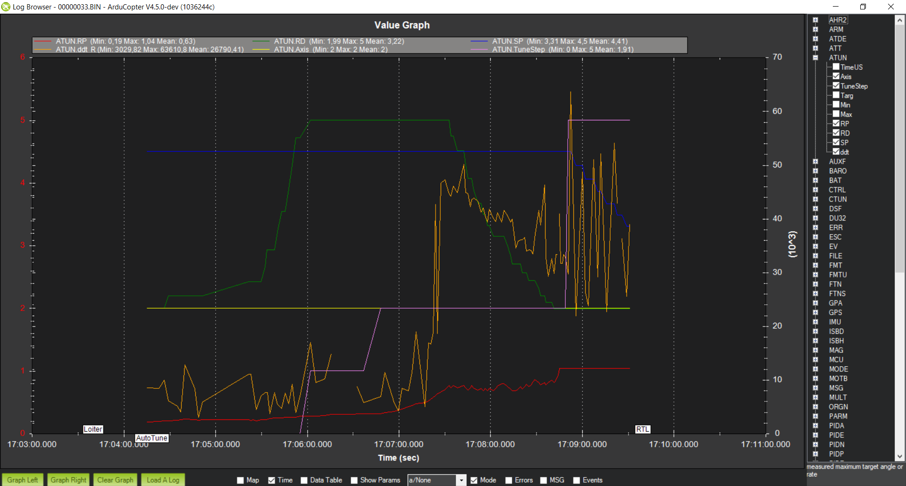

The correspondence between the PIDs' initial values and the `ATUN` message fields is shown in the respective tables for each of the four Autotune axes in the sections below.
The tune of the vehicle must be done in the vehicle's most agile configuration.
That is, the vehicle will be at its minimum take-off weight with fully charged batteries.
This is why we will do Autotune with multiple flights, one axis per flight.

Typically the [quality of the Autotune results for each axis is proportional to the value](https://www.youtube.com/watch?v=1sCskKQIdeg) of the `ATC_ANG_RLL_P`, `ATC_ANG_PIT_P`, and `ATC_ANG_YAW_P` parameters for their respective axis.
Also the higher the values, the tighter the tune.
If you get low values, improve the hardware and revisit the previous sections to further reduce the vibrations.

Autotuning in low-wind conditions is desirable, but if that is not possible you can increase the `AUTOTUNE_AGGR` parameter value to 0.110 or even 0.120.
That is a workaround and will not produce as good results as low-wind conditions autotune.

We set up the autotune as a flight mode, and as such it will use the underlying `ALTHOLD` flight mode.
If you want to use the `LOITER` flight mode as the underlying mode during autotune you need to [set an RC channel function switch to autotune](https://ardupilot.org/copter/docs/autotune.html#setup-before-flying-in-autotune-mode).
Follow the sequence below for tuning each axis as that particular order improves the results.

### 9.5.1 Roll axis autotune

1. On *ArduPilot Methodic Configurator* select `35_autotune_roll_setup.param` and upload it to the FC. It will activate the roll axis Autotune.
1. When asked *Update file with values from FC?* select `Close` to close the application and go perform the experiment.
1. Outdoors on a non-windy day (or indoors in a big warehouse like we at IAV do) take off and fly in either [`AltHold`](https://ardupilot.org/copter/docs/altholdmode.html) or `Loiter` flight mode.
1. At about 2 meters high, select `Autotune` flight mode in the RC transmitter to engage Autotune.
1. Use the RC transmitter sticks to correct the vehicle position if it gets too high, too low or too close to obstacles.
1. Once the Autotune is completed, land and disarm the vehicle without changing the flight mode.
1. connect the flight controller to the PC
1. On *ArduPilot Methodic Configurator* select `36_autotune_roll_results.param`.
1. When asked *Update file with values from FC?* select `Yes` to copy current FC values to the `36_autotune_roll_results.param` file because you've completed the experiment.

The autotune might have found a poor solution, here are some indicators of a poor tune:

1. The resulting `ATC_ANG_RLL_P` parameter value is smaller than 4.5
2. The resulting `ATC_RAT_RLL_D` parameter value is equal to the `AUTOTUNE_MIN_D` parameter value

If the battery got depleted before Autotune completion, change the initial PID parameters as shown in the table below:

|PID parameter name|PID parameter value based on the ATUN field|
|:-|:-|
|-|ATUN.Axis=0|
|ATC_RAT_RLL_P|ATUN.RP|
|ATC_RAT_RLL_I|ATUN.RP|
|ATC_RAT_RLL_D|ATUN.RD|
|ATC_ANG_RLL_P|ATUN.SP|
|ATC_ACCEL_R_MAX|ATUN.ddt|

### 9.5.2 Pitch axis autotune

1. On *ArduPilot Methodic Configurator* select `37_autotune_pitch_setup.param` and upload it to the FC. It will activate the pitch axis Autotune.
1. When asked *Update file with values from FC?* select `Close` to close the application and go perform the experiment.
1. Outdoors on a non-windy day (or indoors in a big warehouse like we at IAV do) take off and fly in either `AltHold` or `Loiter` flight mode.
1. At about 2 meters high, select `Autotune` flight mode in the RC Transmitter to engage Autotune.
1. Use the RC transmitter sticks to correct the vehicle position if it gets too high, too low or too close to obstacles.
1. Once the autotune is completed, land and disarm the vehicle without changing the flight mode.
1. connect the flight controller to the PC
1. On *ArduPilot Methodic Configurator* select `38_autotune_pitch_results.param`.
1. When asked *Update file with values from FC?* select `Yes` to copy current FC values to the `38_autotune_pitch_results.param` file because you've completed the experiment.

The autotune might have found a poor solution, here are some indicators of a poor tune:

1. The resulting `ATC_ANG_PIT_P` parameter value is smaller than 4.5
2. The resulting `ATC_RAT_PIT_D` parameter value is equal to the `AUTOTUNE_MIN_D` parameter value

If the battery got depleted before Autotune completion, change the initial PID parameters as shown in the table below:

|PID parameter name|PID parameter value based on the ATUN field|
|:-|:-|
|-|ATUN.Axis=1|
|ATC_RAT_PIT_P|ATUN.RP|
|ATC_RAT_PIT_I|ATUN.RP|
|ATC_RAT_PIT_D|ATUN.RD|
|ATC_ANG_PIT_P|ATUN.SP|
|ATC_ACCEL_P_MAX|ATUN.ddt|

### 9.5.3 Yaw axis autotune

1. Use *ArduPilot Methodic Configurator* to edit and upload the `39_autotune_yaw_setup.param` file to the FC. It will activate the yaw axis Autotune.
1. Outdoors on a non-windy day (or indoors in a big warehouse like we at IAV do) take off and fly in either `AltHold` or `Loiter` flight mode.
1. At about 2 meters high, select `Autotune` flight mode in the RC transmitter to engage Autotune.
1. Use the RC transmitter sticks to correct the vehicle position if it gets too high, too low, or too close to obstacles.
1. Once the Autotune is completed, land and disarm the vehicle without changing the flight mode.

You should get something like the `40_autotune_yaw_results.param` file.

The autotune might have found a poor solution, here are some indicators of a poor tune:

1. The resulting `ATC_ANG_YAW_P` parameter value is smaller than 4.5

If the battery got depleted before Autotune completion, change the initial PID parameters as shown in the table below:

|PID parameter name|PID parameter value based on the ATUN field|
|:-|:-|
|-|ATUN.Axis=2|
|ATC_RAT_YAW_P|ATUN.RP|
|ATC_RAT_YAW_I|**ATUN.RP * 0.1**|
|**ATC_RAT_YAW_FLTE**|ATUN.RD|
|ATC_ANG_YAW_P|ATUN.SP|
|ATC_ACCEL_Y_MAX|ATUN.ddt|

### 9.5.4 Yaw D axis autotune (optional)

This particular `YawD` Autotune axis is [only relevant for small, agile vehicles](https://www.youtube.com/watch?v=b76bPEeRCEk&t=963s).

1. Use *ArduPilot Methodic Configurator* to edit and upload the `41_autotune_yawd_setup.param` file to the FC.
2. Outdoors on a non-windy day (or indoors in a big warehouse like we at IAV do) take-off and fly in either `AltHold` or `Loiter` flight mode.
3. At about 2 meters high, select `Autotune` flight mode in the RC transmitter to engage Autotune.
4. Use the RC transmitter sticks to correct the vehicle position if it gets too high, too low or too close to obstacles.
5. Once the Autotune is completed, land and disarm the vehicle without changing the flight mode.

You should get something like the `42_autotune_yawd_results.param` file.

Make sure that your resulting `ATC_RAT_YAW_D` parameter value is different from `AUTOTUNE_MIN_D` value.
If that is not the case then the autotune failed to find a proper `ATC_RAT_YAW_D`.
The cause is probably too high noise values at the input of the Yaw D controller.
If the battery got depleted before Autotune completion, change the initial PID parameters as shown in the table below:

|PID parameter name|PID parameter value based on the ATUN field|
|:-|:-|
|-|ATUN.Axis=3|
|ATC_RAT_YAW_P|ATUN.RP|
|ATC_RAT_YAW_I|**ATUN.RP * 0.1**|
|ATC_RAT_YAW_D|ATUN.RD|
|ATC_ANG_YAW_P|ATUN.SP|
|ATC_ACCEL_Y_MAX|ATUN.ddt|

### 9.5.5 Roll and pitch axis re-autotune

Now that the yaw axis is tuned, the [autotune should be able to improve the roll and pitch axis tune](https://youtu.be/jK0I97dMsK0?si=F1lyl2iq8gUUencl&t=2535).

1. Use *ArduPilot Methodic Configurator* to edit and upload the `43_autotune_roll_pitch_retune_setup.param` file to the FC.
2. Outdoors on a non-windy day (or indoors in a big warehouse like we at IAV do) take off and fly in either `AltHold` or `Loiter` flight mode.
3. At about 2 meters high, select `Autotune` flight mode in the RC transmitter to engage Autotune.
4. Use the RC transmitter sticks to correct the vehicle position if it gets too high, too low or too close to obstacles.
5. Once the Autotune is completed, land and disarm the vehicle without changing the flight mode.

You should get something like the `44_autotune_roll_pitch_retune_results.param` file.

## 9.6 Performance evaluation flight

As you can see in the picture below, the Stabilize Roll, Pitch and Yaw P gains achieved with this method are high. The maximum *stabilize P gain* that autotune strives for is 36, and that was achieved in the roll axis! This is a clear indication that the vibration noise filters and the PID control loops are working well together.


After using Autotune to find proper PID parameters, it is time to evaluate the performance of the vehicle's control loops in real flight.

Follow these steps:

1. Power on the vehicle and connect it to the PC
1. Use *ArduPilot Methodic Configurator* to upload the `33_evaluate_the_aircraft_tune_ff_disable.param` file to the FC.
1. Switch to `ALTHOLD` flight mode and wait for home location acquisition.
1. Take-off at around 10m above the ground.
1. Perform smooth maneuvers using the RC transmitter roll stick.
1. Perform smooth maneuvers using the RC transmitter pitch stick.
1. Perform smooth maneuvers using the RC transmitter yaw stick.
1. Repeat the maneuvers with increasing aggressiveness making sure you stay inside the stable envelope of the vehicle.
1. Land and download the latest `.bin` log file from `/APM/LOGS` to your PC
1. Use [ArduPilot's PID Review Tool](https://firmware.ardupilot.org/Tools/WebTools/PIDReview/) to review the PID step response of each PID.
1. Use *ArduPilot Methodic Configurator* to upload the `34_evaluate_the_aircraft_tune_ff_enable.param` file to the FC.

In our vehicle, we got a transient response of around 60ms in roll and pitch and around 110ms in yaw.

Step response Roll:

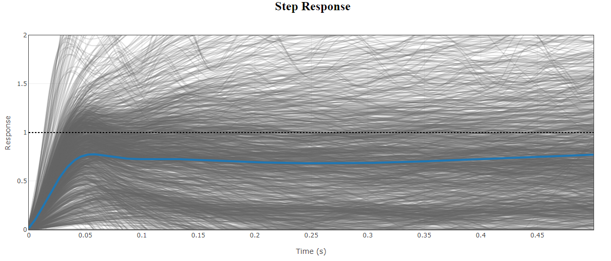

Step response Pitch:

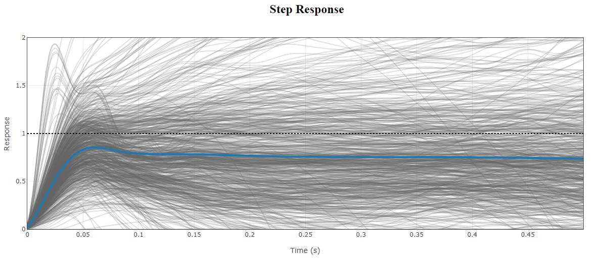

Step response Yaw:

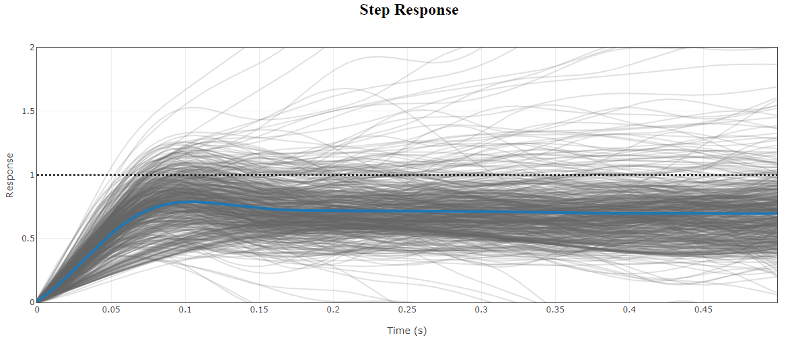

If you are satisfied with the performance, increase `ATC_THR_MIX_MAX` to 0.9 (default is 0.5) to increase prioritization of attitude control over throttle.
This can reduce the pitch overshoot sometimes seen (especially on copters with large propellers) in AltHold if the vehicle suddenly slows after performing a fast-forward flight.
Take a look at the `RATE.*out` values in the `.bin` log file, they all should be below 0.1.

Repeat the steps from [Section 6.1.1](#611-use-ardupilot-methodic-configurator-to-edit-the-parameter-file-and-upload-it-to-the-flight-controller) to edit and upload the `45_autotune_finish.param` file. This sets `ATC_THR_MIX_MAX` to maximize attitude control authority at high throttle.
It must only be applied after all autotune axes are complete and PID values are finalized.

Now the standard tuning is complete you can skip to [Section 13 Productive Configuration](#13-productive-configuration)

# 10. Improve altitude under windy conditions (optional)

## 10.1 [Windspeed Estimation flight(s)](https://ardupilot.org/copter/docs/airspeed-estimation.html)

Follow [ArduCopter's airspeed estimation Wiki](https://ardupilot.org/copter/docs/airspeed-estimation.html) and/or use the [Lua script provided by Yuri in the forum](https://discuss.ardupilot.org/t/scripting-copter-wind-estimation-baro-compensation-tuning/98470/1).

In our case, the frontal area looks like this:

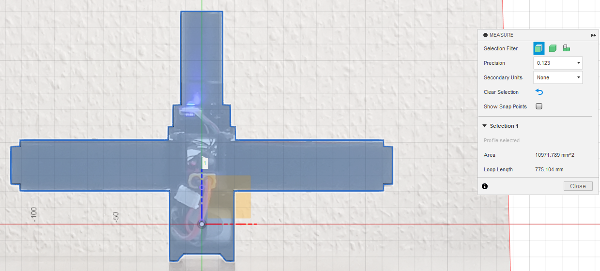

and the side area looks like this:

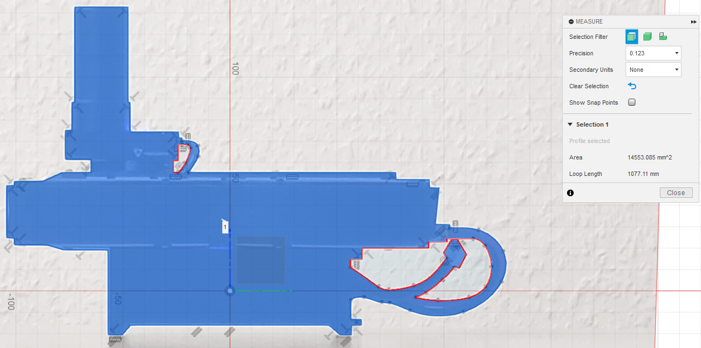

Divided by 1,000,000 to convert from mm² to m², the frontal area is 0.01097 m² and the side area is 0.01455 m².
The weight of our drone is 560g, therefore the ballistic coefficients are

> [EK3_DRAG_BCOEF_X](https://ardupilot.org/copter/docs/parameters.html#ek3-drag-bcoef-x) = 0.56 kg / 0.01097 m² = 51.0399 <br>
> [EK3_DRAG_BCOEF_Y](https://ardupilot.org/copter/docs/parameters.html#ek3-drag-bcoef-y) = 0.56 kg / 0.01455 m² = 38.4798 <br>

Use *ArduPilot Methodic Configurator* to edit and upload the `47_windspeed_estimation.param` file to the FC.

Now do the flight to collect the data to [Calculate the Propeller Drag Coefficient](https://ardupilot.org/copter/docs/airspeed-estimation.html#calculate-the-propeller-drag-coefficient).
After that, open the logs with MAVExplorer to get the needed values.
Display the absolute values for acceleration in X and Y, as well as GPS speed by inputting `graph abs(IMU.AccX) abs(IMU.AccY) GPS.Spd`.
Then crop it so you only see the tests in AltHold flight mode.
It should look like this:

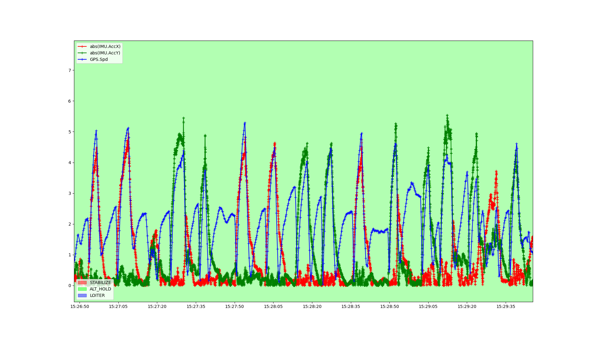

Note that our test flight was quite noisy but there *is* enough data to extract.
Next crop it so you see one acceleration into the wind and the consecutive deceleration.
It should look like this:

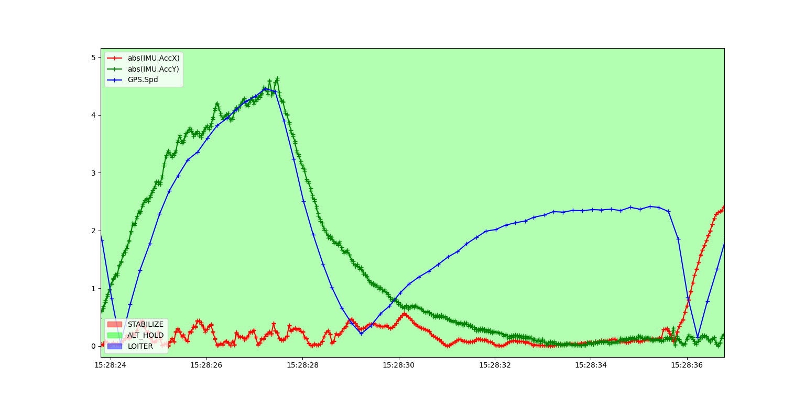

Get the current wind speed, that is the GPS speed when AccY reaches zero and the GPS speed has stabilized.
In this case, it is:

> windspeed = 2.35 [m/s]

Next, get the groundspeed at the start of the test.
That is the GPS speed when the vehicle starts to decelerate after the little bit of jitter is over.
In this case, it is:

> groundspeed = 3.9 [m/s]

With this information, you can calculate the vehicle's airspeed, which is:

> airspeed = windspeed + groundspeed = 6.25 [m/s]

Next get the maximum acceleration during the test, which is the acceleration at the time of the groundspeed measurement.
In this case, it is:

> max_accel = 4.2 [m/s²]

With the air density at the time of testing and the previously calculated ballistic drag coefficient (`EK3_DRAG_BCOEF_X` for front and back, `EK3_DRAG_BCOEF_Y` for left and right side) you can now calculate the bluff body drag, which is 1/2 \* air density \* airspeed^2 / BCOEF.
In this case, it is:

> Bluff body drag = 0.5 \* 1.260 [kg/m³] \* (6.25 [m/s])² / 38.4798 [kg/m²] = 0.6395 [m/s²]

With that, you can now calculate the momentum drag, which is max_accel - bluff body drag.
In this case, it is:

> Momentum drag = 4.2 [m/s²] - 0.6395 [m/s²] = 3.5605 [m/s²]

Now you can calculate the momentum drag coefficient `EK3_DRAG_MCOEF`, which is momentum drag / airspeed.
In this case, it is:

> [EK3_DRAG_MCOEF](https://ardupilot.org/copter/docs/parameters.html#ek3-drag-mcoef) = 3.5605 [m/s²] / 6.25 [m/s] = 0.5697 [1/s]

For better accuracy, you should do that for all directions and take the average. In our case, we got:

> front: 0.4628 [1/s] <br>
> back: 0.4757 [1/s] <br>
> left: 0.5426 [1/s] <br>
> right: 0.5697 [1/s] <br>
> average: 0.5127 [1/s] <br>

Note that these are quite high values due to the ducts around the props.
For a normal copter with open propellers, it should be in the range of 0.1 to 0.2.

After it is set, do another flight and [check that the windspeed and direction are correctly estimated](https://ardupilot.org/copter/docs/airspeed-estimation.html#viewing-windspeed-and-direction-in-real-time).

## 10.2 [Baro Compensation flight(s)](https://ardupilot.org/copter/docs/airspeed-estimation.html#barometer-position-error-compensation)

Follow [ArduCopter's baro compensation Wiki](https://ardupilot.org/copter/docs/airspeed-estimation.html#barometer-position-error-compensation) and/or use the [Lua script provided by Yuri in the forum](https://discuss.ardupilot.org/t/scripting-copter-wind-estimation-baro-compensation-tuning/98470/).

Use *ArduPilot Methodic Configurator* to edit and upload the `48_barometer_compensation.param` file to the FC.

Now do the flight to collect the data and analyze the logs to see if the barometer is correctly compensated and insensitive to wind.

## 10.3 Finish wind estimation

Repeat the steps from [Section 6.1.1](#611-use-ardupilot-methodic-configurator-to-edit-the-parameter-file-and-upload-it-to-the-flight-controller) to edit and upload the `49_windspeed_estimation_finish.param` file to restore logging to normal after the windspeed estimation flights by disabling `LOG_DISARMED` and `LOG_REPLAY`, which were enabled exclusively for windspeed estimation and barometer compensation data collection.

# 11. System identification for analytical PID optimization (optional)

This uses [ArduPilot's system identification flight mode](https://ardupilot.org/copter/docs/common-systemid-mode-operation.html) to collect data to [build a mathematical model of the vehicle](https://ardupilot.org/copter/docs/systemid-model-development.html#identification-of-a-multicopter) that can later be used to further [optimize the control loops of the vehicle according to a set of constraints (requirements)](https://discuss.ardupilot.org/t/analitical-multicopter-flight-controller-pid-optimization/109759).

## 11.1 System Identification Flights

These flights need to be performed in the total absence of wind.
The vehicle PIDs need to be a bit detuned in order to not fully cancel out the injected chirp signals.

Use *ArduPilot Methodic Configurator* to edit and upload the `50_system_id_input_roll.param` file to the FC.
This sets `SID_AXIS = 1` to inject a chirp signal on the roll input channel, capturing input-to-output data before the mixer.

Now do the flight to collect the input roll data.

Use *ArduPilot Methodic Configurator* to edit and upload the `51_system_id_input_pitch.param` file to the FC.
This sets `SID_AXIS = 2` to inject a chirp signal on the pitch input channel.

Now do the flight to collect the input pitch data.

Use *ArduPilot Methodic Configurator* to edit and upload the `52_system_id_input_yaw.param` file to the FC.
This sets `SID_AXIS = 3` to inject a chirp signal on the yaw input channel.

Now do the flight to collect the input yaw data.

### 11.1.1 Roll rate mathematical model

Use *ArduPilot Methodic Configurator* to edit and upload the `53_system_id_mixer_roll.param` file to the FC.

Now do the flight to collect the data for the roll rate system identification.

### 11.1.2 Pitch rate mathematical model

Use *ArduPilot Methodic Configurator* to edit and upload the `54_system_id_mixer_pitch.param` file to the FC.

Now do the flight to collect the data for the pitch rate system identification.

### 11.1.3 Yaw rate mathematical model

Use *ArduPilot Methodic Configurator* to edit and upload the `55_system_id_mixer_yaw.param` file to the FC.

Now do the flight to collect the data for the yaw rate system identification.

### 11.1.4 Thrust mathematical model

Use *ArduPilot Methodic Configurator* to edit and upload the `56_system_id_mixer_thrust.param` file to the FC.

Now do the flight to collect the data for the thrust system identification.

## 11.2 Analytical Multicopter Flight Controller PID Optimization

This describes how to use [IAV's multi-objective optimization](https://discuss.ardupilot.org/t/analytical-multicopter-flight-controller-pid-optimization/109759) to achieve even better (according to a predefined set of constraints) PID tuning.

One other approach is described by Bill Geyer in his Blog post: [Predicting Closed Loop Response For Faster Autotune](https://discuss.ardupilot.org/t/predicting-closed-loop-response-for-faster-autotune/75096).

Use *ArduPilot Methodic Configurator* to edit and upload the `57_analytical_pid_optimization.param` file to the FC.

# 12. Position controller tuning (optional)

## 12.1 Position controller

The most inner *angle rate* and *angle* control loops have been tuned. Now let's tune the position controller.

Use *ArduPilot Methodic Configurator* to edit and upload the `60_position_controller.param` file to the FC.

## 12.2 Guided operation without RC transmitter

These are **optional**, and only make sense if you do beyond visual line-of-sight (BVLOS) autonomous flights using a companion computer.

Use *ArduPilot Methodic Configurator* to edit and upload the `61_guided_operation.param` file to the FC.

## 12.3 Precision land

These are **optional**, and only make sense if you have extra hardware on your vehicle to support it.

Use *ArduPilot Methodic Configurator* to edit and upload the `62_precision_land.param` file to the FC.

## 12.4 Optical flow calibration (optional)

These are **optional**, and only make sense if you have an [optical flow sensor](https://ardupilot.org/copter/docs/common-optical-flow-sensors-landingpage.html) on your vehicle.

Repeat the steps from [Section 6.1.1](#611-use-ardupilot-methodic-configurator-to-edit-the-parameter-file-and-upload-it-to-the-flight-controller) to edit and upload the `63_optical_flow_setup.param` file to configure the optical flow sensor calibration parameters before the calibration flight.

After performing the calibration flight, repeat the steps to edit and upload the `64_optical_flow_results.param` file to store the optical flow sensor calibration results computed by [FlowCal](https://ardupilot.org/copter/docs/common-optical-flow-sensor-setup.html).

If you want to use the optical flow sensor instead of GNSS for positioning, repeat the steps to edit and upload the `65_use_optical_flow_instead_of_gnss.param` file to switch the position source from GNSS to optical flow.

# 13. Productive configuration

Some changes should be made for everyday productive operation.

Use *ArduPilot Methodic Configurator* to edit and upload the `66_everyday_use.param` file to the FC.

# 14. Conclusion

We presented a sequence of small, methodic steps that result in a fully operational and safe drone.
Beginning with informed hardware decisions, appropriate hardware configuration and concluding with a finely tuned vehicle equipped with robust, fast-acting control loops.
Each step is documented in its own intermediate parameter file, ensuring reproducibility and traceability.
Each file is numbered, ensuring that the sequence of steps is clear.
The number of test flights was reduced to a minimum, and their order was optimized.
This process was developed for our specific multicopter, but **it can be tailored to any other ArduPilot vehicle**.

| PID controller | Intermediate parameter file(s) used to configure and tune it |
| ---- | ---- |
| Position Z acceleration | `24_throttle_controller.param` |
| Roll rate | `36_autotune_roll_results.param`, `44_autotune_roll_pitch_retune_results.param` |
| Pitch rate | `38_autotune_pitch_results.param`, `44_autotune_roll_pitch_retune_results.param` |
| Yaw rate | `40_autotune_yaw_results.param`, `42_autotune_yawd_results.param` |
| Roll | `36_autotune_roll_results.param`, `44_autotune_roll_pitch_retune_results.param` |
| Pitch | `38_autotune_pitch_results.param`, `44_autotune_roll_pitch_retune_results.param` |
| Yaw | `40_autotune_yaw_results.param`, `42_autotune_yawd_results.param` |
| Position XY velocity | `60_position_controller.param` |

Many thanks to the ArduPilot's developers and community.

This work has been sponsored by the company I work for [IAV GmbH](https://www.iav.com/).
We provide engineering and consulting for robotic systems including multicopters.
Feel free to contact us for help or development support.

Your vehicle is now properly tuned according to AduPilot's standard procedures and some of IAV GmbH's know-how.

Enjoy,

Jan Ole Noack

Amilcar do Carmo Lucas

<!-- Gurubase Widget -->
<script async src="https://widget.gurubase.io/widget.latest.min.js"
    data-widget-id="uE4kxEE4LY3ZSyfNsF5bU6gIOnWGTBOL_e16KwDH-0g"
    data-text="Ask AI"
    data-margins='{"bottom": "1rem", "right": "1rem"}'
    data-light-mode="true"
    id="guru-widget-id">
</script>
