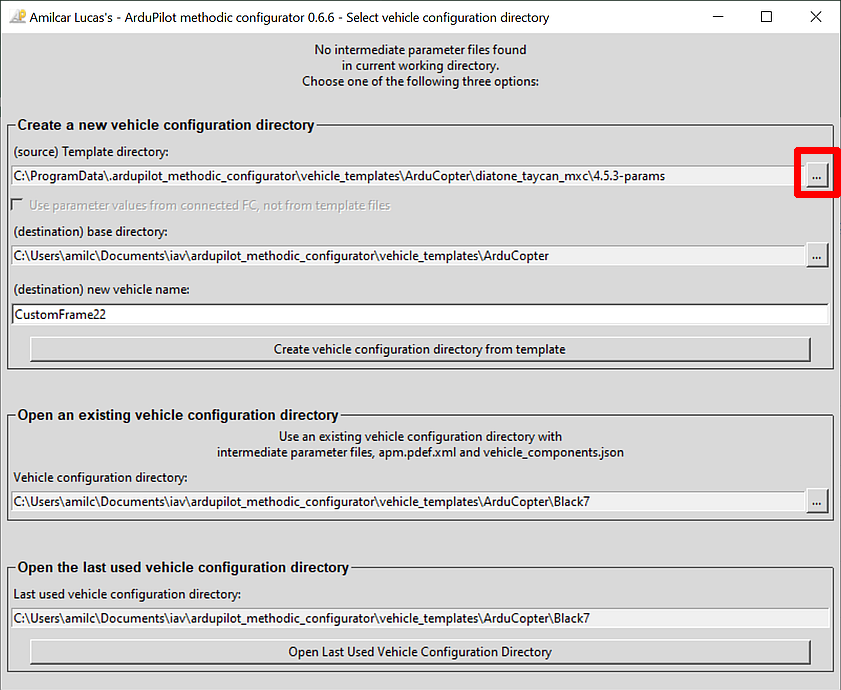
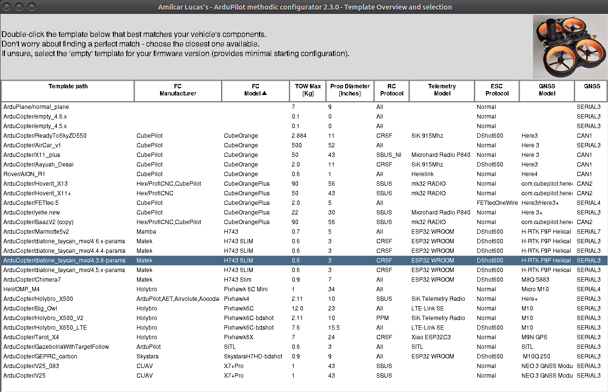
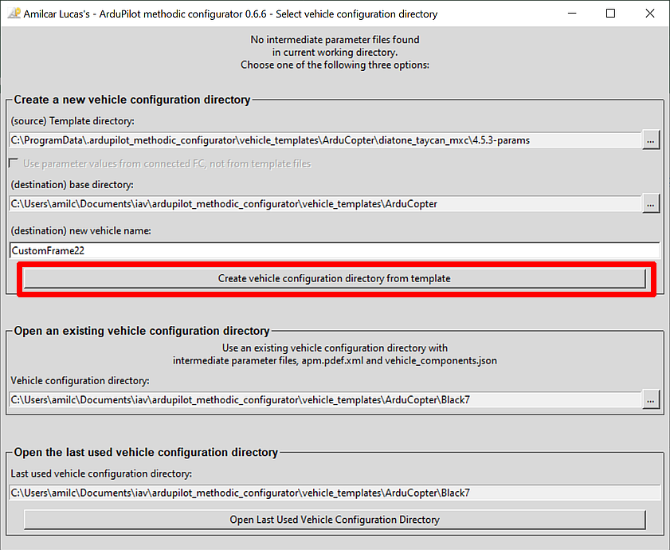
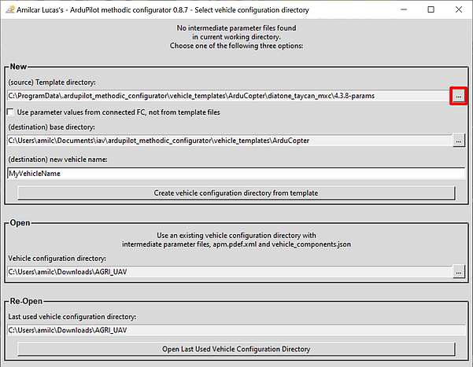
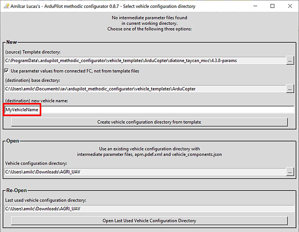
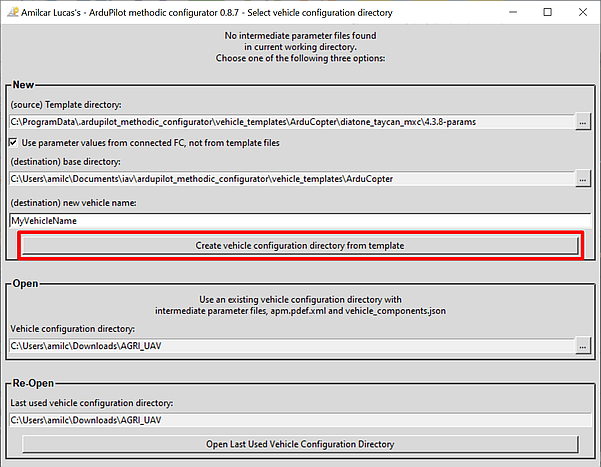

# Ardupilot Methodic Configurator use cases

The software is meant to guide you a in sequence of procedural steps to configure and tune your vehicle in a safe and time-efficient way.

Hence the two main use cases are:

1. [Use the *ArduPilot Methodic Configurator* software for the first time](#use-the-ardupilot-methodic-configurator-software-for-the-first-time)
   to create a vehicle configuration based on a pre-existing template
   [](https://www.youtube.com/watch?v=9n4Wh6wBuHQ&list=PL1oa0qoJ9W_89eMcn4x2PB6o3fyPbheA9)
1. [Use the *ArduPilot Methodic Configurator* software after having created a vehicle from a template](#use-the-ardupilot-methodic-configurator-software-after-having-created-a-vehicle-from-a-template)
   to edit existing vehicle configuration files to configure and tune a vehicle

But there are other use cases as well:

- [Create a vehicle configuration based on a correctly configured vehicle](#create-a-vehicle-configuration-based-on-a-correctly-configured-vehicle)
- [Review and or edit configuration files without having the vehicle FC](#review-and-or-edit-configuration-files-without-having-the-vehicle-fc)
- [Use the correct default values](#use-the-correct-default-values)
- [Re-run the procedure after changing a vehicle component](#re-run-the-procedure-after-changing-a-vehicle-component)

## Use the *ArduPilot Methodic Configurator* software for the first time

It is recommended to start with default parameter values on your flight controller as it guarantees that all parameters have sane values and
provides a clean baseline for the configuration process.
This is especially important for new vehicles or when you've made significant changes to your setup.

If your vehicle is already operating correctly and you're just making minor adjustments, you do not need to reset the parameters to their default values
as this would require reconfiguring everything from scratch.

The ArduPilot documentation explains [how to reset all parameters to their default value](https://ardupilot.org/copter/docs/common-parameter-reset.html)
if you decide this is the best approach for your situation.

1. Close all other GCS software (MissionPlanner, QGroundControl, MAVProxy, DroneKit-Python, APM Planner 2.0, UgCS, LOGOS, Tower, AndroPilot, etc)
the *ArduPilot Methodic Configurator* needs connection exclusivity.
1. Connect the flight controller to the computer using a USB cable.
1. Wait at least 7 seconds.
1. Open the *ArduPilot Methodic Configurator* software.
1. The software should now automatically detect and connect to your flight controller.

1. Select source template directory to use.

1. Select the vehicle template that better resembles your vehicle, it does not need to fully match your vehicle.

1. Give a name to your vehicle.

1. Press *Create vehicle configuration from template*.

1. Edit all the components of your vehicle to match your own in the *Vehicle Component Editor* window.
Please scroll down and make sure you do not miss a property.

1. Press *Save data and start configuration*.
1. The application will validate your input.
If issues are found the problematic fields' background will be marked in red color.
Correct those entries and press the `Save data and start configuration` button again.
1. You should now see the *Parameter file editor and uploader* window.


If something is not clear, read the [ArduPilot Methodic Configurator user manual](USERMANUAL.md)

## Use the *ArduPilot Methodic Configurator* software after having created a vehicle from a template

1. Close all other GCS software (MissionPlanner, QGroundControl, MAVProxy, DroneKit-Python, APM Planner 2.0, UgCS, LOGOS, Tower, AndroPilot, etc)
the *ArduPilot Methodic Configurator* needs connection exclusivity.
1. Connect the flight controller to the computer using a USB cable.
1. Wait at least 7 seconds.
1. Open the *ArduPilot Methodic Configurator* software.
1. The software should now automatically detect and connect to your flight controller.

1. Open the vehicle configuration directory that you created in the [Use the *ArduPilot Methodic Configurator* software for the first time](#use-the-ardupilot-methodic-configurator-software-for-the-first-time).

double-click and step inside the directory that you want to use, not just select it
1. Edit all the components of your vehicle to match your own.
Please scroll down and make sure you do not miss a property.

1. Press *Save data and start configuration*.
1. You should now see the *Parameter file editor and uploader* window.

1. Proceed as explained in [parameter editor workflow overview](USERMANUAL.md#step-4-parameter-file-editor-and-uploader-interface)

If something is not clear, read the [ArduPilot Methodic Configurator user manual](USERMANUAL.md)

## Create a vehicle configuration based on a correctly configured vehicle

1. Connect the flight controller to the computer using a USB cable.
1. Wait at least 7 seconds.
1. Open the *ArduPilot Methodic Configurator* software.
1. The software should now automatically detect and connect to your flight controller.

1. Select the vehicle template that better resembles your vehicle.


1. **select the `Use parameter values from connected FC, not from template files` checkbox**

1. Give a name to your vehicle.

1. Press *Create vehicle configuration from template*.

1. Edit all the components of your vehicle to match your own in the *Vehicle Component Editor* window.

1. Press *Save data and start configuration*.
1. The application will validate your input.
If issues are found the problematic fields' background will be marked in red color.
Correct those entries and press the `Save data and start configuration` button again.
1. You should now see the *Parameter file editor and uploader* window.

1. Follow the procedure to [configure the vehicle parameters](USERMANUAL.md#step-4-parameter-file-editor-and-uploader-interface)

If something is not clear, read the [ArduPilot Methodic Configurator user manual](USERMANUAL.md)

## Review and or edit configuration files without having the vehicle FC

1. Open the *ArduPilot Methodic Configurator* software.
1. Select `Skip FC connection, just edit .param files on disk` button.

1. Open the vehicle configuration directory that you want to edit or review.

**double-click and step inside the directory that you want to use, not just select it**
1. Edit all the components of your vehicle to match your own in the *Vehicle Component Editor* window.

1. Press *Save data and start configuration*.
1. The application will validate your input.
If issues are found the problematic fields' background will be marked in red color.
Correct those entries and press the `Save data and start configuration` button again.
1. You should now see the *Parameter file editor and uploader* window.
 the `Upload selected params to FC, and advance to next param file`
button will be grayed out because there is no FC connected.
1. Follow the procedure to [configure the vehicle parameters](USERMANUAL.md#step-4-parameter-file-editor-and-uploader-interface)

If something is not clear, read the [ArduPilot Methodic Configurator user manual](USERMANUAL.md)

## Use the correct default values

To get the correct default values for your board (if it does not support MAVFTP) you need to do:

```bash
cd VehicleConfigurarationDirectory
extract_param_defaults bin_log_file.bin > 00_default.param
```

## Re-run the procedure after changing a vehicle component

1. Connect the flight controller to the computer using a USB cable.
1. Wait at least 7 seconds.
1. Open the *ArduPilot Methodic Configurator* software.
1. The software should now automatically detect and connect to your flight controller.

1. Open the vehicle configuration directory that you want to edit or review.

**double-click and step inside the directory that you want to use, not just select it**
1. Edit all the components of your vehicle to match the component and/or connections changes you made in the *Vehicle Component Editor* window.

1. Press *Save data and start configuration*.
1. The application will validate your input.
If issues are found the problematic fields' background will be marked in red color.
Correct those entries and press the `Save data and start configuration` button again.
1. You should now see the *Parameter file editor and uploader* window.

1. Now depending of the changes you made you will need to re-do some steps and can skip some others:
   - FC changed - Need to redo all steps
   - Frame and/or Take-off-weight - redo steps 19 and above
   - RC Controller - redo step 05 and the RC parts of step 12
   - RC Transmitter - Redo step 05 and the RC parts of step 12
   - RC Receiver - redo step 05 and the RC parts of step 12
   - Telemetry - redo step 06
   - Battery Monitor - redo step 08
   - Battery - redo step 08 and 19 and above if the weight changed
   - ESC - redo step 07 and 19 and above
   - motors - redo step 07 and 19 and above
   - props - redo step 07, and 11 and above
   - GNSS receiver - redo step 10
1. Follow the procedure to [configure the vehicle parameters](USERMANUAL.md#step-4-parameter-file-editor-and-uploader-interface)

If something is not clear, read the [ArduPilot Methodic Configurator user manual](USERMANUAL.md)

<!-- Gurubase Widget -->
<script async src="https://widget.gurubase.io/widget.latest.min.js"
    data-widget-id="uE4kxEE4LY3ZSyfNsF5bU6gIOnWGTBOL_e16KwDH-0g"
    data-text="Ask AI"
    data-margins='{"bottom": "1rem", "right": "1rem"}'
    data-light-mode="true"
    id="guru-widget-id">
</script>
