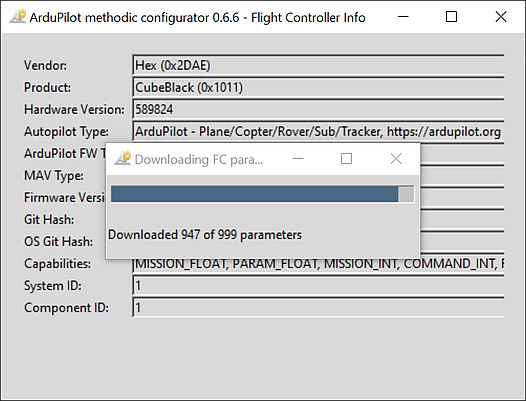
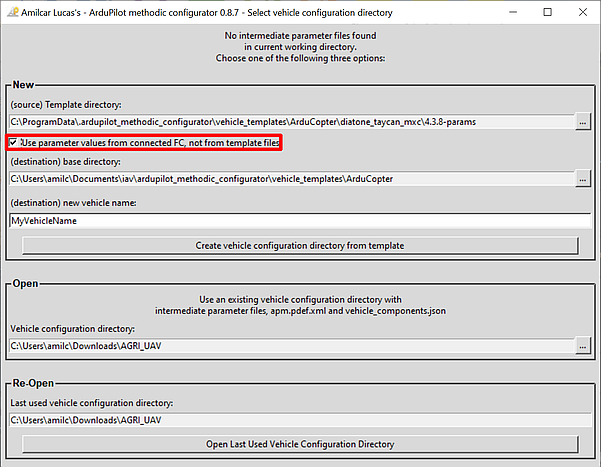
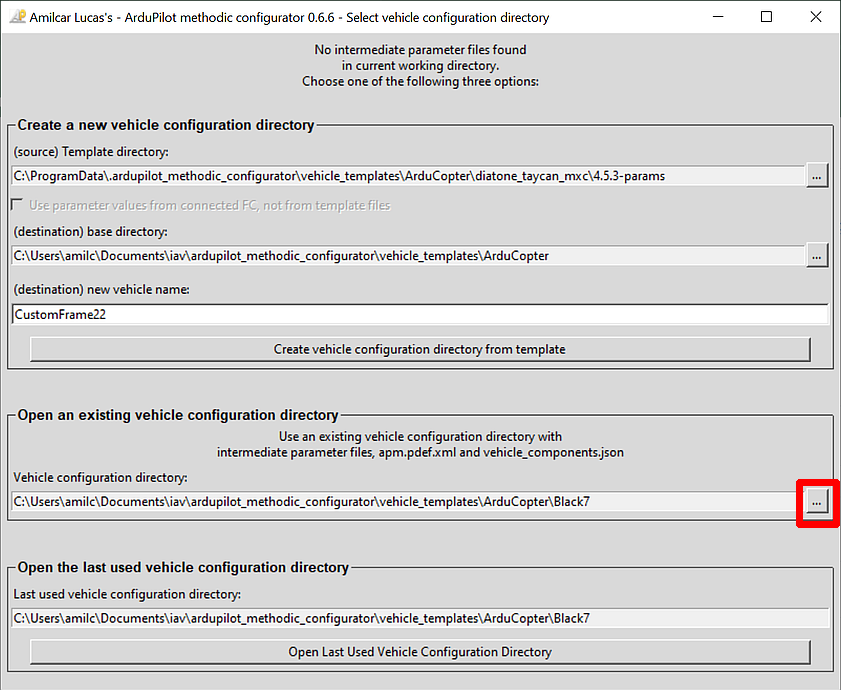

# Ardupilot Methodic Configurator use cases

The software is meant to guide you a in sequence of procedural steps to configure and tune your vehicle in a safe and time-efficient way.

Hence the two main use cases are:

1. [Create a vehicle configuration based on a pre-existing template](QUICKSTART.md#5-use-the-ardupilot-methodic-configurator-software-for-the-first-time)
1. [Edit existing vehicle configuration files to configure and tune a vehicle](QUICKSTART.md#7-use-the-ardupilot-methodic-configurator-software-after-having-created-a-vehicle-from-a-template)

But there are other use cases as well:

- [Ardupilot Methodic Configurator use cases](#ardupilot-methodic-configurator-use-cases)
  - [Create a vehicle configuration based on a correctly configured vehicle](#create-a-vehicle-configuration-based-on-a-correctly-configured-vehicle)
  - [Review and or edit configuration files without having the vehicle FC](#review-and-or-edit-configuration-files-without-having-the-vehicle-fc)
  - [Use the correct default values](#use-the-correct-default-values)

## Create a vehicle configuration based on a correctly configured vehicle

1. Connect the flight controller to the computer using a USB cable.
1. Wait at least 7 seconds.
1. Open the *ArduPilot Methodic Configurator* software.
1. The software should now automatically detect and connect to your flight controller.

1. Select the vehicle template that better resembles your vehicle.


1. **select the `Use parameter values from connected FC, not from template files` checkbox**

1. Give a name to your vehicle.

1. Press *Create vehicle configuration from template*.

1. Edit all the components of your vehicle to match your own in the *Vehicle Component Editor* window.

1. Press *Save data and start configuration*.
1. The application will validate your input.
If issues are found the problematic fields' background will be marked in red color.
Correct those entries and press the `Save data and start configuration` button again.
1. You should now see the *Parameter file editor and uploader* window.

1. Follow the procedure to [configure the vehicle parameters](QUICKSTART.md#6-configure-the-vehicles-parameters-in-a-traceable-way)

If something is not clear, read the [ArduPilot Methodic Configurator user manual](USERMANUAL.md)

## Review and or edit configuration files without having the vehicle FC

1. Open the *ArduPilot Methodic Configurator* software.
1. Select `Skip FC connection, just edit .param files on disk` button.

1. Open the vehicle configuration directory that you want to edit or review.

**double-click and step inside the directory that you want to use, not just select it**
1. Edit all the components of your vehicle to match your own in the *Vehicle Component Editor* window.

1. Press *Save data and start configuration*.
1. The application will validate your input.
If issues are found the problematic fields' background will be marked in red color.
Correct those entries and press the `Save data and start configuration` button again.
1. You should now see the *Parameter file editor and uploader* window.
 the `Upload selected params to FC, and advance to next param file`
button will be grayed out because there is no FC connected.
1. Follow the procedure to [configure the vehicle parameters](QUICKSTART.md#6-configure-the-vehicles-parameters-in-a-traceable-way)

If something is not clear, read the [ArduPilot Methodic Configurator user manual](USERMANUAL.md)

## Use the correct default values

To get the correct default values for your board (if it does not support MAVFTP) you need to do:

```bash
cd VehicleConfigurarationDirectory
extract_param_defaults bin_log_file.bin > 00_default.param
```
