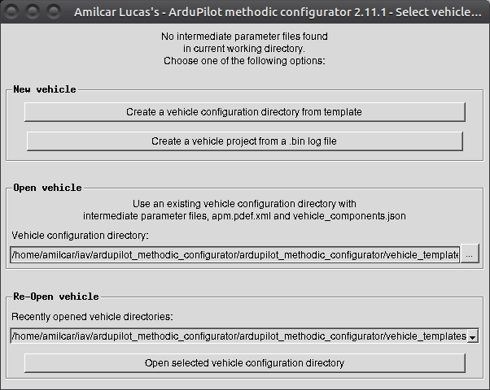
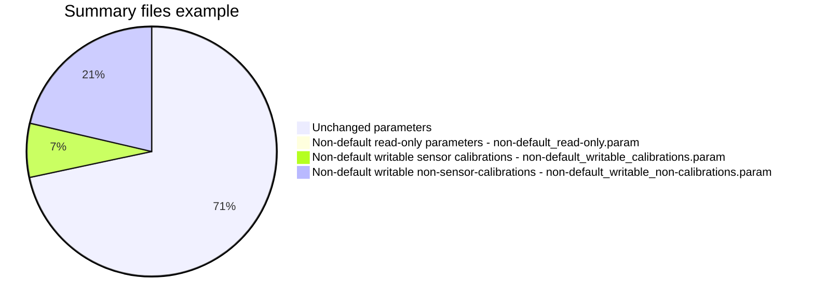

# ArduPilot Methodic Configurator User Manual

## Overview

Amilcar Lucas's - ArduPilot Methodic Configurator is a Python tool designed to simplify the configuration of ArduPilot drones.
It provides a graphical user interface (GUI) for managing, editing and visualizing drone parameter files, as well as uploading parameters to the vehicle.
It automates the tasks described in the [How to methodically tune (almost) any multicopter using ArduCopter forum Blog post](https://discuss.ardupilot.org/t/how-to-methodically-tune-almost-any-multicopter-using-arducopter-4-4-x/110842/1)

## Usage

Before starting the application on your PC you should connect a flight controller to the PC and wait at least seven seconds.

### Flight Controller Connection Selection Interface

This interface allows users to select or add a connection to a flight controller **if one was not yet auto-detected**.

<p align="center">
  
<br>
  <ins><b><i>Flight controller connection selection window</i></b></ins>
</p>

It provides three main options for connecting to a flight controller:

#### Option 1: Auto-connect

This option automatically attempts to connect to a flight controller that has been connected to the PC. The user must wait for at least 7 seconds for the flight controller to fully boot before attempting the connection.

#### Option 2: Manually Select or Add a Connection

This option allows users to manually select an existing flight controller connection or add a new one. It provides a dropdown menu listing all available connections, including an option to add a new connection.

- To select an existing connection, use the dropdown menu to choose the desired connection.
- To add a new connection, select "Add another" from the dropdown menu. A dialog box will prompt you to enter the connection string for the new flight controller.

#### Option 3: Skip Flight Controller Connection

This option allows users to skip the flight controller connection process. It proceeds with editing the intermediate `.param` files on disk without fetching parameter values nor parameter default parameter values from the flight controller.

### Vehicle Directory Selection Interface

This interface allows users to select a vehicle directory that contains intermediate parameter files for ArduPilot **if one was not specified with the `--vehicle-dir` command line parameter**.

<p align="center">
  
<br>
  <ins><b><i>Vehicle Selection Window</i></b></ins>
</p>

It provides two main options for selecting a vehicle directory:

#### Option 1: Create a New Vehicle Configuration Directory Based on an Existing Template

This option allows users to create a new vehicle configuration directory by copying files from an existing template directory. It's useful for setting up a new vehicle configuration quickly.

- Use the "Template directory" `...` button to select the existing vehicle template directory containing the intermediate parameter files to be copied.
- Use the "Base directory" `...` button to select the existing directory where the new vehicle directory will be created.
- Enter the name for the new vehicle directory in the "New vehicle name" field.
- Click the "Create vehicle directory from template" button to create the new vehicle directory on the base directory and copy the template files to it.

#### Option 2: Use an Existing Vehicle Configuration Directory

This option allows users to select an existing vehicle configuration directory that already contains intermediate parameter files. It's useful for editing an existing vehicle configuration.

- Use the "Vehicle directory" `...` button to select the existing vehicle directory containing the intermediate parameter files.

### Component Editor Interface

Here you specify the components of your vehicle, their properties and how they are connected to the flight controller.

<p align="center">
  
<br>
  <ins><b><i>Component Editor Window</i></b></ins>
</p>

Change every field to match your vehicle's.
When finished press the `Save data and start configuration` button.

The application will validate your input.
If issues are found the problematic fields' background will be marked in red color.
Correct those entries and press the `Save data and start configuration` button again.

### Parameter Editor interface

Here you sequentially configure the parameters of your flight controller to meet your needs while having all the available documentation at your fingertips.

<p align="center">
  
<br>
  <ins><b><i>Parameter Editor Window (main application)</i></b></ins>
</p>

#### 1. Select a Vehicle Directory (optional)

- **Click the `...` button next to the `Vehicle directory:` label to open a directory selection dialog.**
- **Navigate to the directory containing the vehicle-specific intermediate parameter files (if you are running it for the first time use the one you just created) and click `OK`.**
- vehicle-specific intermediate parameter filenames start with two digits followed by an underscore and end in `.param`

#### 2. Select an Intermediate Parameter File (optional)

- **Use the `Current intermediate parameter file:` combobox to select an intermediate parameter file.**
- The first available intermediate parameter file not named `00_default.param` will be selected by default
- If the selection changes, the parameter table will update to display the parameters from the selected file.

#### 3. Select a Flight Controller Connection (optional)

- **If a flight controller is detected and the `--device` command-line parameter was not explicitly set, it will connect to it.**
- The `Flight controller connection:` Combobox lists available connections.
- Select a connection to establish communication with the flight controller.

#### 4. Viewing Documentation

- **Click on the documentation labels to open the corresponding documentation in a web browser.**
- Documentation is split into four categories:
  - **Blog Post - ArduPilot's forum Methodic configuration Blog post relevant to the current file**
  - Wiki - ArduPilot's wiki page relevant to the current file
  - External tool -External tool or documentation relevant to the current file
  - Mandatory - Mandatory level of the current file:
    - 100% you MUST use this file to configure the vehicle,
    - 0% you can ignore this file if it does not apply to your vehicle
- Hover over the labels to see tooltips with additional information.

#### 5. Editing Parameters

- The parameter table presents the parameters in the current intermediate parameter file
- The first column is the ArduPilot parameter name used in that row.
  - ReadOnly parameters are presented on a *red background*🟥, they should not be present in an intermediate configuration file because under normal conditions they can not be changed
  - Sensor calibration parameters are presented on a *yellow background*🟨, they are vehicle-instance dependent and can NOT be reused between similar vehicles
- The current parameter value downloaded from your FC is in the `Current Value` column.
  - Not available parameter values are presented as `N/A` on an *orange background*🟧
  - Parameters that have the default parameter value are presented on a *light blue background* 🟦
- The new value is the value in the intermediate file and will be uploaded to the flight controller. **You MUST change the value to meet your needs**. The provided values in the `example_vehicle` directory are just examples.
- **In the parameter table, you can edit the `New Value` and `Change Reason` entries for each parameter.**
- **You MUST edit the `Change Reason` so that other users understand why you changed the parameter to that particular `new value`**
- Check the `Upload` checkbox to select parameters to be uploaded to the flight controller
- **Hover over the labels to see tooltips with additional information.**
- The entire ArduPilot official parameter documentation is available on the tooltip, no need to use a browser to search for it.

#### 6. Focus on the changed parameters (optional)

- You can focus on the changed parameters by ticking the "See only changed parameters" checkbox
- Usually, you want to see all parameters and look at their mouse-over tooltips to decide if and how you want to change them

#### 7. Uploading Parameters to the Flight Controller

- You can also jump to a particular file using the Combobox as explained in [2. Select an Intermediate Parameter File](#2-select-an-intermediate-parameter-file)
- **After editing parameters, click the `Upload selected params to FC, and advance to next param file` button to upload the (`Upload` checkbox) selected parameters to the flight controller.**
- All parameter's `New Value` and `Change Reason` will be written to the current intermediate parameter file, irrespective of the `Upload` checkboxes
- The application will then:
  - upload the selected and changed parameters to the flight controller
  - reset the flight controller if necessary for the new parameter values to take effect
  - upload the parameters again, because before the reset some parameters might have been not visible/uploadable
  - download all the parameters from the flight controller, and validate their value
    - if some parameters fail to upload correctly it asks the user if he wants to retry
- **The application will then advance to the next parameter file.**

#### 8. Skipping to the Next Parameter File (optional)

- If you want to skip the current parameter file without uploading any changes, click the `Skip parameter file` button.

#### 9. Completing the Configuration Process

Once all the intermediate parameter files have been processed, the ArduPilot Methodic Configurator will display a summary message box.
In other words when the last available intermediate parameter file is selected (see [2. Select an Intermediate Parameter File](#2-select-an-intermediate-parameter-file)) and either `Upload selected params to FC, and advance to next param file` or `Skip parameter file` button is pressed.
This message box provides a comprehensive overview of the configuration process, including the number of parameters that were kept at their default values, the number of non-default read-only parameters that were ignored, and the number of non-default writable parameters that were updated.


The summary message box will also categorize the writable parameters into four groups:



- **Unchanged parameters**: These parameters are left unchanged and are displayed on a light blue background 🟦.

- **Non-default read-only parameters**: These parameters are read-only and cannot be changed. They are typically related to system configurations that can not be modified and are displayed on a red background 🟥.

- **Non-default writable sensor calibrations**: These parameters are vehicle-instance dependent and cannot be reused between similar vehicles. They are typically related to sensor calibration and should be adjusted for each vehicle and are displayed on a yellow background 🟨.

- **Non-default writable non-sensor calibrations**: These parameters can be reused between similar vehicles. They are not related to sensor calibration and are generally applicable to a range of vehicles with the same configuration.

After the summary message box is displayed, the application will write the summary information into separate files for easy reference and documentation. These files include:

- `complete.param`: Contains all parameters contained in the flight controller.
- `non-default_read-only.param`: Contains all non-default read-only 🟥 parameters. You can ignore these.
- `non-default_writable_calibrations.param`: Contains all non-default writable sensor calibration 🟨 parameters. These are non-reusable.
- `non-default_writable_non-calibrations.param`: Contains all non-default writable non-sensor-calibration parameters. These are reusable across similar vehicles.


The summary files provide a clear overview of the changes made.

The files are also automatically zipped into a file with the same name as the vehicle directory, inside the vehicle directory.


You should upload this `.zip` file or the `non-default_writable_non-calibrations.param` file to the [ArduPilot Methodic configuration Blog post](https://discuss.ardupilot.org/t/how-to-methodically-tune-almost-any-multicopter-using-arducopter-4-4-x/110842)

Once the summary files are written, the application will close the connection to the flight controller and terminate.

## Configuring

### 1. Configuration files

Most users will not need to configure the tool, but if you do want to do it you can.

The ArduPilot Methodic Configurator uses several configuration files to manage and visualize drone parameters. These files are crucial for the tool's operation and are organized in a specific directory structure.

- **Intermediate Parameter Files**: These files are located in the vehicle-specific directory and are named with two digits followed by an underscore, ending in `.param`. They contain the parameters that need to be configured for the drone. Each file corresponds to a specific configuration step or aspect of the drone's setup.

- **Documentation File**: This file provides documentation for each intermediate parameter file. It is used to display relevant information about the parameters and their configuration process. The `ArduCopter_configuration_steps.json` documentation file is first searched in the selected vehicle-specific directory, and if not found, in the directory where the script is located.

- **Default Parameter Values File**: The `00_defaults.param` file is located in the vehicle-specific directory.
If the file does not exist or is invalid, use this command to regenerate it

```bash
./extract_param_defaults.py bin_log_file.bin > 00_default.param
```

- **ArduPilot parameter documentation File**: The `apm.pdef.xml` contains documentation and metadata for each ArduPilot parameter in an XML format.
The file is first searched in the selected vehicle-specific directory, and if not found, in the directory where the script is located, and if not found automatically downloaded from the internet.
The only version available on the internet is the latest 4.6.0-DEV.
So until that changes you need to generate this file yourself for the firmware version that you want to use.

The tool uses these files to manage the configuration process, allowing users to select and edit parameters, and upload the changes back to the flight controller. The intermediate parameter files are the primary focus of the user interface, as they contain the parameters that the user can modify. The documentation files provide context and guidance for each parameter.

## Command Line Usage

The *ArduPilot Methodic Configurator* can be started from the command line.
The command line interface provides several options to customize the behavior of the tool.

To use the command line interface, navigate to the directory where the `ardupilot_methodic_configurator.py` script is located and run the script with the appropriate arguments.

Here is a list of command line options:

- **`--device`**: The MAVLink connection string to the flight controller. It defaults to autoconnection to the first available flight controller.
- **`--vehicle-dir`**: The directory containing intermediate parameter files. Defaults to the current working directory directory.
- **`--n`**: Start directly on the nth intermediate parameter file (skip previous files). The default is 0.
- **`--loglevel`**: The logging level (DEBUG, INFO, WARNING, ERROR, CRITICAL). The default is INFO.
- **`-t` or `--vehicle-type`**: The type of the vehicle. Choices are 'AP_Periph', 'AntennaTracker', 'ArduCopter', 'ArduPlane', 'ArduSub', 'Blimp', 'Heli', 'Rover', 'SITL'. Defaults to 'ArduCopter'.
- **`-r` or `--reboot-time`**: Flight controller reboot time. The default is 7.
- **`-v` or `--version`**: Display version information and exit.

Example usage:

```bash
python ardupilot_methodic_configurator.py --device="tcp:127.0.0.1:5760" --vehicle-dir="/path/to/params" --n=0 --loglevel=INFO -t=ArduCopter
```

This command will connect to the flight controller at `tcp:127.0.0.1:5760`, use the parameter files in the specified directory, start with the first parameter file, set the logging level to INFO, and target the ArduCopter vehicle type.

For more detailed information on the command line options, you can run the script with the `-h` or `--help` flag to display the help message:

```bash
python ardupilot_methodic_configurator.py --help
```

This will show a list of all available command line options along with a brief description of each.

## Troubleshooting

If you encounter any issues during the configuration process, refer to the error messages provided by the application.
These messages can guide you to the specific problem and suggest possible solutions.
If the issue persists, consider consulting Amilcar Lucas at ArduPilot community forums or re-read this documentation.
