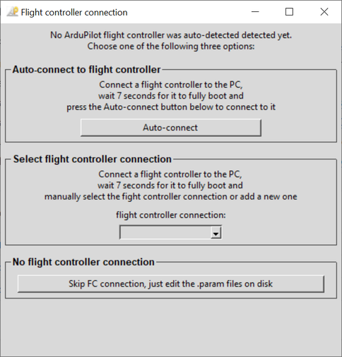
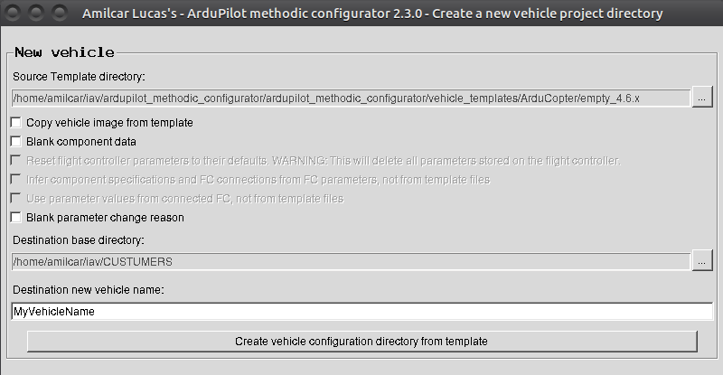
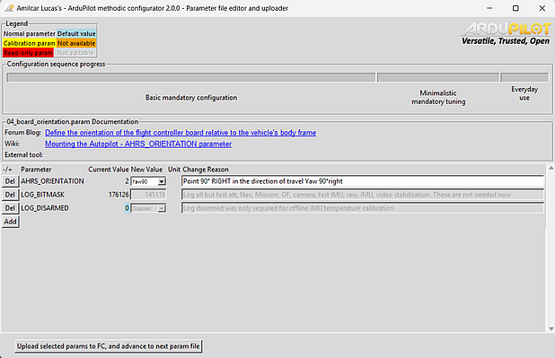
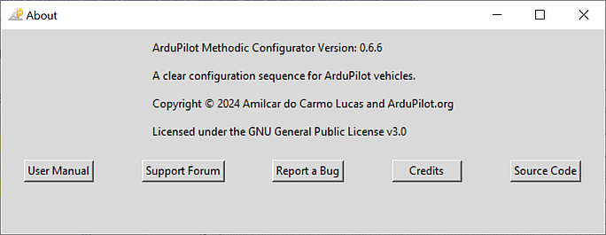

# ArduPilot Methodic Configurator User Manual

## Overview

*ArduPilot Methodic Configurator* is a PC software designed by ArduPilot developers to simplify the configuration of ArduPilot vehicles.
Its graphical user interface (GUI) manages, edits and visualizes parameter files, as well as uploads parameters to the vehicle.
It automates the tasks described in the [How to methodically tune any ArduCopter](https://ardupilot.github.io/MethodicConfigurator/TUNING_GUIDE_ArduCopter) tuning guide.

This user manual gives a general overview of the software functionality.
There are also [quick start instructions](README.md), [specific use case instructions](USECASES.md), and [frequently asked questions](FAQ.md).

## Table of Contents

1. [Step-by-Step Workflow](#step-by-step-workflow)
2. [Configuration Details](#configuration-details)
3. [Command Line Usage](#command-line-usage)
4. [Troubleshooting](#troubleshooting)
5. [Support](SUPPORT.md) (External Document)
6. [Installation and Security](INSTALL.md) (External Document)
7. [FAQ](FAQ.md) (External Document)
8. [Glossary](#glossary)

## Before You Begin

⚠️ **IMPORTANT**: Connect your flight controller to the PC and wait **at least 7 seconds** before starting the software.

💡 **TIP**: Have your vehicle's component documentation ready (motor specifications, ESC type, etc.)

## Step-by-Step Workflow

Don't worry! It looks more complicated than it actually is. And **you do not need to understand the diagram** to use the software.


If the diagram above does not display correctly [look here](https://github.com/ArduPilot/MethodicConfigurator/blob/master/USERMANUAL.md#step-by-step-workflow)

This section guides you through the complete configuration process. Follow these steps in order:

### Step 1: Preparation

1. **Connect** your flight controller to the PC via USB cable
2. **Wait** at least 7 seconds for the flight controller to fully boot
3. **Launch** ArduPilot Methodic Configurator

### Step 2: Flight Controller Connection

If the software successfully auto-detects your flight controller, this step will be skipped automatically and you'll proceed directly to Step 3.

The connection selection interface is only presented **if auto-connection fails** or if no flight controller is detected.

#### Flight Controller Connection Selection Interface

This interface allows users to select or add a connection to a flight controller **if one was not yet auto-detected**.


<figure>
<br>
  <ins><b><i>Flight controller connection selection window</i></b></ins>
</figure>

It provides three main options for connecting to a flight controller:

**Choose your connection method:**

#### Option 1: Auto-connect to flight controller ⭐ **Recommended for most users**

This option automatically detects and connects to your flight controller.

- ✅ **Use when**: Your flight controller is connected via USB and powered on
- ⏱️ **Wait time**: Ensure 7+ seconds have passed since connecting
- 🔧 **Troubleshooting**: If auto-detection fails, try Option 2

#### Option 2: Select flight controller connection ⚙️ **For advanced users**

Manually specify your connection details.

- ✅ **Use when**:
  - Auto-connect doesn't work
  - Using network connections (TCP/UDP)
  - Multiple flight controllers connected
  - A baudrate other than 115200 is to be used
- 📝 **How to**:
  - Select existing connection from dropdown, OR
  - Choose "Add another" to enter custom connection string
  - For serial connection select the correct baudrate
- 💡 **Examples**:
  - Serial: `COM3` (Windows) or `/dev/ttyUSB0` (Linux)
  - Network: `tcp:192.168.1.100:5760`

#### Option 3: No flight controller connection 📝 **For offline editing**

Work with parameter files without connecting to hardware.

- ✅ **Use when**:
  - Flight controller not available
  - Pre-planning configurations
  - Reviewing existing configurations
- ⚠️ **Limitations**:
  - Cannot read current parameter values
  - Cannot upload parameters
  - No parameter validation against hardware

### Step 3: Flight Controller Info and Parameter Download

If a flight controller is connected the software will now get information from it.
The information is presented in the corresponding window and at the same time all flight controller parameters are downloaded to the PC.


<figure>
<br>
  <ins><b><i>Flight controller info and parameter download</i></b></ins>
</figure>

### Step 4: Vehicle Configuration Directory Selection

This interface allows users to select a vehicle directory that contains intermediate parameter files for ArduPilot
**if one was not specified with the `--vehicle-dir` command line parameter** and if no configuration files were found in the current working directory.


<figure align="center">
<br>
  <ins><b><i>Vehicle Selection Window</i></b></ins>
</figure>

It provides three main options for selecting a vehicle directory:

#### New

Create a new vehicle configuration directory

#### Open

Open an existing vehicle configuration directory that already contains intermediate parameter files.
It's useful for editing an existing vehicle configuration.

- Use the "Vehicle directory" `...` button to select the existing vehicle directory containing the intermediate parameter files.

#### Re-open

Re-open the last used vehicle configuration directory.

### Create a New Vehicle Configuration Directory


<figure align="center">
<br>
  <ins><b><i>Create new Vehicle Window</i></b></ins>
</figure>

Create a new vehicle configuration directory by copying files from an existing template directory.
It's useful for setting up a new vehicle configuration quickly.

- Use the "Source template directory" `...` button to select the existing vehicle template directory containing the intermediate parameter files to be copied.
  Use the overview window to select the template that better matches the components of your vehicle.

- By default, the new vehicle parameter values are taken from the source template.
  But if your connected vehicle has already been correctly configured, checking the `Use parameter values from connected FC, not from template files`
  will use the parameter values from the flight controller instead.
- Use the "Destination base directory" `...` button to select the existing directory where the new vehicle directory will be created.
- Enter the name for the new vehicle directory in the "Destination new vehicle name" field.
- Click the "Create vehicle directory from template" button to create the new vehicle directory on the base directory and copy the template files to it.

### Step 5: Vehicle Component Editor Interface

Here you specify the components of your vehicle, their properties and how they are connected to the flight controller.

 

On the left with simple GUI complexity for beginners, on the right with normal GUI complexity.

Change every field to match your vehicle's.
When finished press the `Save data and start configuration` button.

The software will validate your input.
If issues are found the problematic fields' background will be marked in red color.
Correct those entries and press the `Save data and start configuration` button again.

### Step 6: Parameter File Editor and uploader interface

Here you sequentially configure the parameters of your flight controller to meet your needs while having all the available documentation at your fingertips.


<figure align="center">
<br>
  <ins><b><i>Parameter File Editor and Uploader Window (main application) in simple GUI complexity for beginners</i></b></ins>
</figure>


<figure align="center">
<br>
  <ins><b><i>Parameter File Editor and Uploader Window (main application) in normal GUI complexity</i></b></ins>
</figure>

The GUI complexity (simple or normal) is selected in the vehicle component editor window in the previous step.
The normal layout is explained below, the simple layout is similar but has less elements.

#### Parameter editor and uploader workflow overview

Do this in a loop until the software tells you the process is finished and automatically closes:

- Read all the documentation links displayed at the top of the GUI (marked with the big red number 4),
- Edit the parameter's *New value* and *Reason changed* fields to match your vehicle (marked with the big red number 5),
  documenting change reasons is crucial because it:
  - Promotes thoughtful decisions over impulsive changes
  - Provides documentation for vehicle certification requirements
  - Enables validation or suggestions from team members or AI tools
  - Preserves your reasoning for future reference or troubleshooting
- Press *Del* and/or *Add* buttons to delete or add parameters respectively (marked with the big red number 5),
- If necessary scroll down using the scroll bar on the right and make sure you edit all parameters,
- Press *Upload selected params to FC, and advance to next param file* (marked with the big red number 7),
- Repeat from the top until the software tells you the process is finished.

#### 1. See the Current Vehicle Directory (optional)

- this vehicle configuration directory contains the files to be edited and uploaded

#### 2. Select an Intermediate Parameter File (optional)

- vehicle-specific intermediate parameter filenames start with two digits followed by an underscore and end in `.param`
- **Use the `Current intermediate parameter file:` combobox to select an intermediate parameter file.**
- The first available intermediate parameter file not named `00_default.param` will be selected by default
- If the selection changes, the parameter table will update to display the parameters from the selected file.
- The sequence is defined by the order of the intermediate parameter files in the vehicle configuration directory.

For more details on intermediate parameter files, see [Intermediate Parameter Files](#intermediate-parameter-files).

#### 3. About information and help links (optional)

When you click the ArduPilot logo the following window will appear:


#### 4a. Configuration sequence progress bar

This segmented bar shows the progress in the vehicle configuration sequence.
The progress bar is updated automatically when you upload an intermediate parameter file to the flight controller or
select a different intermediate parameter file in the `Current intermediate parameter file:` combobox above it.
The steps are grouped into phases and optional phases are greyed-out.
There are mouse-over hints for each phase.


#### 4b. Viewing Documentation

- **Click on the documentation labels to open the corresponding documentation in a web browser.**
- Documentation is split into four categories:
  - **Blog Post - ArduPilot's forum Methodic configuration Blog post relevant to the current file**
  - Wiki - ArduPilot's wiki page relevant to the current file
  - External tool -External tool or documentation relevant to the current file
  - Mandatory - Mandatory level of the current file:
    - 100% you MUST use this file to configure the vehicle,
    - 0% you can ignore this file if it does not apply to your vehicle
- Hover over the labels to see tooltips with additional information.

#### 5. Editing Parameters


- The parameter table presents the parameters in the current intermediate parameter file
- The first column is a `Del` button that deletes the parameter in this row from the current intermediate parameter file.
- The second column is the ArduPilot parameter name used in that row.
  - ReadOnly parameters are presented on a *red background*🟥, they should not be present in an intermediate configuration file because
    under normal conditions they can not be changed
  - Sensor calibration parameters are presented on a *yellow background*🟨, they are vehicle-instance dependent and can NOT be reused between similar vehicles
- The current parameter value downloaded from your flight controller is in the `Current Value` column.
  - Not available parameter values are presented as `N/A` on an *orange background*🟧
  - Parameters that have the default parameter value are presented on a *light blue background* 🟦
- The new value is the value in the intermediate file and will be uploaded to the flight controller.
  **You MUST change the value to meet your needs**. The provided values in the `vehicle_template` directory are just examples.
  - parameters that should not be changed by the users, or are derived from information in the [*component editor*](#step-5-vehicle-component-editor-interface)
    are greyed out and can not be edited.
  - bitmask parameters are editable in two ways:
    - *Decimal* - enter the decimal value of the bitmask as you would with any other parameter.
    - *Bitmask* - double-click the parameter value with the mouse and a window will popup where you can edit the individual bits in the bitmask.
- **In the parameter table, you can edit the `New Value` and `Change Reason` entries for each parameter.**
- **You MUST edit the `Change Reason` so that other users understand why you changed the parameter to that particular `New value`**
- Check the `Upload` checkbox to select parameters to be uploaded to the flight controller
- **Hover over the labels to see tooltips with additional information.**
- The entire ArduPilot official parameter documentation is available on the tooltip, no need to use a browser to search for it.
- The `Add` button adds a parameter to the current intermediate parameter file.

#### 6a. Focus on the changed parameters (optional)

- You can focus on the changed parameters by ticking the "See only changed parameters" checkbox
- Usually, you want to see all parameters and look at their mouse-over tooltips to decide if and how you want to change them

#### 6b. Annotate parameter metadata information into the parameter files (optional)

Annotate parameter metadata information into the parameter files in the form of comments preceding the respective parameter.
It will create bigger and harder-to-compare parameter files but is more suitable for text editor editing.

#### 7. Uploading Parameters to the Flight Controller

- You can also jump to a particular file using the Combobox as explained in [2. Select an intermediate parameter file](#2-select-an-intermediate-parameter-file-optional)
- **After editing parameters, click the `Upload selected params to FC, and advance to next param file`**
  **button to upload the (`Upload` checkbox) selected parameters to the flight controller.**
- All parameters' `New Value` and `Change Reason` will be written to the current intermediate parameter file, irrespective of the `Upload` checkboxes
- The software will then:
  - upload the selected and changed parameters to the flight controller
  - reset the flight controller if necessary for the new parameter values to take effect
  - upload the parameters again, because before the reset some parameters might have been not visible/uploadable
  - download all the parameters from the flight controller, and validate their value
    - if some parameters fail to upload correctly it asks the user if he wants to retry
- **The software will then advance to the next parameter file.**

#### 8. Skipping to the Next Parameter File (optional)

- If you want to skip the current parameter file without uploading any changes, click the `Skip parameter file` button.

#### 9. Completing the Configuration Process

Once all the intermediate parameter files have been processed, the ArduPilot Methodic Configurator will display a summary message box.
In other words when the last available intermediate parameter file is selected (see
[2. Select an Intermediate Parameter File](#2-select-an-intermediate-parameter-file-optional)) and either
`Upload selected params to FC, and advance to next param file` or `Skip parameter file` button is pressed.
This message box provides a comprehensive overview of the configuration process, including the number of parameters that were kept at their default values,
the number of non-default read-only parameters that were ignored, and the number of non-default writable parameters that were updated.


The summary message box will also categorize the writable parameters into four groups:


If the diagram above does not display correctly [look here](https://github.com/ArduPilot/MethodicConfigurator/blob/master/USERMANUAL.md#9-completing-the-configuration-process)

- **Unchanged parameters**: These parameters are left unchanged and are displayed on a light blue background 🟦.

- **Non-default read-only parameters**: These parameters are read-only and cannot be changed.
  They are typically related to system configurations that can not be modified and are displayed on a red background 🟥.

- **Non-default writable sensor calibrations**: These parameters are vehicle-instance dependent and cannot be reused between similar vehicles.
  They are typically related to sensor calibration and should be adjusted for each vehicle and are displayed on a yellow background 🟨.

- **Non-default writable non-sensor calibrations**: These parameters can be reused between similar vehicles.
  They are not related to sensor calibration and are generally applicable to a range of vehicles with the same configuration.

After the summary message box is displayed, the application will write the summary information into separate files for easy reference and documentation. These files include:

- `complete.param`: Contains all parameters contained in the flight controller.
- `non-default_read-only.param`: Contains all non-default read-only 🟥 parameters. You can ignore these.
- `non-default_writable_calibrations.param`: Contains all non-default writable sensor calibration 🟨 parameters. These are non-reusable.
- `non-default_writable_non-calibrations.param`: Contains all non-default writable non-sensor-calibration parameters. These are reusable across similar vehicles.

The summary files provide a clear overview of the changes made.

The files are also automatically zipped into a file with the same name as the vehicle directory, inside the vehicle directory.


You should upload this `.zip` file or the `non-default_writable_non-calibrations.param` file to the [How to methodically tune any ArduCopter Blog post](https://discuss.ardupilot.org/t/how-to-methodically-configure-and-tune-any-arducopter/110842/)

Once the summary files are written, the application will close the connection to the flight controller and terminate.

## Configuration Details

This section provides detailed information about configuration files, customization options, and advanced setup procedures.

### Configuration Files

Most users will not need to configure the tool, but if you do want to do it you can.

The ArduPilot Methodic Configurator uses several configuration files to manage and visualize vehicle parameters.
These files are crucial for the tool's operation and are organized in a specific directory structure.

- **Intermediate Parameter Files**: These files are located in the vehicle-specific directory and are named with two digits followed by an underscore, ending in `.param`.
  They contain the parameters that need to be configured for the vehicle. Each file corresponds to a specific configuration step or aspect of the vehicle's setup.

- **Documentation File**: This file provides documentation for each intermediate parameter file.
  It is used to display relevant information about the parameters and their configuration process.
  The `configuration_steps_ArduCopter.json` documentation file is first searched in the selected vehicle-specific directory,
  and if not found, in the directory where the script is located.

- **Default Parameter Values File**: The `00_defaults.param` file is located in the vehicle-specific directory.
  If the file does not exist or is invalid, use this command to regenerate it

```bash
extract_param_defaults bin_log_file.bin > 00_default.param
```

- **ArduPilot parameter documentation File**: The `apm.pdef.xml` contains documentation and metadata for each ArduPilot parameter in an XML format.
  The file is first searched in the selected vehicle-specific directory, and if not found, in the directory where the script is located,
  and if not found automatically downloaded [from the internet](https://autotest.ardupilot.org/Parameters/versioned/).
  If the vehicle/version combination does not exist you need to generate this file yourself using the ardupilot source code for the firmware version that you want to use:

```bash
cd ardupilot
./Tools/autotest/param_metadata/param_parse.py --vehicle ArduCopter --format xml
cp apm.pdef.xml /path/to/your/vehicle/directory
```

The tool uses these files to manage the configuration process, allowing users to select and edit parameters, and upload the changes back to the flight controller.
The intermediate parameter files are the primary focus of the user interface, as they contain the parameters that the user can modify.
The documentation files provide context and guidance for each parameter.

### Intermediate Parameter Files

Building on the configuration files described above, intermediate parameter files are the primary files you'll interact with during vehicle setup.

For reproducibility and quality purposes, we configure the vehicle with a well-defined sequence of intermediate parameter files.

Each file modifies just a small set of the [over 1200 parameters on the flight controller](https://ardupilot.org/copter/docs/parameters.html).
By splitting the process into small manageable steps, we reduce the probability of making a mistake or missing a step and allow interleaving parameter changes with test flights.
Each intermediate parameter file is a text file, editable in any common text editor (excluding MS Word) like [Notepad++](https://notepad-plus-plus.org/),
[nano](https://www.nano-editor.org/) or [code](https://code.visualstudio.com/).
It contains the *official ArduPilot parameter documentation* in the form of comments in the lines preceding the parameter.
By using this you save the time of looking up the online documentation for each parameter.
It contains the **reason why we changed the parameter** in a comment on the same line as the parameter and is used to
trace each parameter change to the reason for that parameter change.

Comments start with the '#' character.
A small example with a single parameter is shown below:

```text

# Arming with Rudder enable/disable
# Allow arm/disarm by rudder input. When enabled arming can be done with right rudder, disarming with left rudder.
# 0: Disabled
# 1: ArmingOnly
# 2: ArmOrDisarm
ARMING_RUDDER,0 # We find it safer to use only a switch to arm instead of through rudder inputs
```

If you are working with multiple vehicles, create a separate directory for each vehicle with a descriptive identifiable name.
Copy the approx. 50 *intermediate parameter files* into them.
Edit the files to match the specific requirements of each vehicle.
Now you have traceable documentation records for every parameter change on each of your vehicles.

If you are in the business of manufacturing multicopters and maintain **high-quality standards that result in the production of multiple, nearly identical vehicles**,
you can reuse most intermediate parameter files across these vehicles.
Only three intermediate parameter files: `03_imu_temperature_calibration_results.param`, `12_mp_setup_mandatory_hardware.param` and
`25_inflight_magnetometer_fit_results.param` are specific to each vehicle instance.
All other intermediate parameter files can be used without modifications across all instances (or serial numbers) of the same product model.

## Command Line Usage

The *ArduPilot Methodic Configurator* can be started from the command line.
The command line interface provides several options to customize the behavior of the tool.

To use the command line interface, execute `ardupilot_methodic_configurator` on the command line.

Here is a list of command line options:

- **`--skip-check-for-updates`**: Skip check for software updates before starting the software. Default is False.
- **`--baudrate BAUDRATE`**: MAVLink serial connection baudrate to the flight controller. Default is 115200
- **`--device`**: The MAVLink connection string to the flight controller. It defaults to autoconnection to the first available flight controller.
- **`--vehicle-dir`**: The directory containing intermediate parameter files. Defaults to the current working directory directory.
- **`--n`**: Start directly on the nth intermediate parameter file (skip previous files). The default is 0.
- **`--skip-component-editor`**: Skip the component editor window. Only use this if all components have been configured. Default is False
- **`--loglevel`**: The logging level (DEBUG, INFO, WARNING, ERROR, CRITICAL). The default is INFO.
- **`-t` or `--vehicle-type`**: The type of the vehicle.
  Choices are 'AP_Periph', 'AntennaTracker', 'ArduCopter', 'ArduPlane', 'ArduSub', 'Blimp', 'Heli', 'Rover', 'SITL'. Defaults to 'ArduCopter'.
- **`-r` or `--reboot-time`**: Flight controller reboot time. The default is 7.
- **`-v` or `--version`**: Display version information and exit.

### Example Usage Scenarios

#### Basic Usage (Auto-detection)

```bash
# Simplest form - auto-detect flight controller and use current directory
ardupilot_methodic_configurator
```

#### Specific Connection and Directory

```bash
# Windows - specify COM port and project directory
ardupilot_methodic_configurator --device="COM3" --vehicle-dir="C:\MyQuadcopter"

# Linux - specify USB device and project directory
ardupilot_methodic_configurator --device="/dev/ttyUSB0" --vehicle-dir="/home/user/MyQuadcopter"

# Network connection (SITL or network-connected FC)
ardupilot_methodic_configurator --device="tcp:127.0.0.1:5760" --vehicle-dir="/path/to/params"
```

#### Skip Steps for Faster Workflow

```bash
# Skip component editor (when components already configured)
ardupilot_methodic_configurator --skip-component-editor --vehicle-dir="C:\MyDrone"

# Start from specific parameter file (skip earlier steps)
ardupilot_methodic_configurator --n=5 --vehicle-dir="C:\MyDrone"

# Combine multiple options for fastest startup
ardupilot_methodic_configurator --device="COM3" --vehicle-dir="C:\MyDrone" --skip-component-editor --n=3
```

#### Different Vehicle Types

```bash
# Fixed-wing aircraft
ardupilot_methodic_configurator -t ArduPlane --vehicle-dir="C:\MyPlane"

# Rover/boat
ardupilot_methodic_configurator -t Rover --vehicle-dir="C:\MyRover"

# Helicopter
ardupilot_methodic_configurator -t Heli --vehicle-dir="C:\MyHeli"
```

#### Debugging and Development

```bash
# Enable debug logging for troubleshooting
ardupilot_methodic_configurator --loglevel=DEBUG --vehicle-dir="C:\MyDrone"

# Skip update check (for offline use)
ardupilot_methodic_configurator --skip-check-for-updates --device="COM3"

# Combine debugging options
ardupilot_methodic_configurator --loglevel=DEBUG --skip-check-for-updates --device="COM3"
```

#### Pro Tip: Desktop Shortcuts

Create multiple desktop shortcuts for different projects:

**Shortcut 1** (MyQuadcopter):

```text
Target: ardupilot_methodic_configurator.exe --device="COM3" --vehicle-dir="C:\MyQuadcopter"
```

**Shortcut 2** (MyPlane):

```text
Target: ardupilot_methodic_configurator.exe --device="COM4" --vehicle-dir="C:\MyPlane" -t ArduPlane
```

For more detailed information on command line options, run:

```bash
ardupilot_methodic_configurator --help
```

This will show a list of all available command line options along with a brief description of each.

For command line completion setup, see the **[Installation Guide](INSTALL.md#install-command-line-completion)**.

## Speed up software start

To speed up the startup of the ArduPilot methodic configurator, consider the following tips, presented from most to least effective:

All of these can be either added in the command line as a parameter, or in the "properties > link > target" of the desktop icon.
Use an empty space to separate each option.

1. `--device <devicename>` this explicitly connects to \<devicename> skipping the auto-detection process.
1. `--vehicle-dir <vehicle-directory>` this explicitly looks for project files in \<vehicle-directory> saving you the trouble to
 manually select it in the GUI.
1. `--skip-component-editor` if you do not need to change the components and connections of your vehicle, this will skip the
 component and connection editor window.
1. `--n <number>` this will skip directly to step number \<number> so that you do not need to skip the previous steps
1. `--skip-check-for-updates` this saves very little time on startup, but you can skip it using this.

**Pro tip:** create multiple desktop icons, each one with a different project and or configuration.

## Troubleshooting

### Common Issues and Solutions

#### Connection Problems

**Issue**: "No flight controller detected" or auto-connect fails

**Solutions**:

1. **Check physical connection**: Ensure USB cable is properly connected
2. **Incorrect serial baudrate**: If the serial baudrate is different from 115200 you must connect manually
3. **Wait longer**: Flight controller needs 7+ seconds to boot fully
4. **Try different USB port**: Some ports may have power/data issues
5. **Check USB cable**: Try a different cable (data cable, not just power)
6. **Manual connection**: Use Option 2 and select the correct COM port
7. **Driver issues**: Install flight controller drivers if needed

**Issue**: "Connection lost during operation"

**Solutions**:

1. **Check USB connection**: Ensure cable isn't loose
2. **Restart software**: Close and reopen the configurator

#### Parameter File Issues

**Issue**: "Parameter file not found" or "Invalid parameter file"

**Solutions**:

1. **Check file location**: Ensure parameter files are in the correct directory
2. **File permissions**: Verify you have read/write access to the directory
3. **File format**: Ensure parameter files follow the correct format
4. **Regenerate defaults**: Use `extract_param_defaults` if `00_default.param` is missing

**Issue**: "Parameter upload failed" or "Parameter validation error"

**Solutions**:

1. **Check parameter values**: Ensure values are within valid ranges
2. **Flight controller firmware**: Verify firmware version compatibility
3. **Retry upload**: Some parameters require multiple attempts

#### Component Issues

**Issue**: "Component validation failed"

**Solutions**:

1. **Review component settings**: Check all required fields are filled
2. **Component compatibility**: Ensure components are compatible with your flight controller
3. **Firmware limitations**: Some components require specific firmware versions
4. **Documentation**: Consult component manufacturer specifications

#### Application Issues

**Issue**: Software crashes or freezes

**Solutions**:

1. **Restart software**: Close and reopen the configurator
2. **Check system resources**: Ensure adequate RAM and disk space
3. **Update software**: Check for newer version of the configurator
4. **Log files**: Check application logs for detailed error information
5. **Safe mode**: Try running with `--loglevel DEBUG` for more information

**Issue**: GUI elements not displaying correctly

**Solutions**:

1. **Display scaling**: Adjust Windows display scaling settings
2. **Screen resolution**: Ensure minimum resolution requirements are met
3. **Graphics drivers**: Update graphics card drivers
4. **Compatibility mode**: Try running in compatibility mode (Windows)

### Getting Help

For detailed support information, troubleshooting guidance, and how to report issues, see the **[Support Guide](SUPPORT.md)**.

## Installation and Security Verification

For detailed installation instructions and installer security verification, see the **[Installation Guide](INSTALL.md)**.

## Frequently Asked Questions

For comprehensive answers to common questions about the ArduPilot Methodic Configurator, please see our dedicated **[FAQ document](FAQ.md)**.

The FAQ covers:

- **General Questions**: Internet requirements, supported vehicles, timing expectations
- **Technical Questions**: Parameter editing, templates, firmware compatibility
- **Workflow Questions**: Component editor, configuration changes, vehicle comparisons

> 💡 **Quick Access**: [View Complete FAQ →](FAQ.md)

## Glossary

**ArduPilot**: Open-source autopilot software suite for unmanned vehicles, providing autonomous flight capabilities

**Bitmask Parameter**: A parameter where each bit represents a different option that can be enabled/disabled independently

**Component Editor**: Interface for specifying vehicle hardware components and their connections to the flight controller

**ESC**: Electronic Speed Controller - controls motor speed based on flight controller commands

**FC**: Flight Controller - the main computer hardware that runs ArduPilot firmware and controls the vehicle

**Firmware**: The ArduPilot software program running on the flight controller hardware

**Flight Mode**: Different operational modes of the vehicle (Manual, Stabilize, Auto, etc.)

**IMU**: Inertial Measurement Unit - sensors that measure acceleration and rotation (accelerometer + gyroscope)

**Intermediate Parameter File**: A `.param` text file containing a subset of parameters for a specific configuration step

**MAVLink**: The communication protocol used between ground control software and flight controllers

**Parameter**: A configuration value that controls flight controller behavior (over 1200 available)

**Parameter Documentation**: Detailed descriptions of what each parameter controls, including valid ranges and units

**Parameter Template**: A pre-configured set of parameter files for a specific vehicle type or configuration

**PID Controller**: Proportional-Integral-Derivative controller used for flight stabilization and navigation

**SITL**: Software In The Loop - ArduPilot simulation environment for testing without hardware

**Template Directory**: Folder containing pre-configured parameter files that can be copied for new vehicle setups

**Vehicle Instance**: A specific physical vehicle with unique calibration parameters (vs. reusable template parameters)

**Vehicle Type**: The category of vehicle (ArduCopter, ArduPlane, etc.) that determines available parameters and features

<!-- Gurubase Widget -->
<script async src="https://widget.gurubase.io/widget.latest.min.js"
    data-widget-id="uE4kxEE4LY3ZSyfNsF5bU6gIOnWGTBOL_e16KwDH-0g"
    data-text="Ask AI"
    data-margins='{"bottom": "1rem", "right": "1rem"}'
    data-light-mode="true"
    id="guru-widget-id">
</script>
