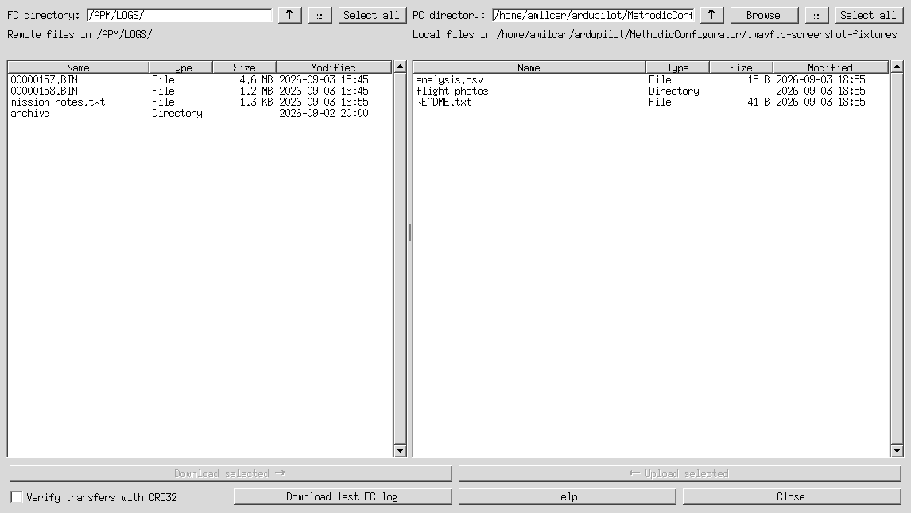
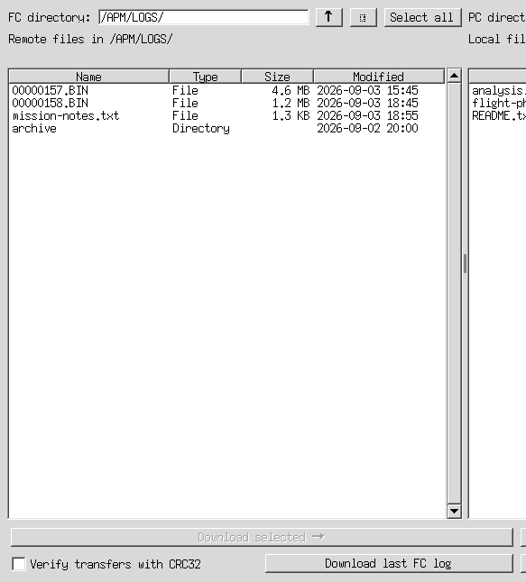

# MAVFTP File Browser User Manual

The **MAVFTP File Browser** lets you browse and manage files on a connected
ArduPilot flight controller and on your PC in one window. It is intended for
flight logs, but it can also manage other files and directories exposed by the
flight controller's MAVFTP service.

## Contents

1. [Before you start](#before-you-start)
1. [Open the file browser](#open-the-file-browser)
1. [Window overview](#window-overview)
1. [Browse and sort files](#browse-and-sort-files)
1. [Create, rename, and delete entries](#create-rename-and-delete-entries)
1. [Copy files and directories](#copy-files-and-directories)
1. [Modification dates](#modification-dates)
1. [Keyboard shortcuts](#keyboard-shortcuts)
1. [Troubleshooting](#troubleshooting)

## Before you start

- Connect and power the flight controller.
- Wait for it to boot completely before connecting.
- MAVFTP must be supported by the flight controller firmware.
- Use a reliable link for large log transfers; USB is normally preferable to a
  slow telemetry link.

The browser starts in `/APM/LOGS/`. If that directory is unavailable, it
automatically tries `/APM/` and then `/`.

## Open the file browser

From the Parameter Editor, select **Download .bin log file(s)**.

For standalone use, run the following command from the project root. The
standalone mode connects to the flight controller before opening the browser,
so ensure that the selected or auto-detected device is available.

```powershell
python .\ardupilot_methodic_configurator\frontend_tkinter_file_browser.py
```

## Window overview



*Example browser window. The files and dates shown are illustrative.*

The window has two panels:

- **Left — FC directory:** files and directories on the flight controller.
- **Right — PC directory:** files and directories on your computer.

Both panels contain:

- a directory field;
- **↑** to go to the parent directory;
- **⟳** to refresh the current directory;
- **Select all** to select all normal entries; and
- a table with **Name**, **Type**, **Size**, and **Modified** columns.

The PC panel also includes **Browse**, which opens a folder picker.

Right-click an entry in the PC panel to open its context menu. Choose **Open**
to open a selected local file with the operating system's default application.
You can also double-click a local file to open it directly.
The **Open** action is available for one selected file; it is disabled for
directories, multiple selections, and when nothing is selected.

At the bottom of the window:

- **Verify transfers with CRC32** compares each completed transfer with the
  corresponding file on the flight controller.
- **Download last FC log** downloads the latest flight log using the flight
  controller's log mechanism.
- **Download selected →** copies selected flight-controller entries to the
  currently displayed PC directory.
- **← Upload selected** copies selected PC entries to the currently displayed
  flight-controller directory.
- **Help** opens this MAVFTP file-browser manual.
- **Close** closes the browser when no remote operation is in progress.

## Browse and sort files



### Change directory

- Type an absolute MAVFTP path in **FC directory** and press **Enter**, or
  click **⟳** to refresh the displayed path.
- Double-click a directory to open it.
- Click **↑**, or press **Backspace** while a panel is active, to go to that
  panel's parent directory.
- Use **Browse** on the PC side to choose a local folder.
- Press **←** to focus the FC panel, or **→** to focus the PC panel. If the
  destination panel has no selected entry, the first usable entry is selected
  automatically.

The file browser accepts remote locations outside `/APM/LOGS/`. Take care when
working outside the log directory because those locations can contain
configuration or other non-log files.

### Sort the table

Click a column heading to sort by that column. Click the same heading again to
reverse the order.

- **Name** sorting is case-insensitive.
- **Type** places directories and files into separate groups.
- **Size** uses the actual byte count, not the displayed abbreviated value.
- **Modified** uses the underlying modification timestamp.

## Create, rename, and delete entries

### Create a directory

Right-click either panel and choose **New directory**. Enter one directory name
in the dialog and confirm it.

The new directory is created in the directory currently shown by that panel.
After a successful refresh, it is selected automatically. Names must be a
single directory name: do not include `/` or `\`, and do not use `.` or `..`
as the name.

### Rename an entry

Select exactly one file or directory and press **F2**. Edit the inline name
field and press **Enter**. If inline editing is unavailable, the browser opens
a name dialog instead.

Rename only changes the final name component; it does not move the entry to a
different directory.

### Delete entries

Select one or more entries and press **Delete**, then confirm the deletion.

Deletion is deliberately non-recursive:

- files can be deleted;
- directories can be deleted only when empty; and
- a non-empty directory is reported as failed while the browser continues with
  the other selected entries.

## Copy files and directories

### Download from the flight controller

1. In the FC panel, select files and/or directories.
1. In the PC panel, browse to the destination folder.
1. Click **Download selected →**.
1. Confirm overwriting existing local entries if prompted.

Directories are copied recursively. The destination retains the selected
directory's name and hierarchy.

### Upload to the flight controller

1. In the PC panel, select files and/or directories.
1. In the FC panel, browse to the destination directory.
1. Click **← Upload selected**.
1. Confirm the upload.

Directories are uploaded recursively. Required remote directories are created
before their files are uploaded. Local symbolic links are skipped.

### Optional checksum verification and retry

Select **Verify transfers with CRC32** before starting a download or upload to
compare each completed local file with the file on the flight controller.
The summary distinguishes **Verified**, **Not verified**, and transfer failures.
Generated `@SYS` files can change while being read and are reported as
**Not verified** rather than being checked. A failed checksum check is reported
as **Not verified**; it does not delete the transferred file.

After a batch with failed file transfers, the summary offers to retry only
those files once. Files already transferred successfully are not transferred
again. Failed directory listings and non-transfer operations are not retried.

### Transfer progress

The browser shows a progress window for remote transfers. The browser cannot
be closed while a remote operation is in progress; wait for it to finish.

When an operation finishes, the browser reports successful and failed entries.
One failed file does not stop the remaining selected entries from being
processed.

## Modification dates

The **Modified** column displays the modification time for both files and
directories when it is available.

- PC entries use the local filesystem's modification time.
- Flight-controller entries use MAVFTP timestamp metadata available in newer
  ArduPilot firmware.
- On older firmware that does not provide MAVFTP timestamps, the remote value
  is shown as **Unsupported** rather than an invented or unreliable date.

## Keyboard shortcuts

| Shortcut | Action |
| --- | --- |
| `Ctrl+A` / `Cmd+A` | Select all normal entries in the focused panel |
| `Backspace` | Open the parent directory of the active panel |
| `Delete` | Delete selected entries after confirmation |
| `F2` | Rename one selected entry |
| `F5` | Refresh the focused panel |
| `←` | Focus the FC panel; select its first entry if needed |
| `→` | Focus the PC panel; select its first entry if needed |
| Double-click directory | Open the directory |
| Double-click a PC file | Open it with the default application |
| Right-click panel | Open the panel context menu |

When the PC panel has exactly one local file selected, choose **Open** from the
right-click menu to launch it with the operating system's default application.
Directories and multiple selections cannot be opened this way.

On macOS, `Ctrl` + left-click also opens the panel context menu.

## Troubleshooting

### The Modified column says Unsupported

This means the connected firmware did not provide MAVFTP modification-date
metadata. Upgrade to a firmware version that supports it if those timestamps
are required.

### A directory cannot be deleted

Only empty directories can be removed. Download or delete its contents first,
then delete the empty directory.

### A transfer fails

Check that the flight controller is still connected, MAVFTP is supported, and
the selected remote path exists. For large logs, retry over USB or reduce other
traffic on the MAVLink connection.

### Upload or download buttons are disabled

Select at least one normal file or directory in the corresponding source
panel.
