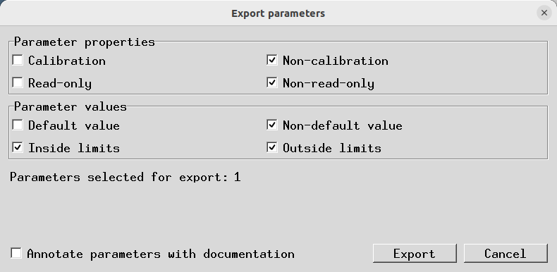

# Flight-Controller Parameter Export



## Purpose

The **Export parameters** window saves a selection of the values currently stored on your
ArduPilot flight controller to a `.param` file.

This is useful for creating a backup, reviewing how a vehicle is configured, sharing reusable
settings, or diagnosing unusual values. Exporting does not upload anything and does not change the
flight controller.

The export uses the live values read from the connected flight controller. It does not export the
values staged in the currently selected AMC parameter file.

## Before You Start

1. Connect and power your flight controller.
2. Start ArduPilot Methodic Configurator and open the vehicle project.
3. Wait for the flight-controller parameters to finish downloading.
4. Open the **Parameter Editor**.
5. Click **Export parameters** in the parameter action buttons.

The export button is unavailable when no flight controller is connected or when its parameters
have not been downloaded.

## Choosing Parameters

The window has two groups of selectors. A parameter must match **every selected group**, so the
filters use AND logic.

- Selecting both options in a row removes that row as a restriction.
- Clearing both options in a row selects no parameters for that row.
- The number beside **Parameters selected for export** updates as you change the selectors.
- The export window shows the count, not a list of parameter names.

### Parameter Properties

These selectors describe what a parameter is.

#### Calibration

Calibration parameters contain corrections learned for the sensors on one particular flight
controller, such as accelerometer, gyroscope, or compass calibration. They are dependent on the
physical board, sensor, installation, and vehicle.

Do not copy calibration parameters to another flight controller. A different board needs its own
calibration. Include them when you are making a backup of this exact vehicle, or when you need to
diagnose or restore its calibration. Leave **Calibration** unchecked when creating settings to
reuse on another vehicle.

#### Non-calibration

These parameters are not sensor calibration values. They usually describe how ArduPilot should
operate, such as vehicle setup, communication, safety, or tuning choices. They are generally more
appropriate for reuse on another vehicle with compatible hardware and firmware, but you should
still review them before applying them.

#### Read-only

Read-only parameters are reported by ArduPilot for information, status, or detected hardware.
ArduPilot normally does not allow them to be changed. They can be useful in a complete backup or
for diagnosing hardware, but they are usually not useful in a reusable configuration file.

#### Non-read-only

These are parameters that ArduPilot normally allows you to configure. They are usually the most
useful parameters when creating a configuration file for review or reuse.

### Parameter Values

These selectors describe the current value stored on the flight controller.

#### Default value

The current value is the default supplied by the installed ArduPilot firmware. No custom value has
been applied for that parameter.

Default values can make a complete backup easier to understand, but they are often unnecessary
when sharing only the settings that were intentionally changed.

#### Non-default value

The current value differs from the firmware default. It represents a setting that was customized,
changed during setup, or changed during operation.

This is commonly the useful choice when exporting the configuration decisions made for a vehicle.

#### Inside limits

The current value is between the minimum and maximum documented by ArduPilot. It is within the
normal range described for that parameter.

This does not guarantee that the value is appropriate for your vehicle; it only means that it is
within the documented numeric range.

#### Outside limits

The current value is below the documented minimum or above the documented maximum. Such a value
may be invalid or unsafe, but it can be important when diagnosing a configuration problem or
recovering a vehicle.

Select **Outside limits** deliberately when you want to find or preserve unusual values.

## Default Selection

The window starts with these choices:

- **Non-calibration**
- **Non-read-only**
- **Non-default value**
- **Inside limits** and **Outside limits**

This selects changed, writable, non-calibration parameters while allowing both normal and unusual
values to be counted. You can select both limit options because the default goal is to avoid hiding
an out-of-range value from a backup or review.

## Documentation Comments

Enable **Annotate parameters with documentation** to add human-readable ArduPilot documentation
comments to the exported file.

Annotation makes a file easier to read in a text editor, but it makes the file larger and does not
change any parameter value. Leave it disabled when you want a compact file for comparison or use
by another tool.

## Saving the File

Press **Export** to open the save dialog. AMC suggests a filename made from the vehicle type and
the categories selected in the window. The file always uses the `.param` extension.

For example:

```text
ArduCopter_calibrations_read-only_default-values_inside-limits.param
Rover_non-calibrations_non-read-only_non-default-values_outside-limits.param
ArduPlane.param
```

A category appears in the suggested name only when exactly one option in its row is selected. If
both options are selected, that category is omitted because it does not restrict the export.

The suggested filename is only a convenience. You may choose another filename and location in the
save dialog.

## Use Cases

### Back Up One Specific Vehicle

Use this when you want a snapshot that can restore the same physical vehicle.

1. Leave calibration parameters selected if you want the backup to include sensor calibration.
2. Select read-only parameters if you want a more complete diagnostic snapshot.
3. Select both default and non-default values for a complete parameter backup.
4. Select both inside-limit and outside-limit values so unusual values are not hidden.
5. Enable documentation annotation if the backup will be inspected in a text editor.
6. Export the file to a clearly named backup directory.

Do not use this complete backup as a generic configuration for another flight controller. It may
contain calibration and hardware-specific values.

### Share Reusable Vehicle Settings

Use this when preparing settings for another vehicle with compatible hardware and firmware.

1. Select **Non-calibration**.
2. Select **Non-read-only**.
3. Select **Non-default value**.
4. Select **Inside limits**.
5. Review the resulting file and remove settings that are specific to the destination vehicle,
   such as identifiers, radio setup, or component connections.
6. Apply and validate the settings on the destination vehicle using the normal ArduPilot workflow.

Even non-calibration settings are not automatically safe for every vehicle. Hardware, firmware,
and vehicle setup must be compatible.

### Find Unusual or Invalid Values

Use this when troubleshooting a vehicle or reviewing a configuration after an unexpected event.

1. Select **Outside limits** and clear **Inside limits**.
2. Select both calibration and non-calibration if you want to inspect every parameter type.
3. Select both read-only and non-read-only if status parameters may help with diagnosis.
4. Select both default and non-default if you want a complete diagnostic set.
5. Export the file and compare the unusual values with the ArduPilot parameter documentation.

An outside-limit value is a finding to investigate, not a value that should automatically be copied
back to a flight controller.

### Export Only Intentional Changes

Use this when you want a compact file containing the settings that differ from firmware defaults.

1. Select **Non-calibration** and **Non-read-only**.
2. Select **Non-default value**.
3. Select **Inside limits**.
4. Leave documentation annotation disabled for a compact file, or enable it if the file will be
   reviewed by someone unfamiliar with ArduPilot.

## Important Limitations

- The flight controller must be connected and its parameters must be downloaded.
- Exporting does not upload, reset, reboot, or otherwise change the flight controller.
- Exporting does not change the active AMC configuration step or its parameter files.
- The current export is a Mission Planner-style `.param` file. MAVProxy and QGroundControl-specific
  output formats are not currently available.
- The export window does not prevent you from selecting calibration or outside-limit values. Review
  those selections carefully before sharing or applying an exported file.
