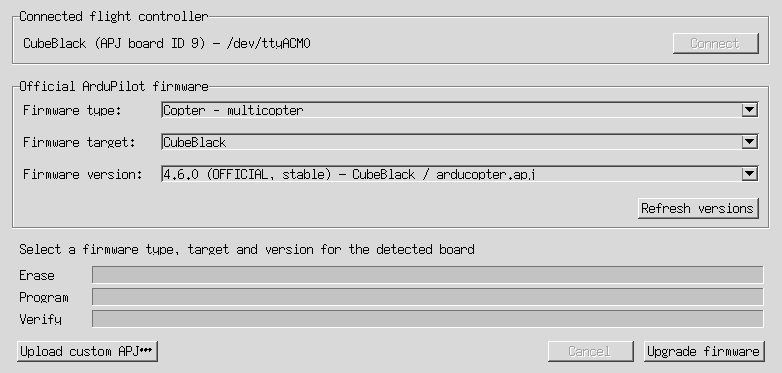
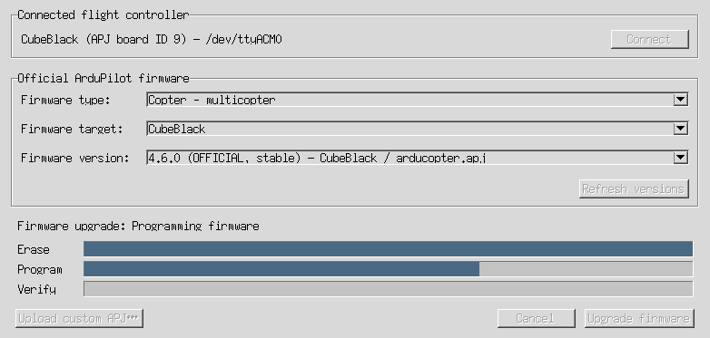

# Flight-Controller Firmware Upload



## Purpose

The **Upload ArduPilot firmware** window installs ArduPilot firmware on a connected flight
controller. You can choose a release from the official ArduPilot catalog or upload a local `.apj`
file.

Firmware is the software that runs on the flight controller. Uploading replaces the installed
firmware, temporarily disconnects the controller, and restarts it after checking the uploaded
image. This is a separate operation from uploading vehicle parameters.

The window detects the connected board and offers firmware builds with a matching APJ board ID.
You still need to choose the firmware type and target appropriate for your vehicle and hardware.

The screenshots show an example CubeBlack board and sample release data. The available versions,
targets, and serial port on your computer may differ.

## Before You Start

1. Disarm the vehicle and remove its propellers or otherwise make its actuators safe.
2. Back up the flight-controller parameters. Use the
   [parameter export guide](USERMANUAL_fc_parameter_export.md#back-up-one-specific-vehicle) to
   preserve the settings and calibration of this specific vehicle.
3. Connect the flight controller directly to your computer by USB, using a reliable data cable.
4. Keep the controller powered and the USB cable connected throughout the upload.
5. Close other applications that may be using the controller's serial port.
6. Make sure you have internet access if you plan to use the official firmware catalog.

Firmware upload requires a working connection to the running flight controller and an identifiable
USB serial device. Network connections, including UDP and TCP connections or telemetry forwarding,
cannot be used for firmware upload.

## Opening the Window

In the vehicle project opener, click **Upload ArduPilot firmware**. The project opener
remains visible but inactive until you close the firmware upload window. The upload window
shares the application's flight-controller connection.
Closing without attempting an upload, or after cancelling safely before erase, returns
to project selection without exiting AMC, provided no restart requirement was recorded.
If a detected controller is unplugged while the window is idle, AMC records a restart
requirement. Reconnecting the controller or safely cancelling a later upload does not
clear it; closing the firmware window then exits AMC. After a successful or failed
upload, closing the firmware window also exits AMC. Restart AMC before continuing
configuration.

With AMC installed in your Python environment, start the standalone tool from a terminal:

```bash
amc_firmware_upload
```

You can also start it from the repository with its Python environment activated:

```bash
python -m ardupilot_methodic_configurator.frontend_tkinter_firmware_upload
```

Startup attempts to connect automatically. If no auto-detected ports respond and you did not
specify `--device`, the connection selector lets you choose a flight controller. A failed explicit
`--device` connection or another connection error displays an error and exits. Cancelling the
startup selector exits the tool.

To specify a serial port, use `--device`. For example, on Linux:

```bash
amc_firmware_upload --device /dev/ttyACM0
```

On Windows, replace the device with your controller's port, such as `COM3`.
Use `amc_firmware_upload --help` to see the available connection options, including `--baudrate`
and `--reboot-time`.

### Connected Flight Controller

The **Connected flight controller** area shows the detected board model, its **APJ board ID**, and
the serial device used for the connection. Check these details before selecting firmware.

If no flight controller is connected, click **Connect**. The connection selector opens as a child
window; choose the controller's USB connection or click **Auto-connect**. Closing this selector
returns to the firmware window.

If you unplug the USB cable while no upload is running, AMC checks for the missing serial
port once per second, clears the disconnected board's firmware choices, enables
**Connect** again, and records a restart requirement. Plug the controller back in and
click **Connect** to reconnect if you want to continue working in the firmware window.
The restart requirement remains even after reconnecting, so closing that window exits
AMC. These checks are suspended during upload because the bootloader intentionally
changes the USB connection.

The firmware selectors and upload actions are unavailable until the controller's board ID is
known. Once the board is detected, AMC loads the official firmware catalog.

## Choosing Official Firmware

The **Official ArduPilot firmware** area has three selectors. Choose them in order.

### Firmware Type

Choose the software for your vehicle. The choices depend on what the catalog offers for the
connected board.

- **Copter - multicopter** is for multicopters.
- **Copter - heli** is for traditional helicopters.
- **Plane**, **Rover**, and **Sub** are offered when matching builds are available.

AMC initially selects the connected controller's vehicle type when it appears in the catalog.
Check this choice, especially when changing the vehicle type or switching between multicopter and
helicopter firmware.

### Firmware Target

A target is a firmware build for a particular board model or variant. Only targets with the
connected controller's APJ board ID are listed.

AMC selects the detected board name when it matches an available target. If it does not match,
AMC selects a target automatically only when there is a single target. When several targets are
available and none matches the detected name, no target is preselected; choose the build intended
for your exact hardware. A matching board ID alone does not choose the right board variant for you.

### Firmware Version

Choose the release to install. Each entry includes its version, release channel, release directory,
target, and APJ filename so that builds can be distinguished.

- **OFFICIAL** identifies a stable release.
- **BETA** identifies a release being tested.
- **DEV** identifies a development build.

For normal vehicle use, choose a suitable stable release. Select testing or development firmware
deliberately when you need that build and can validate it before flying or operating the vehicle.

The version selector starts empty, even when only one version is listed. You must select a version
before **Upload firmware** becomes available. Changing the firmware type or target clears the
version selection, so select a version again after either change.

### Refreshing the Catalog

Click **Refresh versions** to download the catalog again. This requires internet access and clears
the previous version selection when the new list is displayed.

The list contains compatible APJ entries from the official catalog, rather than every historical
ArduPilot build. Older releases that lack the firmware identity needed for verification are
excluded.

## Installing an Official Release

1. Check the connected board, firmware type, target, and version.
2. Click **Upload firmware**.
3. Review the first confirmation and accept it to download the selected release and prepare the
   controller for flashing.
4. Wait while AMC downloads and inspects the APJ, enters the controller's bootloader, and checks
   the board and available flash capacity.
5. Review the **Confirm firmware flash** dialog. It identifies the selected release, the
   **Bootloader board ID**, and the **APJ SHA-256** digest of the file being uploaded.
6. Accept the final confirmation to erase the existing firmware and write the selected image.
7. Keep power and USB connected while AMC erases, programs, verifies, restarts, and reconnects to
   the controller.
8. Wait for **Firmware upload completed and flight controller reconnected** before considering
   the operation successful.

The SHA-256 digest identifies the exact APJ file being flashed. Board and image checks happen
before erasing begins. Declining the final confirmation stops the upload before erasing the
installed firmware.

## Uploading a Local APJ File

Use **Upload custom APJ…** when you already have the firmware file on your computer, such as a
custom build prepared for your board.

1. Check the detected controller and click **Upload custom APJ…**.
2. Select the `.apj` file in the file dialog.
3. Review and accept the confirmation identifying the local file and connected board ID.
4. Wait for AMC to inspect the file and identify the bootloader.
5. Review and accept **Confirm firmware flash** to begin erasing and flashing.
6. Wait for verification, restart, and successful reconnection.

The local file uses the same board compatibility checks, final confirmation, and progress display
as an official release. Its APJ board ID must match the connected controller. Compatibility is
checked from the file's contents, not from its filename.

Only APJ firmware files are supported. Raw `.bin` firmware images cannot be uploaded through this
window. The original local APJ file is not changed by the upload.

A local upload does not need an official version selected and does not download the firmware file.
The window still attempts to load the official catalog after connecting; if that download fails,
the custom APJ action remains available while the controller is connected.

## Progress and Cancellation



The status message describes the current operation. Three bars show the flashing stages:

- **Erase**: removing the old firmware from internal and, when used, external flash.
- **Program**: writing the selected firmware image.
- **Verify**: checking that the written image matches the firmware file before restarting.

When the bootloader reports intermediate progress, the bars show measured completion. For erase
or verification operations that provide no intermediate measurements, the corresponding bar
animates until that operation finishes. An animated bar is an activity indicator, not a percentage
or an estimate of remaining time.

The controller temporarily leaves its normal connection while it runs the bootloader. Its USB
serial port may change during this process; AMC uses the USB device identity to find it again.

**Cancel** is available while preparing the upload, before erasing starts. Cancellation takes
effect at a safe point, so it may not be immediate. Once erasing begins, **Cancel** is disabled.
The window also refuses to close while an upload operation is running. Keep the cable connected
and wait for the result.
After safe cancellation, closing the window returns to AMC without a restart if no
restart requirement was already recorded, such as by unplugging a detected controller
while idle.
If cancellation recovery fails, AMC reports an upload failure instead; closing the
window then exits AMC so you can restart and reconnect.

## After the Upload

1. Confirm that AMC reports successful completion and reconnection.
2. Close the upload window. If you opened it from the project opener, this exits AMC
   after either a successful or failed upload. Restart AMC to reconnect and load the
   current firmware, parameters, and defaults through normal startup. There is no
   automatic post-upload refresh in the existing session. For the standalone tool,
   close it and start AMC before continuing configuration.
3. Check the installed firmware and review the vehicle configuration, calibration, and pre-arm
   checks before operating the vehicle.
4. Review your backup before restoring any values, especially after changing firmware version or
   vehicle type.

A completed progress bar alone does not indicate success. Verification and reconnection must also
succeed. Do not assume that settings appropriate for the previous firmware are appropriate for
the newly installed version.
Cancelling a later retry does not remove the restart requirement from an earlier
successful or failed upload in the same window.

## Troubleshooting

### No Controller or Board ID Detected

Check the USB cable, power, and selected serial port. Close other programs using that port and
retry the connection. Uploading requires a connection to the running flight controller; this
window is not a bootloader-only recovery tool for a board that cannot start ArduPilot.

### Catalog Download Failed or No Firmware Listed

Check internet access and click **Refresh versions**. If AMC reports **No APJ firmware is listed
for this board ID**, the catalog has no usable entries for the detected board. A matching local
APJ can still be selected with **Upload custom APJ…**.

### Firmware or Board Compatibility Error

Check that the firmware is intended for your exact board and fits its flash capacity. Choose the
correct target or obtain a matching APJ file. There is no force-flash option to bypass these checks.

### Upload Failed During Erase, Programming, or Verification

Read the reported error. The firmware may be incomplete if erasing has started. Follow the
recovery instruction to power-cycle the controller before reconnecting. If ArduPilot no longer
starts, use a bootloader recovery procedure appropriate for your board.

### Firmware Written but Reconnection Failed

A reconnection error is not reported as a successful upload. Check power and USB, follow the
error's recovery instructions, and reconnect. Verify the running firmware before continuing
configuration or vehicle operation.

## Important Limitations

- A direct USB serial connection and a valid connected board identity are required.
- Official release selection and downloading require internet access.
- Only compatible APJ images are supported; network uploads, force flashing, and full-chip erase
  are unavailable.
- Selecting firmware does not start flashing. Preparing the upload and erasing the controller each
  require confirmation.
- Uploading interrupts the flight-controller connection and must not be performed on an operating
  vehicle.
- Cancellation cannot interrupt erase, programming, or verification once erasing begins.
